# HVAC SaaS Platform — System Diagrams & Unified Auth Architecture

| Field | Details |
|---|---|
| Document Type | System Architecture Diagrams + Unified Auth Redesign |
| Version | 1.0 |
| Date | March 2026 |
| Relates To | HVAC_SaaS_Phase1_PRD_v2.md |

---

## Table of Contents

1. [Unified Auth — Superadmin in Same Domain](#1-unified-auth--superadmin-in-same-domain)
2. [High-Level System Architecture](#2-high-level-system-architecture)
3. [Monorepo Structure Diagram](#3-monorepo-structure-diagram)
4. [Database ERD](#4-database-erd)
5. [Authentication Flow Diagrams](#5-authentication-flow-diagrams)
6. [User Flow Diagrams](#6-user-flow-diagrams)
7. [API Route Architecture](#7-api-route-architecture)
8. [Multi-Tenancy & RLS Model](#8-multi-tenancy--rls-model)
9. [Deployment Architecture](#9-deployment-architecture)
10. [Data Flow Diagrams](#10-data-flow-diagrams)
11. [Cron & Background Jobs](#11-cron--background-jobs)
12. [Component Architecture (Frontend)](#12-component-architecture-frontend)
13. [Email System Flow](#13-email-system-flow)
14. [Billing & Subscription Flow](#14-billing--subscription-flow)
15. [Affiliate Program Flow](#15-affiliate-program-flow)
16. [Impersonation Flow](#16-impersonation-flow)
17. [Security Architecture](#17-security-architecture)
18. [Feature Module Dependency Map](#18-feature-module-dependency-map)

---

## 1. Unified Auth — Superadmin in Same Domain

### 1.1 Change Summary

**BEFORE (PRD v2):** Superadmin was a separate Next.js app (`apps/admin`) deployed at a different URL with its own auth system.

**AFTER (This Document):** Superadmin is integrated into the same `apps/web` app. Login is unified — entering superadmin credentials on the regular login page authenticates as superadmin and redirects to `/superadmin/*` routes.

### 1.2 What Changes

| Aspect | Before (Separate App) | After (Unified) |
|---|---|---|
| Apps | `apps/web` + `apps/admin` | `apps/web` only |
| Login URL | `/admin/login` (separate) | `/login` (same login page) |
| Auth System | Completely separate Supabase Auth + admin_users | Single login form, dual-path auth |
| Deployment | 2 Vercel deployments | 1 Vercel deployment |
| Domain | `admin.yourapp.com` | `yourapp.com/superadmin/*` |
| Session | Separate cookies | Same cookie store, role-aware |
| Cost | 2x Vercel hobby slots | 1x Vercel hobby slot |

### 1.3 Updated Monorepo Structure (No `apps/admin`)

```
hvac-saas/
├── apps/
│   ├── web/                        # Next.js 14 — ALL UI (tenant + superadmin)
│   │   ├── app/
│   │   │   ├── (auth)/             # Login, signup, forgot-password
│   │   │   ├── (dashboard)/        # Tenant owner dashboard (RLS-protected)
│   │   │   │   ├── jobs/
│   │   │   │   ├── customers/
│   │   │   │   ├── invoices/
│   │   │   │   ├── bookings/
│   │   │   │   ├── quotes/
│   │   │   │   ├── schedule/
│   │   │   │   └── settings/
│   │   │   ├── (superadmin)/       # Super Admin pages (admin auth required)
│   │   │   │   ├── layout.tsx      # Admin layout with sidebar + red "ADMIN" indicator
│   │   │   │   ├── dashboard/      # MRR, signups, active users overview
│   │   │   │   ├── tenants/        # Tenant list + detail + impersonation
│   │   │   │   ├── analytics/      # Full analytics dashboards
│   │   │   │   ├── support/        # Global search, audit log, email log
│   │   │   │   ├── affiliates/     # Affiliate performance
│   │   │   │   └── system/         # Webhook log, cron history
│   │   │   ├── book/[slug]/        # Public booking portal (no auth)
│   │   │   ├── ref/[code]/         # Affiliate redirect
│   │   │   └── api/                # Next.js API routes
│   │   ├── components/
│   │   ├── middleware.ts           # Route protection (tenant vs admin)
│   │   └── package.json
│   └── api/                        # Fastify server (unchanged)
│       ├── src/
│       │   ├── routes/
│       │   │   ├── jobs/
│       │   │   ├── invoices/
│       │   │   ├── bookings/
│       │   │   ├── customers/
│       │   │   ├── quotes/
│       │   │   ├── admin/          # Super admin API routes (unchanged)
│       │   │   └── webhooks/
│       │   └── server.ts
│       └── package.json
├── packages/
│   ├── database/
│   ├── types/
│   ├── ui/
│   ├── email/
│   └── config/
├── turbo.json
├── pnpm-workspace.yaml
└── package.json
```

### 1.4 Unified Login Logic

The login page (`/login`) handles both tenant users and superadmins with a **single form**:

```
User enters email + password on /login
         │
         ▼
  ┌──────────────────────┐
  │ Check admin_users    │ ← Fastify POST /admin/auth/login
  │ table first          │
  └────────┬─────────────┘
           │
     ┌─────┴─────┐
     │ Found in   │
     │admin_users?│
     └─────┬──┬──┘
       YES │  │ NO
           │  │
           ▼  ▼
  ┌────────┐  ┌────────────────┐
  │Verify  │  │ Proceed with   │
  │bcrypt  │  │ Supabase Auth  │
  │password│  │ (normal tenant │
  └───┬────┘  │  login flow)   │
      │       └───────┬────────┘
      ▼               ▼
 Issue admin      Issue tenant
 JWT + redirect   JWT + redirect
 to /superadmin   to /dashboard
```

**Implementation approach:**

1. Login form submits email + password
2. Client calls `POST /api/auth/login` (Next.js API route)
3. Next.js route first tries `POST {FASTIFY_URL}/admin/auth/login` with the credentials
4. If admin auth succeeds → store admin JWT in httpOnly cookie `admin_token`, redirect to `/superadmin/dashboard`
5. If admin auth returns 401 → fall through to normal Supabase Auth `signInWithPassword()`
6. If Supabase auth succeeds → normal tenant flow, redirect to `/dashboard`
7. If both fail → show "Invalid credentials" error

### 1.5 Middleware Route Protection

```typescript
// middleware.ts — updated
export function middleware(request: NextRequest) {
  const { pathname } = request.nextUrl;

  // Superadmin routes: require admin_token cookie
  if (pathname.startsWith('/superadmin')) {
    const adminToken = request.cookies.get('admin_token');
    if (!adminToken) {
      return NextResponse.redirect(new URL('/login', request.url));
    }
    // Verify admin JWT (check expiry, role)
    // If invalid/expired → redirect to /login
  }

  // Dashboard routes: require Supabase session
  if (pathname.startsWith('/dashboard')) {
    const supabaseSession = request.cookies.get('sb-access-token');
    if (!supabaseSession) {
      return NextResponse.redirect(new URL('/login', request.url));
    }
  }
}
```

### 1.6 Updated Route Table

**Removed routes** (no longer exist):
- ~~`/admin/login`~~
- ~~`/admin/*`~~ (all admin routes)

**New routes** (under same app):

| Route | Page | Auth Required |
|---|---|---|
| `/login` | Unified login (tenant + admin) | Public |
| `/superadmin` | Admin dashboard | Admin JWT |
| `/superadmin/tenants` | Tenant list | Admin JWT |
| `/superadmin/tenants/[id]` | Tenant detail + impersonate | Admin JWT |
| `/superadmin/analytics` | Full analytics | Admin JWT |
| `/superadmin/support` | Support tools | Admin JWT |
| `/superadmin/affiliates` | Affiliate overview | Admin JWT |
| `/superadmin/system` | System health | Admin JWT |

### 1.7 Security Considerations

| Concern | Mitigation |
|---|---|
| Admin routes accessible by URL guessing | Middleware blocks all `/superadmin/*` without valid admin JWT |
| Tenant user tries `/superadmin` | Middleware rejects — tenant Supabase token ≠ admin JWT |
| Admin JWT leaks | 4h expiry; re-auth for destructive ops; httpOnly cookie |
| `/superadmin` visible in sitemap/crawlers | Add to `robots.txt` disallow; `noindex` meta tag |
| Shared cookie domain | Admin and tenant cookies use different names (`admin_token` vs `sb-*`) |

---

## 2. High-Level System Architecture

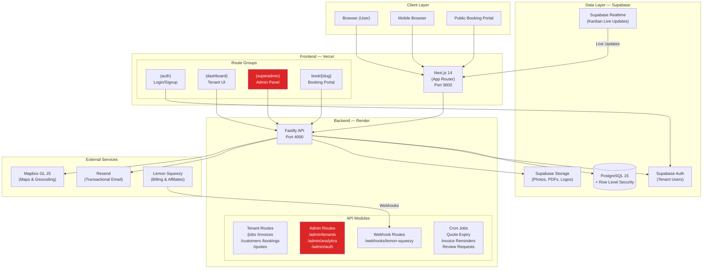

---

## 3. Monorepo Structure Diagram

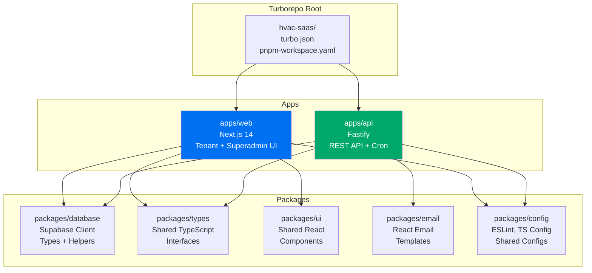

---

## 4. Database ERD

### 4.1 Core Business Tables

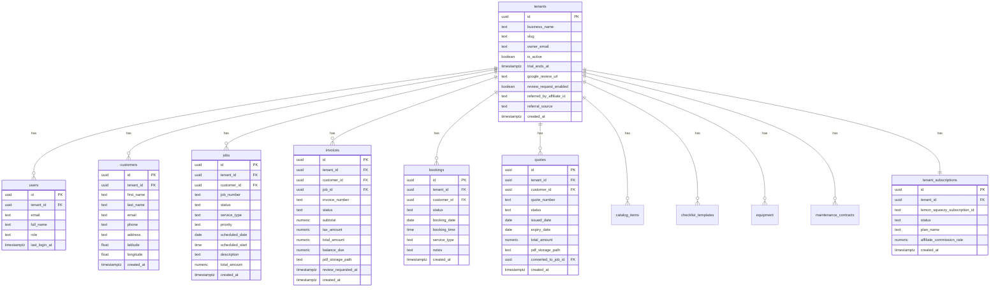

### 4.2 Line Items & Catalog

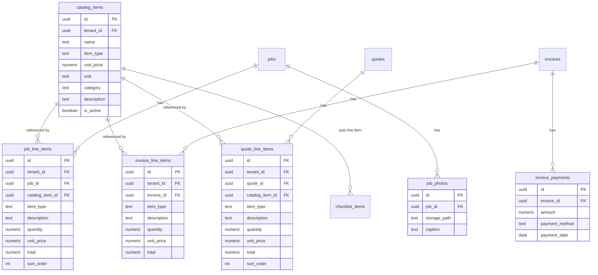

### 4.3 Checklists & Equipment

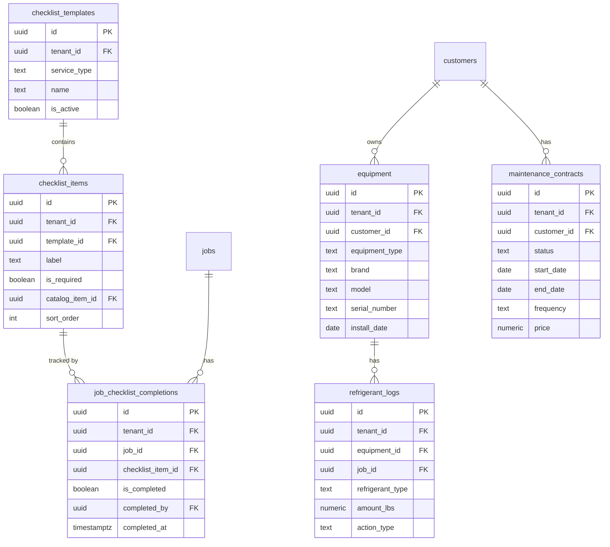

### 4.4 Superadmin & Platform Tables

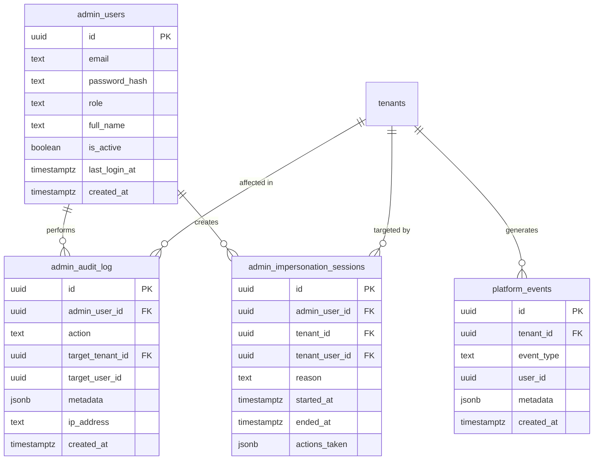

### 4.5 Scheduling & Availability

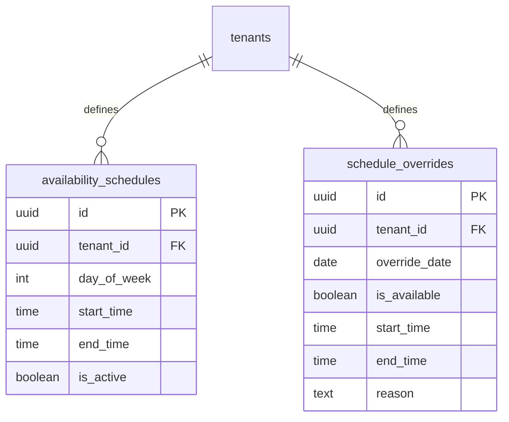

---

## 5. Authentication Flow Diagrams

### 5.1 Unified Login Flow (Updated)

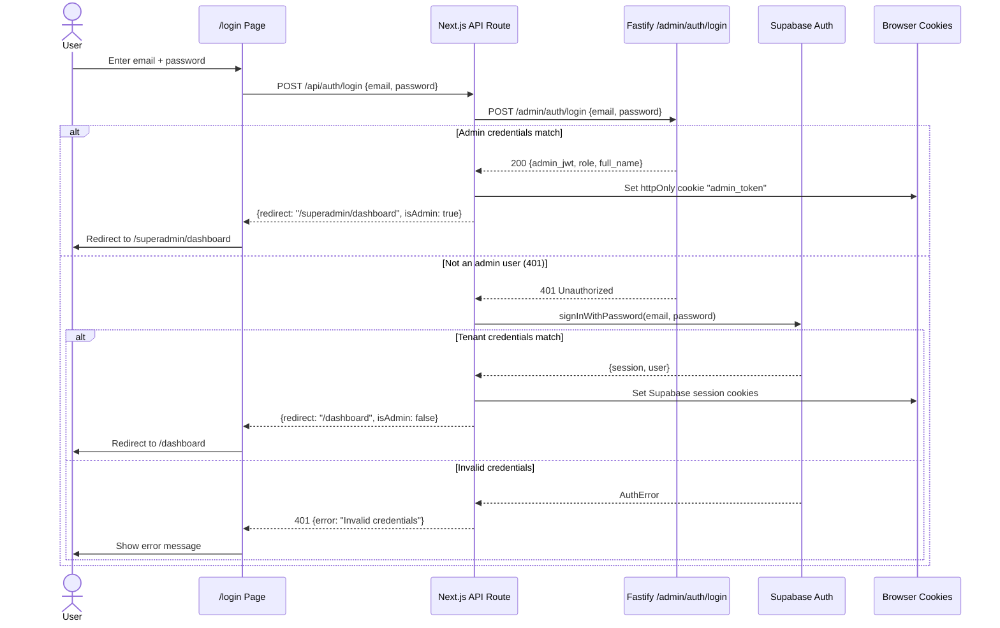

### 5.2 Tenant Signup Flow

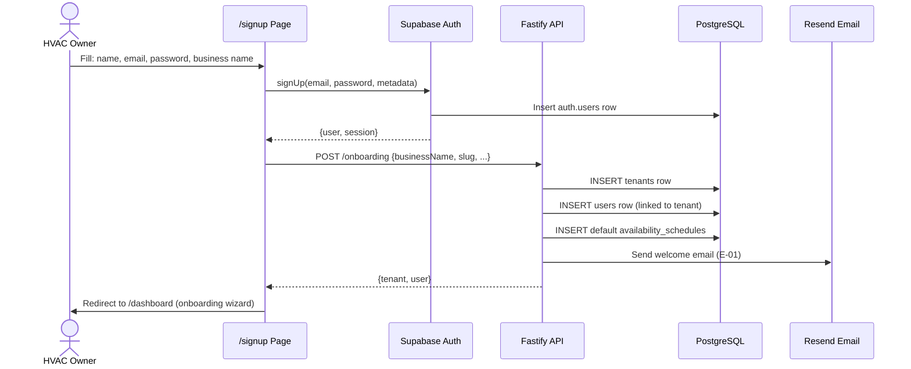

### 5.3 Admin JWT Lifecycle

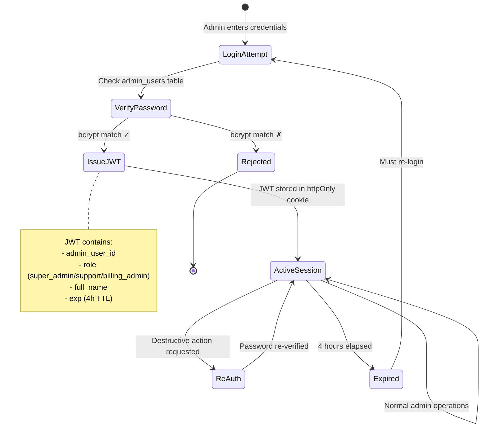

---

## 6. User Flow Diagrams

### 6.1 Job Lifecycle (End-to-End)

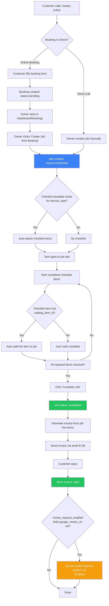

### 6.2 Quote-to-Job Conversion

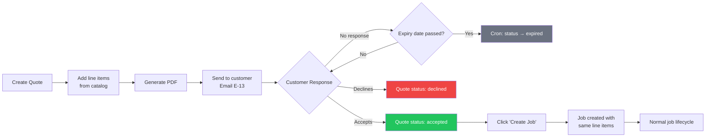

### 6.3 Customer Booking Portal Flow

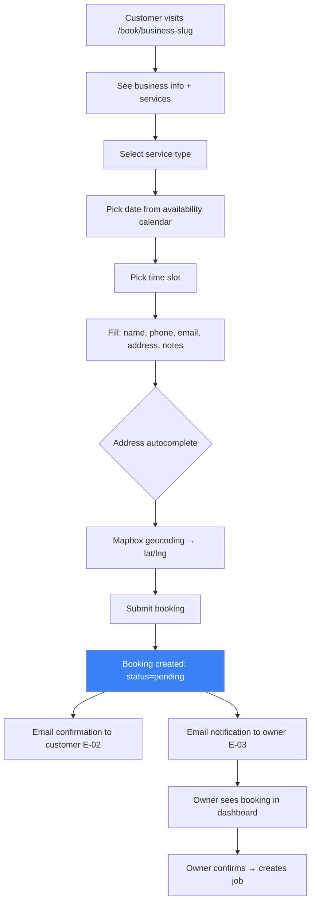

---

## 7. API Route Architecture

```mermaid
graph TD
    subgraph "Fastify API Server (Port 4000)"
        Entry["server.ts<br/>Plugins: CORS, JWT, Rate Limit, Swagger"]

        subgraph "Tenant Routes (Supabase JWT Auth)"
            Jobs["/jobs<br/>CRUD + status transitions"]
            Invoices["/invoices<br/>CRUD + PDF + send"]
            Customers["/customers<br/>CRUD + search"]
            Bookings["/bookings<br/>CRUD + confirm"]
            Quotes["/quotes<br/>CRUD + PDF + convert"]
            Catalog["/catalog<br/>CRUD + search"]
            Equipment["/equipment<br/>CRUD"]
            Refrigerant["/refrigerant-logs<br/>CRUD"]
            Checklists["/checklists<br/>Templates + completions"]
            Schedule["/availability<br/>Schedules + overrides"]
            Settings["/settings<br/>Tenant profile + billing"]
        end

        subgraph "Admin Routes (Admin JWT Auth)"
            AdminAuth["/admin/auth<br/>Login + refresh"]
            AdminTenants["/admin/tenants<br/>List + detail + actions"]
            AdminAnalytics["/admin/analytics<br/>MRR + signups + churn"]
            AdminSearch["/admin/search<br/>Global cross-tenant"]
            AdminAudit["/admin/audit-log<br/>Action history"]
            AdminSystem["/admin/system<br/>Webhooks + crons"]
            AdminAffiliates["/admin/affiliates<br/>Attribution data"]
        end

        subgraph "Public Routes (No Auth)"
            BookingPublic["/public/booking<br/>Availability + submit"]
            WebhooksLS["/webhooks/lemon-squeezy<br/>Subscription events"]
            AffRedirect["/ref/[code]<br/>Cookie + redirect"]
        end

        subgraph "Background Jobs"
            CronInvoice["Cron: Invoice reminders<br/>Daily 9am"]
            CronQuote["Cron: Quote expiry<br/>Daily midnight"]
            CronReview["Cron: Review requests<br/>Every 2 hours"]
            CronEvents["Cron: Platform events<br/>aggregation"]
        end
    end

    Entry --> Jobs
    Entry --> AdminAuth
    Entry --> BookingPublic
    Entry --> CronInvoice

    style AdminAuth fill:#dc2626,color:#fff
    style AdminTenants fill:#dc2626,color:#fff
    style AdminAnalytics fill:#dc2626,color:#fff
    style AdminSearch fill:#dc2626,color:#fff
    style AdminAudit fill:#dc2626,color:#fff
    style AdminSystem fill:#dc2626,color:#fff
    style AdminAffiliates fill:#dc2626,color:#fff
```

---

## 8. Multi-Tenancy & RLS Model

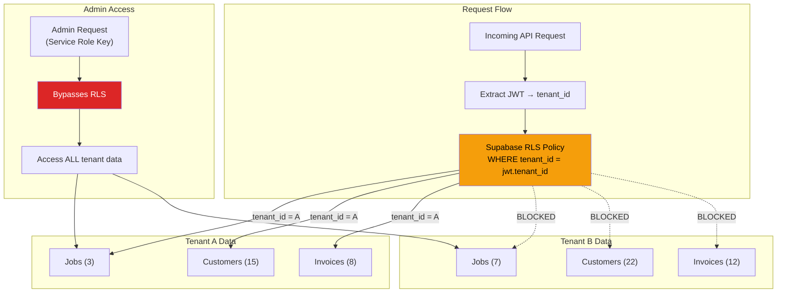

### RLS Policy Pattern (Applied to Every Tenant Table)

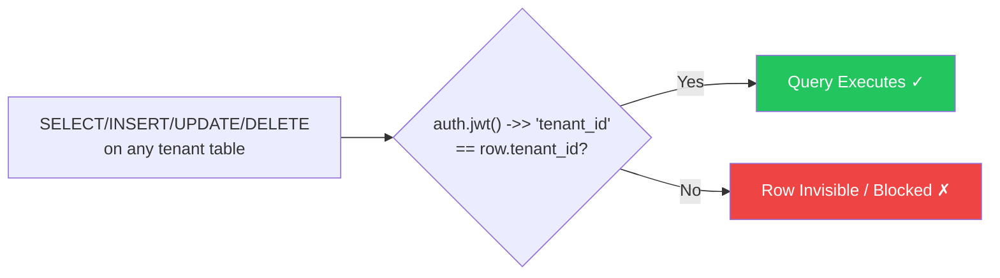

---

## 9. Deployment Architecture

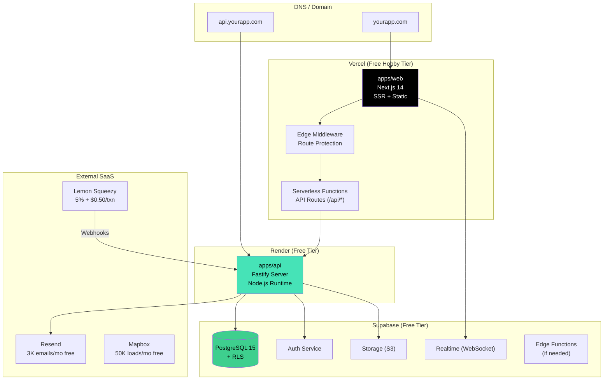

---

## 10. Data Flow Diagrams

### 10.1 Invoice Generation & Payment Flow

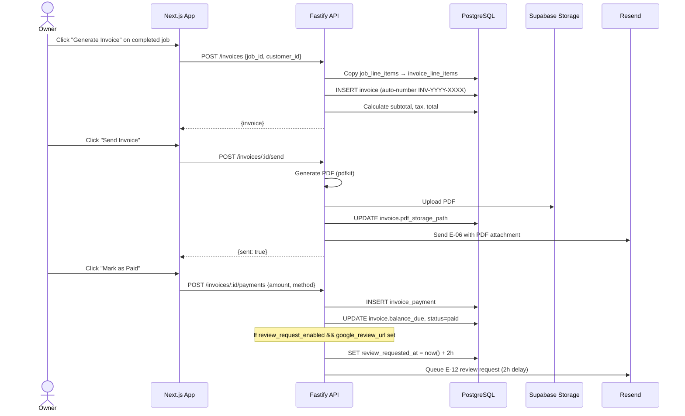

### 10.2 Realtime Kanban Update Flow

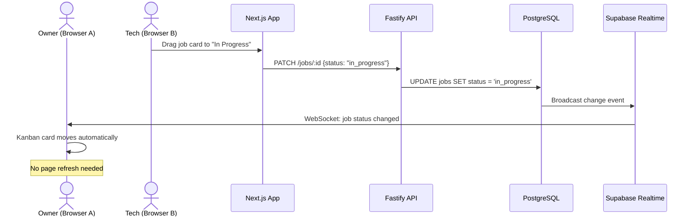

---

## 11. Cron & Background Jobs

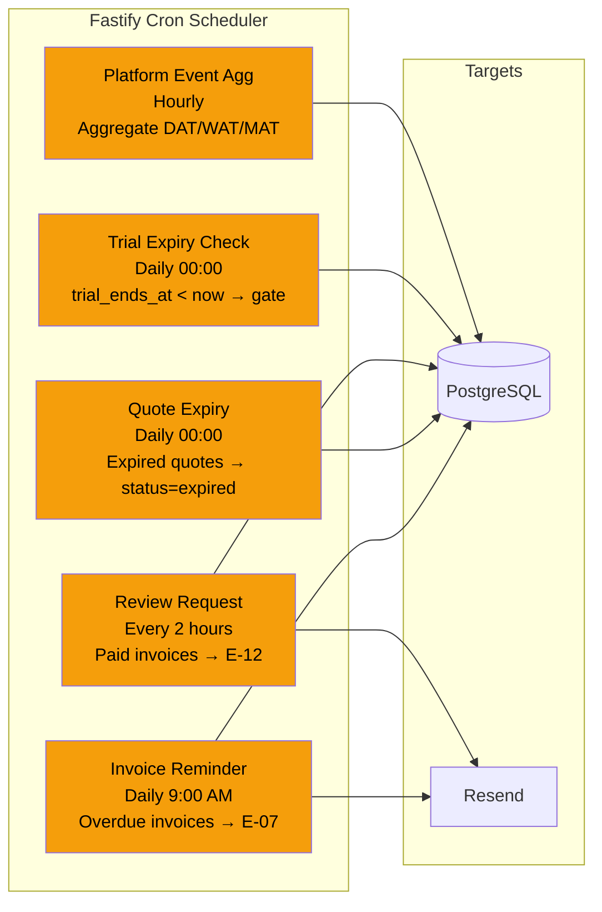

---

## 12. Component Architecture (Frontend)

```mermaid
graph TD
    subgraph "App Shell"
        Layout["Root Layout<br/>Providers, Toasts, Realtime"]
    end

    subgraph "(auth) Route Group"
        Login["LoginPage<br/>Unified: tenant + admin"]
        Signup["SignupPage"]
        ForgotPW["ForgotPassword"]
    end

    subgraph "(dashboard) Route Group"
        DashLayout["DashboardLayout<br/>Sidebar + Header"]
        Home["KPI Dashboard<br/>6 stat cards"]
        JobsKanban["Jobs Kanban<br/>Drag & drop columns"]
        JobsCalendar["Jobs Calendar<br/>react-big-calendar"]
        CustomersPage["Customers<br/>Table + detail"]
        InvoicesPage["Invoices<br/>Table + PDF"]
        BookingsPage["Bookings<br/>Pending list"]
        QuotesPage["Quotes<br/>Table + builder"]
        SchedulePage["Schedule<br/>Availability mgmt"]
        SettingsPage["Settings<br/>Business + billing + catalog"]
    end

    subgraph "(superadmin) Route Group"
        SALayout["SuperAdminLayout<br/>Red sidebar + ADMIN badge"]
        SADash["SA Dashboard<br/>MRR + signups + active"]
        SATenants["SA Tenants<br/>List + detail + impersonate"]
        SAAnalytics["SA Analytics<br/>Charts + metrics"]
        SASupport["SA Support<br/>Search + audit log"]
        SAAffiliates["SA Affiliates<br/>Attribution table"]
        SASystem["SA System<br/>Webhook + cron logs"]
    end

    subgraph "Public Routes"
        BookingPortal["book/[slug]<br/>Public booking form"]
        RefRedirect["ref/[code]<br/>Affiliate redirect"]
    end

    Layout --> Login
    Layout --> DashLayout
    Layout --> SALayout
    Layout --> BookingPortal

    DashLayout --> Home
    DashLayout --> JobsKanban
    DashLayout --> JobsCalendar
    DashLayout --> CustomersPage
    DashLayout --> InvoicesPage
    DashLayout --> BookingsPage
    DashLayout --> QuotesPage
    DashLayout --> SchedulePage
    DashLayout --> SettingsPage

    SALayout --> SADash
    SALayout --> SATenants
    SALayout --> SAAnalytics
    SALayout --> SASupport
    SALayout --> SAAffiliates
    SALayout --> SASystem

    style SALayout fill:#dc2626,color:#fff
    style SADash fill:#dc2626,color:#fff
    style SATenants fill:#dc2626,color:#fff
    style SAAnalytics fill:#dc2626,color:#fff
    style SASupport fill:#dc2626,color:#fff
    style SAAffiliates fill:#dc2626,color:#fff
    style SASystem fill:#dc2626,color:#fff
```

### Shared UI Components

```mermaid
graph TD
    subgraph "packages/ui"
        Button["Button"]
        Input["Input"]
        Table["DataTable<br/>Sortable, filterable"]
        Card["Card / StatCard"]
        Modal["Modal / Dialog"]
        Form["Form + Validation"]
        Select["Select / Combobox"]
        DatePicker["DatePicker"]
        Skeleton["Skeleton Loader"]
        Badge["StatusBadge"]
        Sidebar["Sidebar"]
        Kanban["KanbanBoard"]
        Calendar["CalendarView"]
    end

    subgraph "Used By"
        Web["apps/web<br/>(dashboard + superadmin)"]
    end

    Web --> Button
    Web --> Input
    Web --> Table
    Web --> Card
    Web --> Modal
    Web --> Kanban
    Web --> Calendar
```

---

## 13. Email System Flow

```mermaid
graph TD
    subgraph "Email Triggers"
        T1["Signup → E-01 Welcome"]
        T2["Booking submitted → E-02 Customer Confirm"]
        T3["Booking submitted → E-03 Owner Notify"]
        T4["Booking confirmed → E-04 Customer Notify"]
        T5["Job completed → E-05 Summary"]
        T6["Invoice sent → E-06 Invoice Email"]
        T7["Invoice overdue → E-07 Reminder"]
        T8["Payment received → E-08 Receipt"]
        T9["Contract renewal → E-09 Reminder"]
        T10["Trial expiring → E-10 Warning"]
        T11["First paid sub → E-11 Welcome + Affiliate"]
        T12["Invoice paid → E-12 Review Request"]
        T13["Quote sent → E-13 Quote Email"]
    end

    subgraph "Email Engine"
        ReactEmail["React Email<br/>packages/email"]
        Resend["Resend API<br/>3K emails/mo free"]
    end

    subgraph "Delivery"
        Customer["Customer Inbox"]
        Owner["Owner Inbox"]
    end

    T1 --> ReactEmail
    T2 --> ReactEmail
    T3 --> ReactEmail
    T6 --> ReactEmail
    T12 --> ReactEmail
    T13 --> ReactEmail

    ReactEmail --> Resend
    Resend --> Customer
    Resend --> Owner

    style Resend fill:#000,color:#fff
```

---

## 14. Billing & Subscription Flow

```mermaid
sequenceDiagram
    actor Owner
    participant Web as Next.js App
    participant LS as Lemon Squeezy
    participant Webhook as Fastify Webhook Handler
    participant DB as PostgreSQL

    Owner->>Web: Click "Subscribe" ($49/mo)
    Web->>LS: Redirect to LS checkout

    Note over LS: LS detects aff_code cookie<br/>if affiliate referral

    Owner->>LS: Enter payment details
    LS->>LS: Process payment
    LS->>Webhook: POST /webhooks/lemon-squeezy<br/>event: subscription_created

    Webhook->>DB: UPSERT tenant_subscriptions
    Webhook->>DB: SET tenants.referred_by_affiliate_id<br/>(if affiliate)
    Webhook-->>LS: 200 OK

    Note over DB: tenant.is_active = true<br/>Subscription gates removed

    LS-->>Owner: Redirect back to app
    Owner->>Web: Full access to dashboard

    Note over LS: Monthly recurring charge
    LS->>Webhook: subscription_payment_success (monthly)
    Webhook->>DB: UPDATE subscription status

    Note over LS: If customer cancels
    LS->>Webhook: subscription_cancelled
    Webhook->>DB: UPDATE status = 'cancelled'
    Webhook->>DB: SET is_active = false (after grace period)
```

---

## 15. Affiliate Program Flow

```mermaid
flowchart TD
    A[Happy customer visits<br/>Lemon Squeezy affiliate portal] --> B[Signs up as affiliate]
    B --> C[Gets unique link:<br/>yourapp.com/?aff=ABC123]
    C --> D[Shares with HVAC friends]

    D --> E[Friend visits /ref/ABC123]
    E --> F[Cookie 'aff_code=ABC123' set<br/>30-day expiry]
    F --> G[Friend signs up for account]
    G --> H[Friend goes through onboarding]
    H --> I[Friend hits Lemon Squeezy checkout]

    I --> J{aff_code cookie present?}
    J -->|Yes| K[LS tracks conversion<br/>affiliate_id in webhook payload]
    J -->|No| L[Organic signup]

    K --> M[Webhook: subscription_created]
    M --> N[Save affiliate_id to tenant record]
    N --> O[referral_source = 'affiliate']

    O --> P[LS handles 25% recurring commission<br/>payout to affiliate automatically]

    G --> Q[Send E-11 welcome email<br/>with their own referral link]
    Q --> R[New customer becomes<br/>potential affiliate too]

    style K fill:#22c55e,color:#fff
    style P fill:#22c55e,color:#fff
```

---

## 16. Impersonation Flow (Updated for Unified App)

```mermaid
sequenceDiagram
    actor Admin
    participant SAPage as /superadmin/tenants/[id]
    participant API as Fastify Admin API
    participant DB as PostgreSQL
    participant Dashboard as /dashboard (tenant view)

    Admin->>SAPage: Click "Impersonate" on tenant
    SAPage->>SAPage: Modal: Enter mandatory reason
    Admin->>SAPage: Submit reason: "Support ticket #456"

    SAPage->>API: POST /admin/tenants/:id/impersonate<br/>{reason: "Support ticket #456"}
    API->>DB: INSERT admin_impersonation_sessions
    API->>DB: INSERT admin_audit_log (action: impersonate_start)
    API->>API: Generate short-lived tenant JWT (15 min TTL)<br/>with is_impersonation=true flag
    API-->>SAPage: {impersonation_token, tenant_name}

    SAPage->>Dashboard: Redirect to /dashboard<br/>with impersonation_token cookie

    Note over Dashboard: Red banner shows:<br/>"⚠️ Viewing as [Business Name] — [Admin Name]"

    Admin->>Dashboard: Browse tenant data (RLS enforced)
    Dashboard->>API: All requests use impersonation JWT<br/>scoped to tenant_id
    API->>DB: Log actions to impersonation_sessions.actions_taken

    Admin->>Dashboard: Click "Exit Impersonation" in banner
    Dashboard->>API: POST /admin/impersonation/end
    API->>DB: UPDATE session: ended_at = now()
    API->>DB: INSERT admin_audit_log (action: impersonate_end)
    API-->>Dashboard: Clear impersonation cookie
    Dashboard->>SAPage: Redirect back to /superadmin/tenants
```

---

## 17. Security Architecture

```mermaid
graph TD
    subgraph "Authentication Layers"
        L1["Layer 1: Supabase Auth<br/>Tenant user signup/login<br/>JWT with tenant_id claim"]
        L2["Layer 2: Admin Auth<br/>admin_users table + bcrypt<br/>Separate JWT with admin role"]
        L3["Layer 3: Impersonation<br/>Short-lived tenant JWT<br/>15-min TTL, is_impersonation flag"]
    end

    subgraph "Authorization"
        RLS["Row Level Security<br/>Every table filtered by tenant_id"]
        AdminRole["Admin Role Check<br/>super_admin > support > billing_admin"]
        Middleware["Next.js Middleware<br/>/superadmin/* → admin JWT required<br/>/dashboard/* → tenant JWT required"]
    end

    subgraph "Audit & Compliance"
        AuditLog["admin_audit_log<br/>Append-only, no DELETE policy"]
        ImpLog["admin_impersonation_sessions<br/>Reason + duration + actions"]
        PlatformLog["platform_events<br/>Tenant activity tracking"]
    end

    subgraph "Security Controls"
        HTTPOnly["httpOnly Cookies<br/>No JS access to tokens"]
        CSRF["CORS + Origin Check"]
        RateLimit["Rate Limiting<br/>Login: 5 req/min<br/>API: 100 req/min"]
        ReAuth["Re-auth for<br/>destructive actions"]
        TTL["Token Expiry<br/>Tenant: 1h<br/>Admin: 4h<br/>Impersonation: 15min"]
    end

    L1 --> RLS
    L2 --> AdminRole
    L2 --> Middleware
    L3 --> RLS

    AdminRole --> AuditLog
    L3 --> ImpLog

    style AuditLog fill:#dc2626,color:#fff
    style RLS fill:#f59e0b,color:#000
```

---

## 18. Feature Module Dependency Map

```mermaid
graph TD
    subgraph "Foundation (Week 1)"
        Auth["Auth + Multi-tenancy"]
        DB["Database + RLS"]
        Customers["Customer CRUD"]
        Catalog["Service Catalog"]
        KPI["KPI Dashboard"]
        SAScaffold["Superadmin Scaffold<br/>Login + Tenant List"]
    end

    subgraph "Core Workflows (Week 2)"
        Booking["Booking Portal"]
        Kanban["Job Kanban"]
        Calendar["Calendar View"]
        Impersonate["Impersonation"]
    end

    subgraph "Revenue Features (Week 3)"
        Invoice["Invoicing + PDF"]
        Quotes["Quote Builder"]
        CatalogInteg["Catalog → Line Item<br/>Autocomplete"]
        Review["Review Request"]
        SAAnalytics["Admin Analytics"]
    end

    subgraph "Completion (Week 4)"
        Equipment["Equipment Records"]
        Refrigerant["Refrigerant Logs"]
        Checklists["Checklists + Templates"]
        Contracts["Maintenance Contracts"]
        Affiliate["Affiliate Program"]
        Polish["Polish + Deploy"]
    end

    Auth --> Customers
    Auth --> SAScaffold
    DB --> Auth
    DB --> Catalog

    Customers --> Booking
    Customers --> Kanban
    Kanban --> Calendar
    SAScaffold --> Impersonate

    Catalog --> CatalogInteg
    Kanban --> Invoice
    CatalogInteg --> Invoice
    CatalogInteg --> Quotes
    Invoice --> Review
    Impersonate --> SAAnalytics

    Customers --> Equipment
    Equipment --> Refrigerant
    Catalog --> Checklists
    Kanban --> Checklists
    Invoice --> Affiliate

    style Auth fill:#3b82f6,color:#fff
    style DB fill:#3b82f6,color:#fff
    style SAScaffold fill:#dc2626,color:#fff
    style Impersonate fill:#dc2626,color:#fff
    style SAAnalytics fill:#dc2626,color:#fff
```

---

## Summary of Architecture Decisions

| Decision | Choice | Rationale |
|---|---|---|
| Superadmin deployment | Same app, `/superadmin/*` routes | Saves a Vercel slot, simpler deployment, unified login UX |
| Admin auth | Separate `admin_users` table + bcrypt + own JWT | Complete isolation from tenant auth; service role DB access |
| Login flow | Try admin first, fall through to Supabase | Single login form, zero UX friction, role-based redirect |
| Route protection | Next.js middleware | Edge-level check before any page renders |
| Multi-tenancy | Shared DB + RLS | Cost-effective for free tier; Supabase RLS is battle-tested |
| Realtime | Supabase Realtime | Bundled with DB, zero extra cost |
| Billing | Lemon Squeezy | Built-in affiliates, no Stripe Atlas needed |
| Email | Resend + React Email | 3K/mo free; React components for templates |
| Maps | Mapbox GL JS | 50K loads/mo free; better DX than Google Maps |
| PDF | pdfkit | Zero external API cost; runs on Fastify |

---

*HVAC SaaS — System Diagrams & Unified Auth Architecture · Version 1.0 · March 2026*
