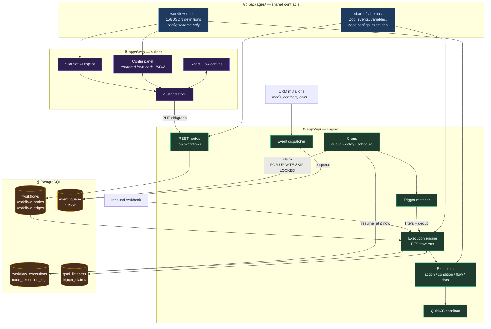
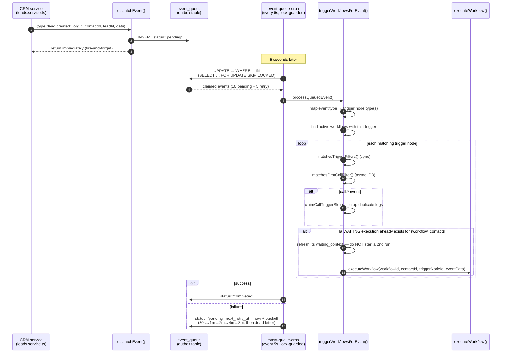

# 01 — Architecture

## 1.0 System map



## 1.1 Physical layout

SiloCRM is a pnpm + Turborepo monorepo. The workflow feature spans four workspaces.

```
packages/
  workflow-nodes/          ← node definition catalog (156 JSON + 4 TS)
    src/
      node-definition.ts   ← the NodeDefinition / NodeProperty TYPE contract
      registry/*.json      ← one file per node
      catalog.ts           ← explicit static imports, lookup fns, optionsFrom expansion
      active-nodes.ts      ← whitelist of shipped node types ("coming soon" gate)
      index.ts

  shared/src/schemas/      ← Zod source of truth for everything crossing the API
      workflow.ts                 (1387)  workflow + node + edge shapes
      workflow-events.ts          (1491)  CRM_EVENTS, EVENT_TO_TRIGGER_MAP, event payloads
      workflow-variables.ts       (4087)  WORKFLOW_VARIABLE_PATHS + variable generators
      workflow-node-configs.ts    (1239)  per-node config schemas
      workflow-actions.ts         (1253)  action node result shapes
      workflow-conditions.ts       (416)  condition/operator shapes
      workflow-execution.ts        (528)  execution + node-log shapes
      workflow-event-payloads.ts   (311)
      workflow-test-action.ts       (66)
      silopilot-workflow-*.ts             AI copilot context + validation

apps/api/src/
  lib/workflow/            ← ~34,700 lines, the engine
  lib/events/              ← dispatcher + event types re-export
  routes/workflow*.ts      ← REST surface
  services/                ← crons: event queue, delay resume, schedules, goal listeners
  prisma/schema/*.prisma   ← tables

apps/web/src/
  components/automation/   ← builder UI (~3,700 lines)
  lib/workflow/            ← Zustand store, hooks, node registry wrapper, validation, variables
  app/(in-app)/automation/ ← pages: list, create, [id] builder, [id]/replay, enrollments
  app/superadmin/automations/ ← agency builder, approvals inbox, audit log
```

**Why a separate `workflow-nodes` package:** the editor (Next.js) and the backend (tsx) both need
the exact same node config schemas. Putting the catalog in a workspace package with **no build
step** (raw TS + JSON) lets both import it directly. Before this package existed, the web registry
and the backend had drifting copies.

> ⚠️ **Vercel OOM trap, documented in `catalog.ts:3-6`.** The catalog uses ~120 *explicit static
> `import x from "./registry/y.json"`* lines rather than a glob / `import.meta.glob` /
> `require.context`. Wildcard imports caused an out-of-memory failure during Next.js "Collecting
> page data". If you port this, keep the imports explicit or verify your bundler handles the glob.

## 1.2 The two runtime paths

### Path A — Event-triggered (the normal case)



Textual form with file references:

```
CRM mutation (e.g. leads.service.ts creates a lead)
   │
   ├─► dispatchEvent({ type:"lead.created", organizationId, contactId, leadId, data })
   │      apps/api/src/lib/events/event-dispatcher.ts:85
   │
   ├─► enqueueEvent()  →  INSERT roofsilo_event_queue (status='pending')
   │      apps/api/src/services/event-queue.service.ts:26
   │      ...returns immediately; the caller does NOT wait for workflows
   │
   ▼  (every 5 seconds, one replica only — advisory lock)
event-queue-cron.ts
   │
   ├─► claimPendingEvents(10)   UPDATE ... WHERE id IN (SELECT ... FOR UPDATE SKIP LOCKED)
   ├─► claimRetryEvents(5)
   │
   ▼
processQueuedEvent() → runEventSideEffects()          event-dispatcher.ts:30
   │
   ├─► triggerWorkflowsForEvent(event)   ← THE WORKFLOW ENTRY POINT
   ├─► checkGoalListenersForEvent(event) ← goal-exit for already-running executions
   └─► 6 other non-workflow side effects (auto-conversions, nurture bot, notifications…)
   │
   ▼
triggerWorkflowsForEvent()   lib/workflow/services/workflow-trigger.service.ts:230
   │
   ├─ event.type starts with "org." ? → triggerAgencyWorkflowsForEvent()  (agency scope)
   ├─ map event type → trigger node type(s)  (EVENT_TO_TRIGGER_MAP + aliases)
   ├─ findWorkflowsByTrigger(orgId, triggerTypes)   ← active, non-deleted workflows
   ├─ per workflow: find ALL matching trigger nodes (multi-trigger workflows supported)
   ├─ build eventData (per-event-type field mapping — ~400 lines of hand-mapping)
   ├─ per trigger node:
   │    ├─ matchesTriggerFilters(nodeConfig, event)      sync, no DB
   │    ├─ matchesFirstCallFilter(nodeConfig, event)     async, hits DB
   │    ├─ call.* → claimCallTriggerSlot()               idempotency (advisory lock)
   │    ├─ dedup: if a WAITING execution already exists for (workflow, contact),
   │    │         REFRESH its context instead of starting a second run
   │    └─ executeWorkflow(workflowId, contactId, triggerNodeId, eventData)
   ▼
```

### Path B — Direct invocation

Bypasses the event queue entirely:

| Entry | Route / caller |
|---|---|
| Inbound webhook | `POST /api/webhooks/workflow/:workflowId/:path` → `executeWorkflow()` |
| Manual test run | `POST /api/workflows/:id/test` |
| Manual execute | `POST /api/workflows/:id/execute` |
| Bulk execute | `POST /api/workflows/:id/bulk-execute` |
| Run from node (replay) | `POST /api/workflows/:id/executions/:executionId/run-from-node` |
| Sub-workflow | `workflow.add` node → `executeWorkflow(..., { depth, parentContext })` |
| Delay resume | `workflow-delay-resume-cron.ts` → `resumeWorkflowExecution()` |
| Scheduled triggers | `schedule-cron.ts` → `dispatchEvent()` (rejoins Path A) |
| Appointment reminders | `appointment-reminder-cron.ts` → `dispatchEvent()` |

## 1.3 Inside the engine

```
lib/workflow/
├── engine/
│   ├── executionEngine.ts   1718  executeWorkflow / resumeWorkflowExecution /
│   │                              executeAgencyWorkflow / loadExecutionContext /
│   │                              global timeout / failure notification
│   ├── traverser.ts          923  BFS walk, edge routing, loops, goto, merge readiness
│   ├── nodeExecutor.ts       493  dispatch by node type → executor; writes node log
│   ├── contextRefresh.ts     753  re-hydrate context after mutating nodes
│   └── agency-context.ts     198  hydrate org/actor/agency namespaces for agency runs
│
├── executors/                     ← behaviour, one module per domain
│   ├── triggerExecutor.ts     61  (trigger nodes are near-no-ops at runtime)
│   ├── actionExecutor.ts     314  router → actions/*
│   ├── actions/                   messaging, lead, contact, appointment, calendar,
│   │                              task/note, dnd, slack, openai, googleSheets,
│   │                              googleAds, googleAnalytics, metaConversion,
│   │                              metaConversation, notification, assignAgent,
│   │                              removeFromAi, webhookSaveToContact, webhookSaveFiles,
│   │                              goalEvent, utility
│   ├── conditionExecutor.ts  713  IF/ELSEIF/ELSE, switch, 30+ operators
│   ├── flowExecutor.ts      1150  split, code, loop, switch, filter, errorHandler,
│   │                              workflow.add / workflow.remove, goal.event, goto
│   ├── dataExecutor.ts        76  router → data/*
│   ├── data/                      transform, math, setFields, aggregate, removeDuplicates, code
│   └── agency/                    org mutations, approval gate, audited write, cross-org
│
├── sandbox/                       QuickJS-based JS sandbox for code nodes
│   ├── SandboxFactory.ts     157
│   ├── QuickJSSandbox.ts     377
│   ├── CodeSandbox.ts        429
│   └── SandboxContext.ts      67
│
├── security/
│   ├── UrlValidator.ts            SSRF guard (blocks private/link-local/metadata IPs)
│   ├── HttpClient.ts              SecureHttpClient wrapping the validator
│   └── OutputEncoder.ts           html/url/js/json/sql encoding for interpolation
│
├── services/                      CRUD, node/edge services, trigger matching,
│                                  trigger claims, webhook URLs, run-from-node,
│                                  execution remap, agency trigger filters
├── variables/                     variable service + trigger-scoped variable lists
├── utils/                         interpolation, logger, rate limiter, timeout manager,
│                                  dynamic user resolver, context resolver
└── mappers/                       snake_case DB row ↔ camelCase domain object
```

## 1.4 Layering rules the codebase follows

1. **A node definition never contains behaviour.** JSON declares fields; a TS executor implements
   the action. The link is the `node` string (e.g. `"sms.send"`).
2. **Executors never touch HTTP.** They take `(node, context)` and return a plain output object.
3. **The traverser never knows what a node does.** It only knows: run it, read its output, decide
   which outgoing edges to follow.
4. **The engine never talks to the DB directly for entity data.** `loadExecutionContext()` hydrates
   contact/lead/user/org once; `refreshContextAfterNode()` re-reads after mutating nodes.
5. **Everything crossing the API boundary is a Zod schema in `packages/shared`.** OpenAPI and TS
   types are generated from it; hand-written response types are banned.

## 1.5 What to keep, what to restructure

**Keep as-is:**
- The `workflow-nodes` package shape (JSON registry + type contract + active-node whitelist).
- The normalized node/edge tables with a JSON `node_config`.
- The transactional-outbox event queue.
- Durable delay pause/resume via serialized context.
- The executor-per-domain split.

**Restructure when porting** (see [`10-audit-findings.md`](10-audit-findings.md) for the full case):
- **Trigger filters.** SiloCRM's `matchesTriggerFilters()` is a 3,146-line file hand-coding filters
  per event family. Replace with a declarative filter spec on the node definition (`{ field,
  operator, source }`) evaluated by one generic matcher.
- **Event payloads.** `CRMEvent.data` is effectively `unknown`, so producers and consumers have
  drifted (documented incident: the Goal Event node was dead in production because one producer
  emitted `pipeline_stage_id` and the consumer read `stageId`). Type each event payload with a Zod
  schema and give each event exactly one producer helper.
- **The eventData mapping block.** ~400 lines of `if (event.type === X) eventData.y = data.z` in
  the trigger service. This belongs in the per-event Zod schema.
- **The variable map.** `interpolateVariables()` hand-writes ~700 `"path": context.x?.y` entries
  that must stay in sync with `WORKFLOW_VARIABLE_PATHS` by convention. Generate one from the other.
