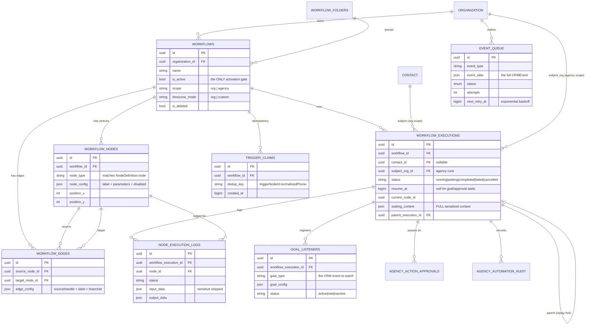

# 02 — Data Model

All tables are PostgreSQL, managed by Prisma (multi-file schema in `apps/api/prisma/schema/`).
The `roofsilo_` prefix is a legacy artifact of the product's original name — **drop it when
porting**, it carries no meaning.

Repo-wide conventions visible in these tables:
- `id uuid DEFAULT uuid_generate_v4()`
- Timestamps are **BigInt epoch-milliseconds**, not `timestamptz`. `_created_time` / `_updated_time`
  are DB-defaulted; domain timestamps (`created_at`, `started_at`, `resume_at`) are set by the app.
- Soft delete: `is_deleted boolean`, `deleted_at`, `deleted_by`, `deletion_reason`.
- `convex_*` columns are dead migration residue from a prior Convex backend. **Do not port them.**

## 2.0 Entity relationships



## 2.1 Table map

| Table | Purpose | File |
|---|---|---|
| `roofsilo_workflows` | The workflow record | `misc.prisma:159` |
| `roofsilo_workflow_nodes` | Graph vertices | `automations.prisma:284` |
| `roofsilo_workflow_edges` | Graph edges | `automations.prisma:194` |
| `roofsilo_workflow_executions` | One run | `automations.prisma:218` |
| `roofsilo_node_execution_logs` | One node within a run | `automations.prisma:119` |
| `roofsilo_workflow_goal_listeners` | Active goal-exit watches | `workflow-goals.prisma` |
| `roofsilo_workflow_trigger_claims` | Call-trigger idempotency | `automations.prisma:270` |
| `roofsilo_event_queue` | Transactional outbox | `event-queue.prisma` |
| `roofsilo_workflow_folders` | Folder organization | (migration `20260202000000`) |
| `roofsilo_workflow_templates` | Reusable workflow blueprints | `automations.prisma:308` |
| `roofsilo_stage_automations` | Pipeline-stage automation config | `automations.prisma:148` |
| `roofsilo_agency_automation_audit` | Agency cross-org write audit | `automations.prisma:332` |
| `roofsilo_agency_action_approvals` | Agency approval gate | `automations.prisma:356` |
| `roofsilo_automation_*` (4 tables) | **Legacy pre-graph engine** — see §2.10 | `automations.prisma:1-117` |

## 2.2 `workflows`

```prisma
model roofsilo_workflows {
  id               String   @id @default(uuid)
  organization_id  String   @db.Uuid          // tenant
  name             String   @db.VarChar(255)
  description      String?
  is_active        Boolean  @default(true)    // the on/off switch
  folder_id        String?  @db.Uuid
  created_by       String?  @db.Uuid
  created_at       BigInt
  updated_at       BigInt

  timezone         String?  @db.VarChar(100)  // IANA, when timezone_mode='custom'
  timezone_mode    String   @default("org")   // 'org' | 'custom'

  /// 'org'    = a tenant's own CRM workflow (every existing row)
  /// 'agency' = super-admin, organization-subject automation on the sentinel org
  scope            String   @default("org") @db.VarChar(20)

  // soft delete: deleted_at, deleted_by, deletion_reason, is_deleted

  @@index([organization_id, is_deleted])
  @@index([scope, organization_id, is_deleted])
  @@index([folder_id, is_deleted])
  @@index([is_deleted, deleted_at])            // trash purge cron
}
```

**Port notes**
- `is_active` is the *only* activation gate. There is no draft/published versioning — editing a live
  workflow changes it for in-flight runs on the next node load. **Consider adding versioning**; see
  [`10-audit-findings.md`](10-audit-findings.md) §F-06.
- `timezone_mode` matters: schedule triggers and date formatting resolve to the workflow's timezone,
  falling back to the org's. Getting this wrong produces off-by-one-day bugs.
- `scope` is what lets one engine serve two products. If you don't have an agency tier, drop it —
  but note that adding it later is a migration on every query.

## 2.3 `workflow_nodes` and `workflow_edges`

```prisma
model roofsilo_workflow_nodes {
  id           String @id @default(uuid)
  workflow_id  String @db.Uuid
  node_type    String @db.VarChar(100)   // e.g. "sms.send" — matches NodeDefinition.node
  node_config  Json                      // { label, parameters: {...}, disabled? }
  position_x   Int
  position_y   Int
  // soft delete
  @@index([workflow_id, is_deleted])
}

model roofsilo_workflow_edges {
  id             String @id @default(uuid)
  workflow_id    String @db.Uuid
  source_node_id String @db.Uuid
  target_node_id String @db.Uuid
  edge_config    Json?                    // { sourceHandle, label, branchId, condition }
  // soft delete
  @@index([workflow_id, is_deleted])
}
```

### The `node_config` shape

Built by `apps/web/src/lib/workflow/nodes/build-node.ts` — the single constructor used by both the
palette drag-and-drop and the AI copilot:

```jsonc
{
  "label": "Send SMS",              // user-editable display name
  "parameters": {                    // keys = NodeProperty.name from the definition
    "recipient": "customer",
    "message": "Hi {{contact.first_name}}, ..."
  },
  "disabled": false                  // optional; skips the node at runtime
}
```

Defaults are seeded from `definition.properties[].default` at creation time. **Three node types get
extra seeding** (`split.branch`, `condition.if`, `logic.switch`) because their branch/route arrays
must exist before the UI can render them.

### The `edge_config` shape and branch routing

`edge_config.sourceHandle` is how a multi-output node routes. `shouldFollowEdge()`
(`traverser.ts:792`) reads the executed node's output and the edge's handle to decide. Examples:

| Node | Handles |
|---|---|
| `condition.if` | one handle per branch id (`branch-if`, `branch-else-if-1`, `branch-else`) |
| `logic.loop` | `"Done"`, `"Each"` |
| `contact.lookup`, `lead.lookup`, `lead.find` | `"Found"`, `"Not Found"` |
| `condition.contact.hasLead` | `"Has Lead"`, `"No Lead"` |
| `logic.errorHandler` | `"Success"`, `"Error"` |
| `data.removeDuplicates` | `"Unique"`, `"Duplicates"` |
| `contact.query` | `"Found"`, `"No Results"` |

**Port note:** `outputLabels` on the node definition is what the editor renders on the handle, and
the label string is what ends up in `sourceHandle`. That couples display text to routing logic — a
label rename silently breaks routing. **Use a stable handle id and a separate display label.**

## 2.4 `workflow_executions`

```prisma
model roofsilo_workflow_executions {
  id                  String  @id @default(uuid)
  workflow_id         String  @db.Uuid
  contact_id          String? @db.Uuid    // null for webhook/schedule runs
  subject_org_id      String? @db.Uuid    // agency runs: the org acted upon
  status              String  @db.VarChar(50)  // running|completed|failed|waiting|cancelled
  started_at          BigInt
  completed_at        BigInt?
  error_message       String?
  execution_data      Json?               // final nodeOutputs snapshot

  // durable pause/resume
  resume_at           BigInt?             // null for goal/approval waits
  current_node_id     String? @db.Uuid
  waiting_context     Json?               // FULL serialized ExecutionContext

  parent_execution_id String? @db.Uuid    // "run from node" replay fork

  @@index([workflow_id, is_deleted])
  @@index([status, resume_at])            // the delay-resume cron query
  @@index([parent_execution_id])
  @@index([subject_org_id])
}
```

**`waiting_context` is the crux of durable delays.** On pause the engine serializes the entire
execution context (contact, lead, org, variables, nodeOutputs, loop state) into this column. A
resume rebuilds from it rather than re-deriving. Two consequences to plan for:

1. **It can get large.** Every node's output accumulates in `nodeOutputs`. A loop over 500 items
   with an HTTP node inside will store 500 response bodies. There is no size cap in the code read.
   ⚠️ **UNVERIFIED**: whether any production row has hit a practical limit.
2. **It is a point-in-time snapshot.** Data that changed during a 7-day delay is stale on resume
   unless the node re-reads it. `contextRefresh.ts` mitigates this for mutating nodes, and the
   trigger service refreshes `waiting_context` when a *new* event arrives for the same
   (workflow, contact) — that's the dedup branch at `workflow-trigger.service.ts:746`.

**Status semantics**

| Status | Meaning | Who moves it next |
|---|---|---|
| `running` | Actively traversing | the engine |
| `waiting` + `resume_at` set | Delay pause | `workflow-delay-resume-cron` (every minute) |
| `waiting` + `resume_at` null | Goal or approval wait | goal listener on a matching event, or a super-admin approval |
| `completed` | Finished, or exited early via goal | terminal |
| `failed` | Crash, timeout, or an error-stop node | terminal |
| `cancelled` | Stopped deliberately (e.g. contact removed from workflow) | terminal |

All status transitions out of `running` use `updateMany({ where: { id, status:"running" } })` —
a compare-and-set that prevents a race between a delay pause and a concurrent goal exit
(`executionEngine.ts:448, 487, 527`). **Copy this pattern.**

## 2.5 `node_execution_logs`

```prisma
model roofsilo_node_execution_logs {
  id                     String  @id @default(uuid)
  workflow_execution_id  String  @db.Uuid
  node_id                String  @db.Uuid
  status                 String  @db.VarChar(50)   // completed|failed|waiting|skipped
  started_at             BigInt
  completed_at           BigInt?
  input_data             Json?     // { context: <sensitive fields stripped> }
  output_data            Json?
  error_message          String?

  // Denormalized so operators can query failures without 3 joins
  organization_id        String?
  workflow_id            String?
  workflow_name          String?
  node_label             String?
  node_type              String?

  @@index([organization_id, status])
  @@index([workflow_id, status])
}
```

This table powers the execution-replay UI. `stripSensitiveData()` (`nodeExecutor.ts:478`) removes
sensitive fields from the context before storing.

**Port note:** this table grows fastest of anything in the system — one row per node per run. Plan
retention (a TTL cron) from day one. SiloCRM has a `trash-cron.ts` but ⚠️ **UNVERIFIED** whether it
prunes node logs.

## 2.6 `event_queue` (transactional outbox)

```prisma
model roofsilo_event_queue {
  id                   String @id @default(uuid)
  organization_id      String @db.Uuid
  event_type           String @db.VarChar(100)   // "lead.created"
  event_data           Json                       // the full CRMEvent
  status               EventQueueStatus @default(pending)
  attempts             Int    @default(0)
  max_attempts         Int    @default(5)
  last_error           String?
  scheduled_at         BigInt                     // supports delayed events
  processed_at         BigInt?
  next_retry_at        BigInt?                    // exponential backoff
  source_entity_type   String?                    // "contact" | "lead"
  source_entity_id     String?  @db.Uuid
  triggered_by_user_id String?  @db.Uuid

  @@index([status, scheduled_at])     // main claim query
  @@index([status, next_retry_at])    // retry claim query
  @@index([organization_id, status])
  @@index([event_type, status])
  @@index([source_entity_id])
}

enum EventQueueStatus { pending processing completed failed cancelled }
```

Backoff: `min(30s * 2^(attempts-1), 8min)` → 30s, 1m, 2m, 4m, 8m, then dead-letter
(`event-queue.service.ts:168`).

## 2.7 `workflow_goal_listeners`

```prisma
model roofsilo_workflow_goal_listeners {
  id                    String @id @default(uuid)
  organization_id       String @db.Uuid
  workflow_id           String @db.Uuid
  workflow_execution_id String @db.Uuid
  node_id               String @db.Uuid
  contact_id            String @db.Uuid
  goal_type             String @db.VarChar(100)   // the CRM event type to watch
  goal_config           Json   @default("{}")     // extra match filters
  status                String @default("active") // active | met | inactive
  met_at                BigInt?

  @@index([organization_id, contact_id, goal_type, status])
  @@index([workflow_execution_id, status])
}
```

Semantics, quoted from the schema comment: *"When a CRM event matches a listener, the execution is
completed (goal exit) — the contact leaves the workflow from wherever they are. It is **not**
redirected to the goal node, and the goal node's downstream branch does not run."*

That's a meaningful product decision. A GHL-style "goal" usually *jumps* to the goal branch;
SiloCRM's exits outright. Decide deliberately which you want.

## 2.8 `workflow_trigger_claims` (idempotency)

```prisma
model roofsilo_workflow_trigger_claims {
  id                 String  @id @default(uuid)
  workflow_id        String  @db.Uuid
  dedup_key          String  @db.VarChar(255)   // "${triggerNodeId}:${normalizedPhone||contactId}"
  trigger_event_type String? @db.VarChar(100)
  created_at         BigInt
  @@index([workflow_id, dedup_key, created_at])
  @@index([created_at])
}
```

Born from a real production bug (schema comment, `automations.prisma:258-269`): a tracking number
forwards to the business number, producing **two inbound call legs** with different CallSids, each
firing `call.*` events that land in the same queue batch and race the workflow's own "does a lead
already exist?" condition → duplicate leads and duplicate notifications.

The fix: claim a `(workflow, triggerNode, caller)` slot under a pg advisory lock; later legs are
dropped within the window. Rows are disposable and pruned by the delay-resume cron.

**Port note:** if your CRM has any many-legs-one-event transport (call forwarding, webhook retries,
dual-write integrations) you will need this. Build it in P2, not as a hotfix.

## 2.9 Agency tables

- **`agency_automation_audit`** — one row per attempted cross-org write, with `before`/`after` JSON
  snapshots and `status ok|noop|error`. Global infrastructure, written via `withoutRLS`.
- **`agency_action_approvals`** — a `pending` row pauses the execution (`status='waiting'`,
  `resume_at` null); a super-admin approves/rejects from an inbox and the run resumes or aborts.
  `expires_at` + a reaper prevent a never-decided approval stranding a run forever.

## 2.10 Legacy tables — do not port

`automations.prisma:1-117` contains four tables from a **superseded, pre-graph automation engine**:

| Table | Note |
|---|---|
| `roofsilo_automation_actions` | ordered `actiontype`/`actionconfig` list — a linear rule engine |
| `roofsilo_automation_execution_logs` | its execution log (strings, not JSON) |
| `roofsilo_automation_message_logs` | message log; still referenced by messaging code |
| `roofsilo_automation_rate_limits` | per-(automation, contact) execution window |

They coexist with the graph engine in the same schema file, which is confusing. The graph engine
uses `workflow_*` tables exclusively. ⚠️ **UNVERIFIED**: whether the legacy tables still have live
writers — `automation_message_logs` appears to, the other three appear vestigial. Do not carry
them into a new build.

## 2.11 Recommended schema for a port

Same shape, cleaned up:

```sql
workflows(id, org_id, name, description, is_active, folder_id,
          timezone, timezone_mode, version, published_at,     -- ← add versioning
          created_by, created_at, updated_at, deleted_at)

workflow_nodes(id, workflow_id, node_type, node_config jsonb,
               position_x, position_y, deleted_at)

workflow_edges(id, workflow_id, source_node_id, source_handle,  -- ← promote handle to a column
               target_node_id, edge_config jsonb, deleted_at)

workflow_executions(id, workflow_id, workflow_version,          -- ← pin the version that ran
                    subject_type, subject_id,                   -- ← generalize contact_id
                    status, started_at, completed_at, error_message,
                    resume_at, current_node_id, waiting_context jsonb,
                    parent_execution_id, idempotency_key)       -- ← first-class

node_execution_logs(...)  -- + a retention policy from day one
event_queue(...)          -- as-is, it's good
goal_listeners(...)
```

Four deliberate changes from SiloCRM:
1. **`source_handle` as a column, not inside `edge_config`** — it's routing logic, it should be
   queryable and indexable.
2. **Workflow versioning** — `workflow_version` on both the workflow and the execution, so an
   in-flight run finishes on the graph it started with.
3. **`subject_type`/`subject_id` instead of `contact_id`** — SiloCRM needed a second nullable
   `subject_org_id` column the moment it added agency workflows. Generalize once.
4. **`idempotency_key` on executions** — makes the trigger-claim table unnecessary; a unique index
   does the same job with less machinery.
