# 03 — Node Catalog

156 node definitions live in `packages/workflow-nodes/src/registry/*.json`. 155 are in the active
whitelist (`active-nodes.ts`); `trigger.form.submitted` exists but is gated off as "coming soon".
`note.add` appears in the whitelist as a **legacy alias** with no registry file.

Machine-readable dump: [`node-catalog.tsv`](node-catalog.tsv) (node_type, display name, category,
subcategory, scope, output count, output labels, property count, description).

## 3.0 Catalog at a glance

```mermaid
graph TB
    ROOT["156 node definitions"]

    ROOT --> TRIG["<b>trigger</b> · 62 nodes"]
    ROOT --> COMM["<b>communication</b> · 5"]
    ROOT --> CRM["<b>crm</b> · 31"]
    ROOT --> LOGIC["<b>logic</b> · 13"]
    ROOT --> DATA["<b>data</b> · 6"]
    ROOT --> INTEG["<b>integration</b> · 8"]
    ROOT --> AGENCY["<b>agency</b> · 29 actions"]

    TRIG --> T1["lead · 6"]
    TRIG --> T2["contact · 6"]
    TRIG --> T3["communication · 8"]
    TRIG --> T4["booking/appointment · 6"]
    TRIG --> T5["task · 3"]
    TRIG --> T6["system · 6"]
    TRIG --> T7["integration · 2"]
    TRIG --> T8["org lifecycle/billing/<br/>provisioning · 27 (agency)"]

    CRM --> C1["lead actions · 6"]
    CRM --> C2["contact actions · 6"]
    CRM --> C3["tags · 2"]
    CRM --> C4["tasks & notes · 5"]
    CRM --> C5["appointments · 4"]
    CRM --> C6["assignment/AI/DND · 6"]
    CRM --> C7["webhook capture · 2"]

    LOGIC --> L1["branching<br/>if · switch · split · merge"]
    LOGIC --> L2["flow control<br/>delay · loop · goto · stop<br/>filter · errorHandler · goal"]
    LOGIC --> L3["sub-workflow<br/>workflow.add · workflow.remove"]

    classDef trig fill:#0d3d2a,stroke:#10B981,color:#e8faf0
    classDef comm fill:#1e1f4f,stroke:#4F46E5,color:#e8eafa
    classDef crm fill:#4a3410,stroke:#F59E0B,color:#faf2e0
    classDef logic fill:#2d1f4f,stroke:#8B5CF6,color:#f0e8fa
    classDef data fill:#4a1633,stroke:#EC4899,color:#fae8f2
    classDef integ fill:#0d3b45,stroke:#06B6D4,color:#e0f7fa
    classDef agency fill:#252a5c,stroke:#6366F1,color:#e8eafa
    class TRIG,T1,T2,T3,T4,T5,T6,T7,T8 trig
    class COMM comm
    class CRM,C1,C2,C3,C4,C5,C6,C7 crm
    class LOGIC,L1,L2,L3 logic
    class DATA data
    class INTEG integ
    class AGENCY agency
```



## 3.1 The node definition contract

`packages/workflow-nodes/src/node-definition.ts` — this is the interface worth copying verbatim.

> **This is n8n's `INodeTypeDescription`, lightly renamed.** If you've written an n8n custom node,
> this will look immediately familiar: same `displayName` / `name` / `icon` / `properties[]`
> structure, same `displayOptions.show` / `.hide` conditional-field mechanism, same `typeOptions`
> bag, same `inputs` / `outputs` arrays. SiloCRM adds four CRM-specific fields — `category` /
> `subcategory` (palette grouping), `optionsFrom` (shared value lists), and `scope` (which builder
> a node belongs to) — and drops n8n's credentials and `webhooks` declarations.
>
> **Port implication:** you can read n8n's node-development docs as supplementary material for this
> contract, and n8n's own node JSON as worked examples of how to express a complex config form
> declaratively.

```ts
interface NodeDefinition {
  node: string;              // UNIQUE, IMMUTABLE id — "sms.send". Persisted on every saved node.
  version: number;
  displayName: string;       // "Send SMS"
  name: string;              // camelCase — "smsSend"
  icon: string;              // icon name, e.g. "Smartphone"
  iconLibrary: "lucide-react" | "hugeicons-react" | "custom";
  color: string;             // hex, drives node chrome
  category: string;          // trigger|communication|crm|logic|data|integration|agency
  subcategory?: string;      // palette grouping within a category
  description: string;       // shown in palette + config panel
  defaults: { name: string };
  inputs: string[];          // usually ["main"]
  outputs: string[];         // ["main"], or 2 for branching nodes
  outputLabels?: string[];   // ["Found","Not Found"] — rendered on handles
  properties: NodeProperty[];// THE CONFIG FORM SCHEMA
  tags?: ("dev"|"deprecated"|"beta"|"new")[];
  devOnly?: boolean;
  scope?: "org" | "agency" | "both";   // absent = "org"
}

interface NodeProperty {
  displayName: string;
  name: string;              // the key written into node_config.parameters
  type: NodePropertyType;    // see below
  required?: boolean;
  default?: any;
  placeholder?: string;
  description?: string;
  hint?: string;
  options?: { name: string; value: string|number; description?: string }[];
  optionsFrom?: "leadSources" | "contactSources";   // pull options from a shared TS constant
  typeOptions?: { rows?, minValue?, maxValue?, step?, keyPlaceholder?, valuePlaceholder?,
                  addButtonText?, noticeType?, noticeMessage? };
  displayOptions?: { show?: Record<string, any[]>; hide?: Record<string, any[]> };  // conditional
}
```

### The 26 property types

These are what the config panel knows how to render. **This list is the real API surface of the
builder** — every new field type is UI work.

| Group | Types |
|---|---|
| Primitives | `string`, `number`, `boolean`, `json`, `dateTime`, `time`, `color`, `file` |
| Choice | `options` (single select), `multiOptions` (multi select) |
| Lists | `emailList`, `phoneList`, `keyValue`, `customFieldList`, `contactFieldUpdateList` |
| CRM pickers | `userSelect`, `agentSelect`, `tagSelect`, `multiTagSelect`, `multiTaskTagSelect`, `pipelineSelect`, `stageSelect`, `customFieldSelect`, `workflowSelect` |
| Integration pickers | `conversionActionSelect`, `accountSelect` |
| Display-only | `notice` (renders an info/warn/error callout, no value) |
| Hybrid | `stringWithSuggestions` (free text + autocomplete) |

**Port advice:** the first 10 (primitives + choice + a couple of lists) cover ~70% of nodes. The
CRM pickers are what make the builder feel native — a "Pipeline" dropdown that actually lists the
tenant's pipelines. Budget them; they're the difference between a generic automation tool and a
CRM-native one.

### `displayOptions` — conditional fields

```jsonc
{
  "displayName": "Phone Number", "name": "phoneNumber", "type": "string",
  "displayOptions": { "show": { "recipient": ["custom"] } }
}
```
Shows this field only when the sibling `recipient` parameter equals `"custom"`. Directly lifted
from n8n. Essential — without it, `email.send` (19 properties) and `trigger.webhook`
(19 properties) would be unusable forms.

### `optionsFrom` — the anti-drift mechanism

Registry files are JSON and can't import a TS constant, so a shared value list would have to be
copy-pasted into every node offering it — and those copies drift. `catalog.ts:409` expands
`"optionsFrom": "leadSources"` at module load from the canonical `LEAD_SOURCES` array.

The comment records why: *"the lead-source picker kept offering 'Phone Call' long after
LEGACY_LEAD_SOURCES retired it, which is how ~7.6k leads ended up stamped with a channel label
instead of a real source."* **Copy this mechanism.**

### `active-nodes.ts` — the "coming soon" gate

A flat whitelist of node-type strings. `getActiveNodeDefinitions({ scope })` filters to
`ACTIVE_NODE_SET ∩ !devOnly ∩ scope-compatible`. Lets you land a node definition + editor UI ahead
of its executor without the palette offering a broken node — and it's the same list the AI copilot
reads, so it can never suggest a node that doesn't work.

## 3.2 Categories

| id | Name | Color | Contains |
|---|---|---|---|
| `trigger` | Triggers | `#10B981` | 62 nodes |
| `communication` | Communication | `#4F46E5` | 5 |
| `crm` | CRM Actions | `#F59E0B` | 31 |
| `logic` | Logic & Flow | `#8B5CF6` | 13 |
| `data` | Data Processing | `#EC4899` | 6 |
| `integration` | Integrations | `#06B6D4` | 8 |
| `agency` | Agency (super-admin) | `#6366F1` | 29 actions + 27 triggers |

Subcategories (`registry/subcategories.json`) add a second grouping level with explicit `order`,
e.g. triggers split into Lead / Contact / Integration / Booking / Task / Communication / System.

---

## 3.3 TRIGGERS (org scope) — 35 nodes

Triggers are near-no-ops at execution time (`triggerExecutor.ts` is 61 lines). Their `properties`
are **filters**, evaluated *before* the run starts by `matchesTriggerFilters()`.

### Lead

| node_type | Display | Filters available |
|---|---|---|
| `trigger.lead.created` | Lead Created | pipeline, stage, assigned user, min score, min value, source |
| `trigger.lead.updated` | Lead Updated | + `watchFields[]` (only fire when specific fields change) |
| `trigger.lead.statusChanged` | Lead Status Changed | fromStage, toStage, pipeline |
| `trigger.lead.assigned` | Lead Assigned | assigned user, pipeline, stage |
| `trigger.lead.score.threshold` | Lead Score Threshold | threshold value, direction (up/down) |
| `trigger.lead.noteAdded` | Lead Note Added | |

### Contact

| node_type | Display | Notes |
|---|---|---|
| `trigger.contact.created` | Contact Created | source filter |
| `trigger.contact.updated` | Contact Updated | source, status, tags, assigned user, watchFields |
| `trigger.contact.tag` | Contact Tag Changed | action (added/removed), tagIds[], source |
| `trigger.contact.dnd` | Contact DND Changed | action, channel (email/sms/call), tags |
| `trigger.contact.noteAdded` | Contact Note Added | |
| `trigger.customfield.changed` | Custom Field Changed | which field, lead or contact |

### Communication

| node_type | Display | Notes |
|---|---|---|
| `trigger.sms.received` | SMS Received | |
| `trigger.sms.keyword` | SMS Keyword Detected | keyword list + auto intent classification |
| `trigger.email.received` | Email Received | from domain, subject match |
| `trigger.customer.replied` | Customer Replied | **multi-channel** — SMS, email, or Facebook |
| `trigger.call.incoming` | Incoming Call | `firstCallFilter`: all / first-time only / repeat only |
| `trigger.call.outbound` | Outbound Call Made | |
| `trigger.call.status` | Call Status Changed | |
| `trigger.call.missed` | Missed Call | |

> `trigger.sms.keyword` ships a built-in intent classifier (`detectMessageIntent`,
> `workflow-trigger.service.ts:180`) — keyword lists for appointment / question / confirmation /
> negative / positive, evaluated in that priority order, with a special case so "no thanks" reads
> as negative rather than a confirmation. Cheap, deterministic, no LLM. Worth copying.

> `trigger.call.incoming`'s `firstCallFilter` has a subtle default documented at
> `workflow-trigger.service.ts:986`: **a missing value means "first", not "all"**, because the
> editor shows "First-time callers only" pre-selected but only persists it if the user touches the
> dropdown. The runtime default must match the UI default or the workflow fires on every call.
> **This is a general trap — make your editor persist defaults on node creation instead.**

### Booking & appointments

`trigger.appointment.booked`, `trigger.appointment.status`, `trigger.appointment.reminder`
(fires N minutes before, driven by a cron), `trigger.booking.created`, `trigger.booking.cancelled`,
`trigger.booking.rescheduled`.

Two families coexist (`appointment.*` and `booking.*`) — a historical split, not a design.

### Task

`trigger.task.added`, `trigger.task.completed`, `trigger.task.overdue` (cron-driven).
Filters: task type, priority, assignee (me / others / unassigned).

### System & integration

| node_type | Display | Notes |
|---|---|---|
| `trigger.webhook` | Webhook | 19 props: path, method, auth (none/secret/basic/hmac), content-type, response code/body, rate limit, idempotency, async, field mapping |
| `trigger.webhook.raw` | Webhook (Raw Passthrough) | no field mapping — whole payload at `{{webhook.body.*}}` |
| `trigger.schedule.daily` | Daily Trigger | time + timezone |
| `trigger.schedule.hourly` | Hourly Trigger | every N hours |
| `trigger.schedule.inactivity` | Inactivity Trigger | after N days of no activity; `once_only` mode |
| `trigger.manual` | Manual Trigger | for testing / one-off runs |
| `trigger.facebook.lead_received` | Facebook Lead Form Received | form/page filters; flattens FB fields |
| `trigger.facebook.message_received` | Facebook Message Received | |
| `trigger.form.submitted` | Form Submitted | **coming soon — not in the active whitelist** |

---

## 3.4 COMMUNICATION — 5 nodes

| node_type | Display | Props | What it does |
|---|---|---|---|
| `sms.send` | Send SMS | 13 | Recipient = contact/lead phone, assigned user, lead owner, contact owner, or custom. From = default business number or custom. Optional template. |
| `email.send` | Send Email | 19 | To/cc/bcc, subject, HTML or template, attachments, reply-to, tracking |
| `notification.internal` | Internal Notification | 9 | In-app notification to team members |
| `integration.slack` | Slack Message | 8 | Post to a channel |
| `integration.metaConversationApi` | Send Facebook Message | 6 | Messenger reply to a contact |

---

## 3.5 CRM ACTIONS — 31 nodes

### Lead

| node_type | Display | Outputs |
|---|---|---|
| `lead.create` | Create Lead | 1 |
| `lead.update` | Update Lead | 1 |
| `lead.statusUpdate` | Update Lead Status | 1 — moves pipeline stage |
| `lead.scoring` | Lead Scoring | 1 |
| `lead.lookup` | Lead Lookup | 2 — **Found / Not Found** |
| `lead.find` | Find Opportunity | 2 — Found / Not Found; scoped to the triggering contact |

### Contact

| node_type | Display | Outputs / notes |
|---|---|---|
| `contact.create` | Create Contact | 1 — 15 props, supports **upsert** by phone/email |
| `contact.update` | Update Contact | 1 — `contactFieldUpdateList` sets standard *and* custom fields in one node |
| `contact.delete` | Delete Contact | 1 |
| `contact.lookup` | Contact Lookup | 2 — Found / Not Found |
| `contact.query` | Query Contacts | 2 — Found / No Results; returns a **list** for batch processing (feeds a Loop) |
| `condition.contact.hasLead` | Contact Has Lead? | 2 — Has Lead / No Lead; filterable by pipeline/stage/status |

### Tags, tasks, notes, assignment, DND

`tag.add`, `tag.remove` (both work on contact *or* lead), `task.create`, `task.update`,
`task.delete`, `note.addToContact`, `note.addToLead`, `user.assign`, `agent.assign` (hand to an AI
agent or lead nurturer), `agent.unassign` (**stop all AI follow-up**: unassign agent, end nurture,
cancel queued follow-ups), `dnd.set`, `dnd.remove`.

### Appointments

`appointment.schedule` (17 props), `appointment.update`, `appointment.cancel`,
`create_calendar_event` (writes to a *specific connected calendar*, not the CRM's own).

> Note the inconsistent id: `create_calendar_event` uses snake_case while every other node uses
> dotted lowerCamel. It's immutable now because saved workflows reference it. **Enforce a naming
> convention with a lint rule from day one.**

### Webhook capture

`webhook.saveToContact` — looks up or creates a contact from the incoming webhook payload and saves
every body field as a contact custom field, **auto-creating field definitions that don't exist**.
`webhook.saveFiles` — persists files that arrived with the webhook (multipart or by URL) to the
contact's photos/documents or the org media library.

These two are unusually high-leverage: they turn "receive an arbitrary webhook" into "ingest it
into the CRM" without per-integration code.

---

## 3.6 LOGIC & FLOW — 13 nodes

| node_type | Display | Outputs | Behaviour |
|---|---|---|---|
| `condition.if` | If Condition | 1 handle per branch | IF / ELSE IF / ELSE, each with AND/OR condition groups |
| `logic.switch` | Switch | N routes | Route by field value; configurable fallback |
| `split.branch` | Split Branch | N | Unconditional fan-out to parallel branches |
| `logic.merge` | Merge | 1 | **AND-join** — waits for all incoming branches |
| `logic.loop` | Loop | 2 — Done / Each | Iterate a list; exposes `{{currentItem}}`, `{{currentIndex}}` |
| `logic.goto` | Go To | 0 | Jump to another node; `maxLoops` guard (default 10) |
| `logic.stop` | Stop | 0 | End the run with success / failed / cancelled |
| `logic.errorHandler` | Error Handler | 2 — Success / Error | Catch errors from upstream |
| `delay.wait` | Wait/Delay | 1 | 18 props: relative duration, absolute datetime, business-hours-aware |
| `filter.data` | Filter Data | 1 | Drop items not matching a condition |
| `goal.event` | Goal Event | 1 | Register a goal-exit listener (see §04) |
| `workflow.add` | Add to Workflow | 2 | Run a sub-workflow, with input/output variable mapping |
| `workflow.remove` | Remove From Workflow | 1 | Cancel the contact's runs of another workflow |

---

## 3.7 DATA — 6 nodes

| node_type | Display | Notes |
|---|---|---|
| `data.setFields` | Set Fields | Add/modify fields on the flowing data |
| `data.transform` | Transform Data | Map/pick/rename operations |
| `data.aggregate` | Aggregate | count, sum, average, min, max |
| `data.removeDuplicates` | Remove Duplicates | 2 outputs: Unique / Duplicates |
| `data.math` | Math Operation | arithmetic on values |
| `data.code` | Code Block | **arbitrary JavaScript in a QuickJS sandbox** |

---

## 3.8 INTEGRATION — 8 nodes

| node_type | Display | Notes |
|---|---|---|
| `http.request` | HTTP Request | 12 props; SSRF-guarded via `UrlValidator` |
| `webhook.send` | Send Webhook | 8 props; simplified HTTP POST |
| `integration.openai` | OpenAI | generate/analyze text |
| `integration.googleSheets` | Google Sheets | 13 props; read or append rows |
| `integration.metaConversionApi` | Meta Conversion API | server-side conversion events to Facebook |
| `integration.googleAdsConversion` | Google Ads Conversion | offline conversion upload for Smart Bidding |
| `integration.googleAnalyticsEvent` | GA4 Event | Measurement Protocol |
| `integration.metaConversationApi` | *(listed under communication)* | Messenger send |

The four ad-platform nodes are what make this a *marketing* CRM automation tool rather than a
generic one — closing the loop from "lead converted in CRM" back to "tell the ad platform".

---

## 3.9 AGENCY nodes — 56 (27 triggers + 29 actions)

`scope: "agency"`. Super-admin only. The **subject is an organization**, not a contact. They live on
a sentinel org, are built in a separate `/superadmin/automations` builder, and never appear in a
tenant's palette.

**Triggers** — org lifecycle (`created`/`archived`/`restored`, lifecycle stage & status changed),
assignment (CSM assigned/unassigned, member added), classification (category/department/tag/service
tier changed), scheduled (daily sweep, inactivity detected, no leads), provisioning (onboarding
started/completed, provisioning completed, website provisioned, A2P status changed), billing
(subscription created/canceled, payment failed, plan up/downgraded, trial ending, billing status
changed — **all seven billing triggers are inert until billing emits them**).

**Actions** — lifecycle (set stage/status, start onboarding), assignment (assign/unassign CSM),
classification (add/remove category/department/tag, set service tier), notifications (notify CSM,
notify team, Slack, email, SMS), tasks (create CSM task, internal note), provisioning (trigger
provisioning, deploy snapshot), high-impact (archive, suspend, set billing tier), cross-org (create
client lead), and AI/HTTP/sub-workflow (AI summarize, AI classify, HTTP request, call agency
workflow).

**Nine actions are approval-gated** (marked in their descriptions: *"Requires super-admin approval
unless run in simulate mode"*): `archive`, `suspend`, `setBillingTier`, `triggerProvisioning`,
`deploySnapshot`, `startOnboarding`, `createClientLead`. Hitting a gated action creates a `pending`
row and pauses the run; a super-admin decides from an inbox. See [`09`](09-security-and-multitenancy.md).

**Port decision:** only build the agency scope if you sell to agencies managing many tenants. It
roughly doubles the node count and adds an approval subsystem. But note the design lesson — SiloCRM
did it *without forking the engine*, by adding a `scope` discriminator to the node definition, the
workflow row, and the execution's subject. That's the right way.

---

## 3.10 Recommended MVP node set (~22 nodes)

If you're building this from scratch, ship these first. They cover the overwhelming majority of
real automations.

**Triggers (7):** record created, record updated (with watch-fields), stage/status changed, tag
added/removed, inbound message received, form/webhook received, scheduled.

**Actions (8):** send SMS, send email, internal notification, create/update record, add/remove tag,
assign user, create task, add note.

**Logic (6):** if/else, delay, loop, merge, stop, goto.

**Data/Integration (3):** HTTP request, set fields, code block.

Then add breadth by category, and add the CRM picker property types as you go.
