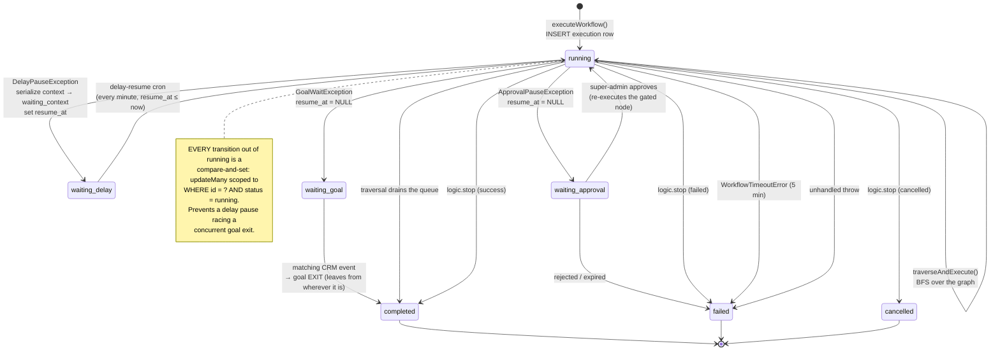
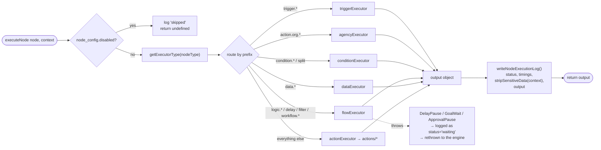
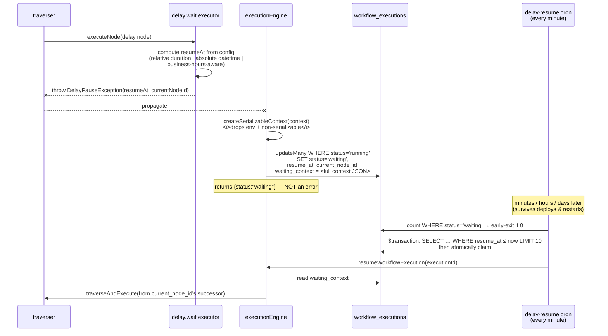
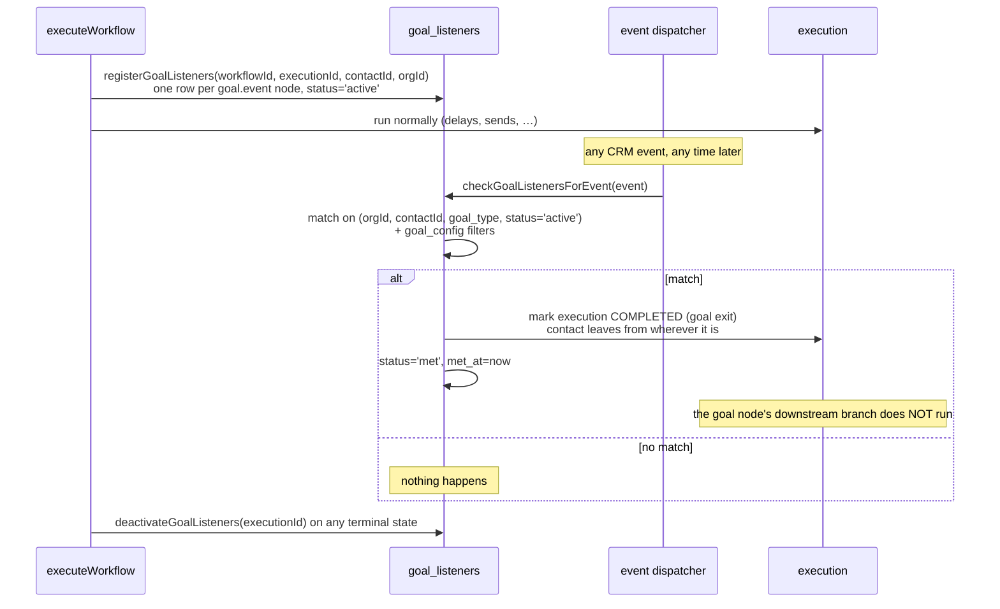

# 04 — Execution Engine

`apps/api/src/lib/workflow/engine/` — 3,382 lines across four modules.

| File | Lines | Responsibility |
|---|---|---|
| `executionEngine.ts` | 1,718 | Run lifecycle: create execution row, load context, timeout, pause/resume, failure handling |
| `traverser.ts` | 923 | BFS graph walk, edge routing, loops, goto, merge readiness |
| `nodeExecutor.ts` | 493 | Dispatch one node to its executor; write the node log |
| `contextRefresh.ts` | 753 | Re-hydrate context after a mutating node |
| `agency-context.ts` | 198 | Hydrate `org.*` / `actor.*` / `agency.*` for agency runs |

## 4.1 Execution lifecycle



### `executeWorkflow()` — `executionEngine.ts:339`

```ts
executeWorkflow(
  workflowId: string,
  contactId: string | null,        // null for webhook / schedule runs
  startNodeId: string,             // the trigger node that matched
  eventData?: Record<string, unknown>,
  options?: { depth?, parentContext?, subjectOrgId? }
): Promise<ExecutionResult>
```

Order of operations:

1. **Nesting guard** — `depth > MAX_WORKFLOW_NESTING_DEPTH (5)` throws. Prevents infinite
   sub-workflow recursion.
2. **Deleted-workflow guard** — refuses to run a soft-deleted workflow. Event triggers already
   filter `is_deleted`, but direct invocations (test run, run-from-node, re-run) don't, so it's
   checked explicitly here.
3. **Create the execution row** — `status='running'`, `subject_org_id` for agency runs.
4. **`loadExecutionContext()`** — hydrate contact, lead, user, organization, org custom values.
5. **Attribution** — set `context.workflowId` / `workflowName` so action executors can stamp
   "created by workflow X" on notes and messages.
6. **Merge parent context** for sub-workflow runs.
7. **`registerGoalListeners()`** — scan the graph for `goal.event` nodes and insert listener rows.
8. **`withTimeout(traverseAndExecute(...), MAX_EXECUTION_TIME)`** — global 5-minute wall clock.
9. **Terminal handling** — one branch per exception class (below).

### The five terminal paths

| Exception | Meaning | Result |
|---|---|---|
| *(none)* | Traversal drained the queue | `completed`, `execution_data = nodeOutputs` |
| `DelayPauseException` | Delay node paused | `waiting` + `resume_at` + `waiting_context` |
| `GoalWaitException` | Goal node registered a wait | `waiting`, `resume_at = null` |
| `ApprovalPauseException` | Agency approval gate hit | `waiting`, `resume_at = null` |
| `WorkflowStoppedError` | `logic.stop` node | `completed` / `failed` / `cancelled` per `stopType` |
| `WorkflowTimeoutError` | Exceeded 5 minutes | `failed`, partial `nodeOutputs` preserved |
| anything else | Crash | `failed`, **re-thrown** so a parent workflow can catch it |

**Failure notification** (`notifyWorkflowFailure`, `executionEngine.ts:152`) fires for `failed`
crashes, timeouts, and error-node stops — but deliberately **not** for `cancelled`, because a
cancel (e.g. "contact removed from workflow") is expected behaviour, not a bug. Good instinct;
copy it.

### Execution limits — `types/workflow.types.ts:538`

```ts
export const EXECUTION_LIMITS = {
  MAX_EXECUTION_TIME:           5 * 60 * 1000,  // 5 min global wall clock
  MAX_NODES_PER_WORKFLOW:       100,
  MAX_LOOP_ITERATIONS:          1000,
  MAX_WORKFLOW_NESTING_DEPTH:   5,
};
```

Plus a per-`logic.goto`-node `maxLoops` (default 10) tracked in `goToCounts`.

> **The 5-minute cap is a real design constraint.** Any long-running work must be modelled as a
> *delay* (which persists and resumes) rather than a slow node. A loop over 500 contacts each
> making an HTTP call will hit the wall. If your CRM needs bulk fan-out, plan a queue-backed
> executor rather than raising this number.

## 4.2 Graph traversal — `traverser.ts:159`

```mermaid
flowchart TD
    START([queue = trigger node]) --> POP{queue empty?}
    POP -->|yes| DONE([execution complete])
    POP -->|no| SHIFT[shift node from queue]

    SHIFT --> VIS{already visited?}
    VIS -->|"yes, and not<br/>logic.merge or a goto target"| POP
    VIS -->|no| KIND{node type?}

    KIND -->|logic.goto| GOTO["increment goto count<br/>guard maxLoops<br/>CLEAR the queue<br/>push target node"]
    GOTO --> POP

    KIND -->|logic.loop| LOOP["handleLoopNode()<br/>resolve items<br/>execute body per item<br/>then follow the 'Done' handle"]
    LOOP --> ENQ

    KIND -->|anything else| RUN["executeNode()"]
    RUN --> REFRESH["refreshContextAfterNode()<br/><i>if the node mutated CRM data</i>"]
    REFRESH --> STORE["store the output under this<br/>node id in context.nodeOutputs"]

    STORE --> EDGES["for each outgoing edge:<br/>shouldFollowEdge(node, output, edge)?"]
    EDGES --> SAT["mark edge satisfied<br/>on the target's readiness record"]
    SAT --> READY{isNodeReady(target)?}
    READY -->|no| POP
    READY -->|yes| ENQ["push target onto queue"]
    ENQ --> POP

    classDef ctrl fill:#2d1f4f,stroke:#8b5cf6,color:#f0e8fa
    classDef act fill:#1f3d2f,stroke:#10b981,color:#e8faf0
    class GOTO,LOOP ctrl
    class RUN,REFRESH,STORE act
```

### Join semantics — the most important rule in the engine

`isNodeReady()` (`traverser.ts:43`) splits a node's incoming edges into *trigger* edges and
*non-trigger* edges, then:

| Edge kind | Join logic | Why |
|---|---|---|
| From a `trigger.*` node | **OR** — any one satisfied | A workflow can have several parallel trigger chains; whichever fires should run |
| Into a `logic.merge` node | **AND** — all must be satisfied | That's what a merge node is *for* |
| Everything else | **OR** — any one satisfied | Converging IF/ELSE branches proceed as soon as either arrives |

**This default is unusual and deliberate.** Most engines default to AND-join. SiloCRM chose OR
because the common CRM pattern is an if/else whose two branches both feed one "send follow-up"
node — with AND semantics that node would never fire, since only one branch runs. Users get
explicit AND by dropping in a `logic.merge`.

**Port advice:** keep the OR default, keep the explicit merge, but **show the semantics in the
editor** — SiloCRM's canvas gives no visual cue whether a converging node is OR or AND, which is a
real source of user confusion.

### `shouldFollowEdge()` — `traverser.ts:792`

Reads the executed node's output plus `edge.edge_config.sourceHandle`. For a `condition.if`, the
output names the branch that won; only the edge whose handle matches that branch id is followed.
For two-output nodes (`lead.lookup` etc.) the handle is the label string (`"Found"` /
`"Not Found"`).

### Loops — `handleLoopNode()` `traverser.ts:593`

1. Resolve the items array from config (a variable path or literal).
2. For each item: set `context.loopState = { currentItem, currentIndex, itemVariable,
   indexVariable }`, then `executeLoopBodyRecursive()` over the subgraph hanging off the `"Each"`
   handle.
3. After the last item, follow the `"Done"` handle.

Loop variables are exposed to interpolation as `{{currentItem}}`, `{{currentIndex}}`, plus whatever
custom names the user configured.

> **Loops are executed inline, inside the 5-minute budget, sequentially.** No parallelism, no
> checkpointing mid-loop. A delay inside a loop body will pause the *whole execution* and resume at
> the loop node — ⚠️ **UNVERIFIED** whether loop position survives that resume correctly. Test this
> case explicitly if you port loops + delays.

### Go To — `traverser.ts:221`

Jumping is destructive: it **clears the entire queue** (`queue.length = 0`) and pushes only the
target, and it deletes the target from `visited` so it can run again. Guarded by a per-node
`maxLoops` counter. This means a Go To abandons any parallel branches still queued — a sharp edge
that isn't surfaced in the UI.

## 4.3 Node execution — `nodeExecutor.ts:148`



Every executor has the same signature — `(node: WorkflowNode, context: ExecutionContext) =>
Promise<Output>` — and the interpolation of `{{variables}}` in config values happens **inside** each
executor, on the fields it uses.

> ⚠️ **That last point is a design weakness.** Interpolation is per-executor rather than a single
> pass over the config before dispatch, so it's possible (and has happened) for a new node to
> forget to interpolate a field. **In a port, interpolate the whole `parameters` object once in
> `executeNode()` before handing it to the executor**, with an opt-out for fields that must stay
> raw (e.g. code bodies).

## 4.4 Durable delays

The single most valuable mechanic to copy.



Details that matter:

- The cron does a **cheap `count()` first** and returns immediately if zero rows are waiting —
  avoids a per-minute table scan on an idle system.
- It claims in a **transaction with `take: 10`** so concurrent cron runs can't double-resume.
- It runs under `withCronLock(CronLockId.WORKFLOW_DELAY_RESUME, …)` — a pg advisory lock ensuring
  only **one API replica** executes the tick. Without this, N replicas resume the same execution N
  times. This applies to *every* cron in the system.
- It opportunistically prunes stale `workflow_trigger_claims` rows, wrapped in its own try/catch so
  a cleanup failure can never block resuming executions.
- `resumeWorkflowExecution(executionId, { reExecuteCurrentNode })` — the flag makes the paused node
  run *again* rather than continuing to its successor. Used by the approval gate: on approval the
  gated node re-executes and this time sees the approved row.

## 4.5 Goal events (early exit)



The semantics are quoted verbatim from the schema comment (`workflow-goals.prisma`). Note this is
**exit**, not **jump** — different from GHL. Pick deliberately.

`checkGoalListenersForEvent` runs on *every* dispatched event, in `runEventSideEffects()`, right
after `triggerWorkflowsForEvent`.

## 4.6 Sub-workflows

`workflow.add` (`flowExecutor.ts:732`) calls `executeWorkflow()` recursively with
`{ depth: current + 1, parentContext: mappedVariables }`. Depth-capped at 5. Supports input and
output variable mapping, so a sub-workflow behaves like a function call rather than a fire-and-forget.

`workflow.remove` (`flowExecutor.ts:994`) cancels the contact's executions of another workflow —
the "unenroll" primitive.

## 4.7 The code sandbox

`data.code` runs user JavaScript. Implementation: **QuickJS via `quickjs-emscripten` ^0.31.0** — a
WASM-compiled JS interpreter, so the guest cannot reach Node's `require`, `process`, `fs`, or the
event loop.

```
sandbox/
  SandboxFactory.ts   157   picks an implementation
  QuickJSSandbox.ts   377   the WASM sandbox
  CodeSandbox.ts      429   higher-level wrapper: marshalling, timeouts
  SandboxContext.ts    67   what the guest can see
  SandboxTypes.ts      83
```

**Why WASM and not `vm`/`vm2`:** Node's built-in `vm` is explicitly not a security boundary, and
`vm2` has a history of sandbox-escape CVEs. QuickJS-in-WASM is the right call. ⚠️ **UNVERIFIED**:
the exact CPU/memory/timeout limits configured — read `QuickJSSandbox.ts` before relying on them.

**Port advice:** a code node is a big security surface for a modest amount of user value. Ship it
late, or ship it with QuickJS from the start — never with `eval`, `new Function`, or `vm`.

## 4.8 Context refresh

`contextRefresh.ts` (753 lines) re-reads the mutated entity after nodes that change CRM data, so a
downstream `{{lead.status}}` reflects the update made two nodes ago rather than the value loaded at
run start. It also populates `context.variables.appointment` after
`appointment.schedule`/`update`, and `context.task` after `task.create`/`update`.

This is the kind of thing that's obvious in hindsight and painful to retrofit. **Design your
context as "loaded once + explicitly refreshed after known-mutating nodes" from the start**, and
declare on each node definition whether it mutates and what it invalidates — SiloCRM does this in
imperative code, which is why the file is 753 lines.

## 4.9 Engine invariants worth stealing

1. **Compare-and-set on every status transition** — `updateMany({where:{id, status:'running'}})`.
2. **Pauses are exceptions, not return values** — control flow reads cleanly, and any executor at
   any depth can pause the run.
3. **Serialize the whole context on pause** — no attempt to be clever about what to keep.
4. **Global wall-clock timeout wrapping traversal**, with partial outputs preserved on timeout.
5. **Re-throw unknown errors** after marking failed, so a parent sub-workflow can catch.
6. **Node logs written for skipped and waiting nodes too**, not just success/failure — the replay
   UI depends on it.
7. **Every recurring process holds a distributed lock.** Multi-replica is the default, not the
   exception.
