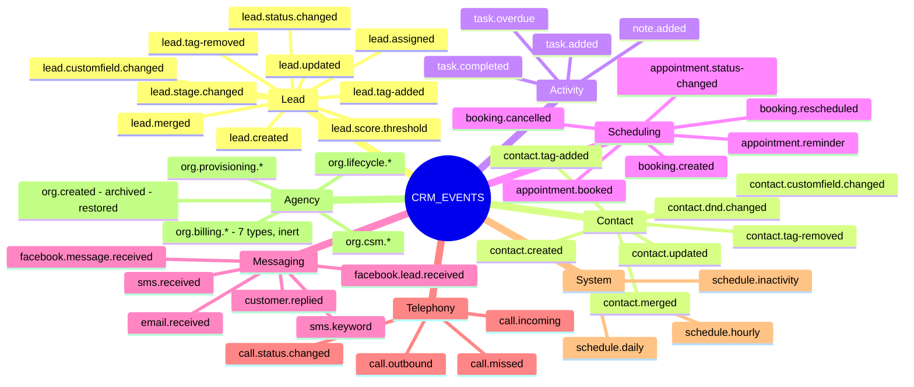
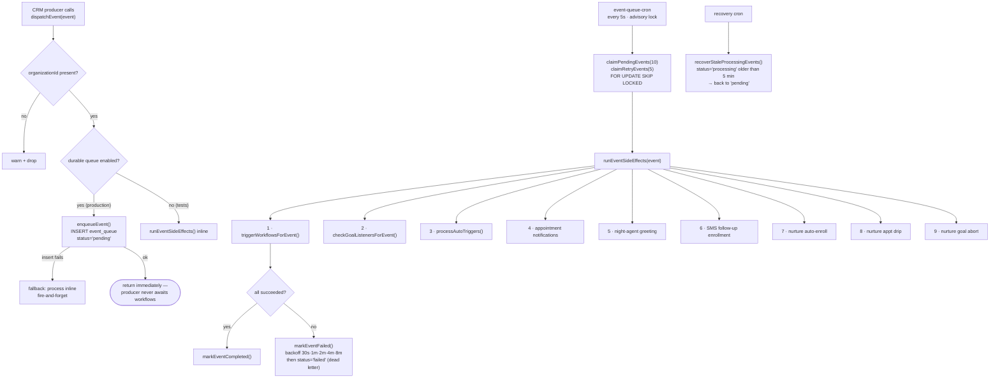
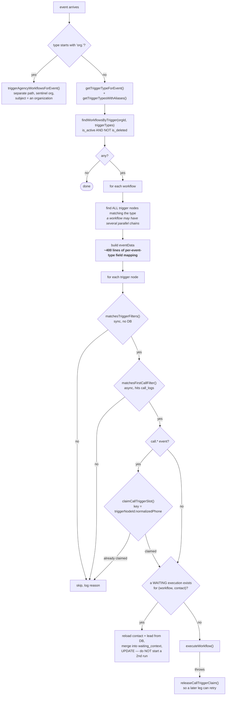
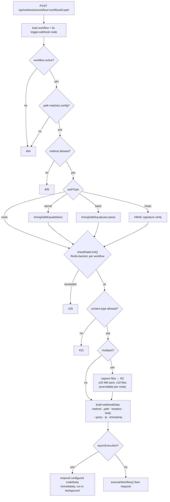

# 05 — Triggers & the Event Pipeline

## 5.1 The event taxonomy

`packages/shared/src/schemas/workflow-events.ts:17` — `CRM_EVENTS` is the single registry.
45 org-scoped event types plus ~25 agency (`org.*`) ones.



Each event type maps to a trigger node type via `EVENT_TO_TRIGGER_MAP`, resolved by
`getTriggerTypeForEvent()`. `getTriggerTypesWithAliases()` expands one event into several
acceptable trigger node types — that's how legacy node ids keep working after a rename.

### The `CRMEvent` shape

```ts
{
  type: CRMEventType,
  organizationId: string,
  contactId?: string,
  leadId?: string,
  userId?: string,
  timestamp?: number,
  data: unknown          // ⚠️ effectively untyped — see the warning below
}
```

> ### ⚠️ The biggest defect in the system
>
> `CRMEvent.data` is `z.unknown()`. Every producer invents its own payload shape and every consumer
> guesses. This caused a documented production outage: `services/leads.ts` spread a raw Prisma row
> into a `lead.status.changed` event (`pipeline_stage_id`, `to_stage_id` — snake_case), while
> `workflow-goal-listener.service.ts` read `stageId`/`toStageId` (camelCase), and
> `workflow-trigger.service.ts` hand-mapped a **third** variant. Both sides were typed
> `Record<string, unknown>`, so it compiled cleanly and **every stage-filtered goal node was
> silently dead in production**. The unit test hand-wrote a camelCase payload that production never
> emits, so it passed while prod failed.
>
> **In a port: give every event type a Zod payload schema and exactly one producer helper. Never
> spread a DB row into an event.** This is the top item in [`10-audit-findings.md`](10-audit-findings.md).

## 5.2 Dispatch — the transactional outbox

`apps/api/src/lib/events/event-dispatcher.ts`



**Three properties that make this production-grade:**

1. **`FOR UPDATE SKIP LOCKED`, not `findMany` + `updateMany`.** The code comment
   (`event-queue.service.ts:63`) is explicit: *"Prisma's findMany + updateMany is NOT safe under
   concurrent access because READ COMMITTED isolation allows two transactions to read the same rows
   before either commits."* Correct, and the standard job-queue pattern.
2. **Stale-processing recovery.** A replica that dies mid-event leaves rows in `processing`
   forever. A recovery cron resets rows untouched for 5 minutes back to `pending`.
3. **Fallback to inline processing if the enqueue itself fails.** Degraded but not silent.

**One weakness:** `runEventSideEffects()` is a **serial list of nine unrelated concerns**, and a
throw in any one fails the whole event and retries all nine. The workflow trigger is item 1, so
it re-runs when item 7 (nurture enrollment) fails. Individual side effects are described as
"self-catching", but that's a convention, not an enforced boundary.

> **Port advice:** make each side effect its own subscriber with independent success/failure
> tracking, or at minimum wrap each in its own try/catch with a per-subscriber retry record.

## 5.3 Trigger matching

`apps/api/src/lib/workflow/services/workflow-trigger.service.ts` — **3,146 lines**.



### `matchesTriggerFilters()` — `:1053`

A **synchronous, DB-free** function so it can be unit-tested and run in a tight loop. Structure:

1. Bail out early if config is null, `parameters` is empty, or every value is "effectively empty"
   (`null`, `""`, `"__any__"`, `0`, `[]`). This matters because the frontend serializes *every*
   field even when unset, so `Object.keys().length === 0` is almost never true.
2. Then a cascade of `if (isLeadEvent) { … }`, `if (isContactEvent) { … }`, `if (isTagEvent) { … }`,
   `if (isDndEvent) { … }`, `if (isTaskEvent) { … }` … each hand-coding its filters.

**Filters implemented per family:**

| Family | Filters |
|---|---|
| Lead | pipelineId, stageId, fromStage, toStage, assignedUserId, minScore, minValue, sourceFilter, watchFields[] |
| Contact | filterSource, filterStatus, filterTags[], assignedUserId, watchFields[] |
| Tag | tagAction (added/removed), tagIds[] (+ legacy single tagId), filterSource |
| DND | dndAction, dndType (email/sms/call), filterTags |
| Task | taskType, priority, assigneeFilter (me/others/unassigned) |
| Call | poolIds[], firstCallFilter (all/first/repeat) |

Two recurring themes worth noting:

- **camelCase↔snake_case field mapping is hardcoded inline**, twice, for `watchFields`
  (`firstName → first_name` etc.). A symptom of raw DB rows leaking into event payloads.
- **Tag filters match both IDs and names**, because the payload sometimes carries formatted tag
  objects `{id,name,color}` and sometimes legacy strings. Defensive coding around an untyped seam.

> ### Port this differently
>
> Make the filter **declarative on the node definition**:
> ```jsonc
> { "displayName":"Pipeline", "name":"pipelineId", "type":"pipelineSelect",
>   "filter": { "path": "lead.pipelineId", "operator": "equals" } }
> ```
> Then one generic evaluator walks `properties[].filter` against a **typed** event payload. You get:
> every filter for free on every new node, one code path to test, no per-event `if` cascade, and
> no possibility of a filter silently not applying because someone forgot to add a branch.

### First-call filter — a lesson about defaults

`matchesFirstCallFilter()` (`:1001`) is separated out because it needs a DB query. Its doc comment
records a real bug:

> *"a MISSING/blank `firstCallFilter` defaults to `"first"`, NOT `"all"`. The registry and editor UI
> both show 'First-time callers only' as the default, but that default is only persisted into
> `node_config` when the user actively touches the dropdown. A user who adds the trigger, sees
> 'First-time callers only' pre-selected, and never changes it ends up with no `firstCallFilter` key
> saved at all. If we treated that as 'all' we'd fire on every call — the exact opposite of what the
> editor told them was configured."*

**The general fix is upstream:** persist all definition defaults into `node_config.parameters` at
node-creation time. SiloCRM's `build-node.ts` actually *does* this — so this bug predates it, or
affects nodes created before. Either way: **never let the UI default and the runtime default be
two separate declarations.**

### Waiting-execution dedup — `:746`

If a new event arrives for a (workflow, contact) that already has a `waiting` execution, the
service **refreshes that execution's `waiting_context` with fresh contact/lead data** instead of
starting a second run. This is what stops a chatty trigger (a contact updated five times during a
3-day delay) from creating five parallel runs.

The refresh block is ~180 lines of manually rebuilding the contact and lead objects to match
`loadExecutionContext`'s format — **duplicated logic that can drift from the loader**. In a port,
call the loader.

## 5.4 Webhook triggers

`apps/api/src/routes/workflow-webhooks.ts` (1,350 lines), mounted at
`/api/webhooks/workflow/:workflowId/:path`.



**Security details worth copying:**
- `timingSafeEqual()` (`workflow-webhooks.ts:60`) pads both buffers to the same length before
  `crypto.timingSafeEqual`, then also requires equal lengths — closing the length-oracle side
  channel that a naive implementation leaves open.
- Rate limits live in **Redis, not process memory**, so they hold across replicas.
- Secrets are generated as 32 random bytes hex and stored **hashed** (`webhook-url.service.ts`).

**Two webhook trigger flavours:**
- `trigger.webhook` — 19 properties including field mapping into CRM fields.
- `trigger.webhook.raw` — no mapping; the entire payload is addressable as
  `{{webhook.body.any.deep.path}}`. Pairs with `webhook.saveToContact` to ingest arbitrary
  third-party payloads with zero per-integration code. **This combination is the highest-leverage
  pair of nodes in the catalog.**

## 5.5 Scheduled triggers

`apps/api/src/services/schedule-cron.ts` (~960 lines) — three cron jobs, each `withCronLock`ed:

| Trigger node | Behaviour |
|---|---|
| `trigger.schedule.daily` | Fires at a configured local time. Resolves the **workflow's** timezone (`timezone_mode='custom'`) falling back to the **org's** (`batchResolveOrgTimezones` + `resolveEffectiveTimezone`). |
| `trigger.schedule.hourly` | Every N hours. |
| `trigger.schedule.inactivity` | Fires for contacts/leads with no activity for N days. Supports `once_only` mode, tracked in an **in-process `Map`** with a 7-day TTL sweep. |

> ⚠️ **`firedInactivityRecords` is a module-level `Map` — per-replica, lost on restart.**
> On a multi-replica deploy, "once only" is *once per replica per uptime window*, not globally once.
> The cron lock means only one replica *ticks*, but not the same one each time, so the map can be
> cold. **In a port, persist the fired marker to a table.** (This is my reading of the code; the
> failure mode itself is ⚠️ **UNVERIFIED** in production.)

Schedule crons don't call the engine directly — they `dispatchEvent()` and rejoin the normal
pipeline. Good: one code path for filters, dedup, and context loading.

Other crons that feed the pipeline the same way: `appointment-reminder-cron` (emits
`appointment.reminder`), `task-overdue-cron` (emits `task.overdue`).

## 5.6 Multi-replica rule

Every recurring process in this repo must hold a distributed lock, because the API runs on multiple
Railway replicas. The canonical primitive:

```ts
import { withCronLock, CronLockId } from "../lib/cron-lock.js";

cron.schedule("*/5 * * * * *", () =>
  withCronLock(CronLockId.EVENT_QUEUE_PROCESSOR, async () => { /* one replica only */ })
);
```

Backed by `pg_try_advisory_lock` (non-blocking — a losing replica skips the tick and logs it, never
queues or throws), with acquire+release pinned inside one `$transaction` because Neon's transaction
pooler can hand consecutive queries different physical connections.

For jobs that must hold a lock for **minutes** or **per-entity** rather than per-tick, the repo uses
a table-based TTL lock instead (`a2p_sync_locks` pattern: `INSERT … ON CONFLICT DO UPDATE …
WHERE expires_at < NOW()` with `acquired_by = pid:<pid>`), which is pooler-agnostic and self-heals
if a replica dies holding it.

**Port this rule as a hard requirement, not a guideline.** Without it: an hourly digest sends N
copies, a queue drainer double-processes, and a backfill races itself. Idempotency reduces damage
but still burns DB connections, API quota, and money.
