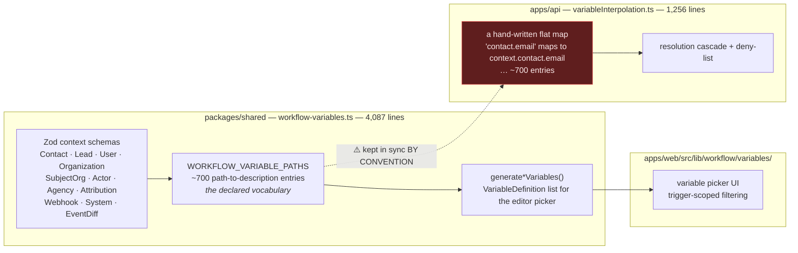
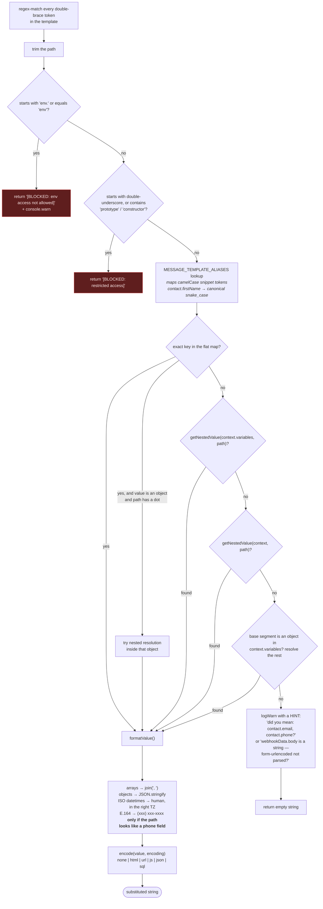

# 06 — Variables & Templating

Every string field in every node config is templated. `{{contact.first_name}}` in an SMS body,
`{{lead.pipelineStageName}}` in a condition, `{{httpResponse.body.id}}` in a downstream HTTP call.
This is what makes a workflow feel dynamic rather than a static rule.

## 6.1 The two-part contract



> ### ⚠️ The dotted line is a real defect
>
> `WORKFLOW_VARIABLE_PATHS` (the declaration) and the flat map inside `interpolateVariables()`
> (the implementation) are **two hand-maintained lists of the same ~700 paths**. Nothing enforces
> that they agree. A path declared but not mapped resolves to `""` with a warning; a path mapped but
> not declared works but never appears in the picker.
>
> **In a port: derive one from the other.** Define each namespace once as
> `{ path, description, resolve: (ctx) => value }` and generate both the picker list and the
> interpolation map from it. This single change removes an entire class of "the variable is in the
> dropdown but comes out blank" bugs.

## 6.2 Namespaces

| Namespace | Source | Examples |
|---|---|---|
| `contact.*` | loaded entity | `id, first_name, last_name, name, email, phone, email_secondary/tertiary, phone_secondary/tertiary, company, address, city, state, zip_code, full_address, calendly_link, source, status, owner_id, tags, customFields` |
| `lead.*` | loaded entity | `id, title, email, phone, full_address, value, score, status, source, assignedTo, assignedToName, pipelineId, pipelineName, pipelineStageId, pipelineStageName, squareFootage, tags, dynamic_fields` |
| `user.*` | assigned user | `id, first_name, last_name, name, email, phone` |
| `organization.*` | tenant org | `id, name, email_slug, email, phone, website, address1/2, city, state, postal_code, country, full_address` |
| `system.*` | computed at interpolation time | `currentDate, currentTime, currentDatetime, currentDayOfWeek, timestamp` (+ snake_case aliases) |
| `attribution.*` | tracking | `utm_source/medium/campaign/content/term, gclid, wbraid, gbraid, fbclid, msclkid, ttclid, li_fat_id, facebook_lead_id, landing_page_url, referrer_url, device, source` |
| `webhook.*` | inbound webhook | `method, path, headers, body, query, ip, timestamp` |
| Trigger-specific | `eventData` | `call.*`, `sms.*`, `email.*`, `message.*`, `booking.*`, `appointment.*`, `task.*`, `note.*`, `form.*`, `formData.*`, `keyword.*`, `tagEvent.*`, `dndEvent.*`, `assignmentEvent.*`, `inactivityData.*`, `facebookLead.*`, `facebookMessage.*`, `score.*`, `field.*` |
| Node outputs | `context.nodeOutputs` | ``, ``, and named vars like `{{httpResponse.body}}` |
| Loop | `context.loopState` | `{{currentItem}}`, `{{currentIndex}}`, plus user-named aliases |
| Agency (scope=agency) | `context.variables` | `org.*`, `org.csm.*`, `actor.*`, `agency.*`, `event.changedFields` |
| Call attribution | `eventData.call` | `call.attribution.firstTouch.*` / `lastTouch.*` × {source, medium, campaign, keyword, landingPage, gclid, wbraid, gbraid, fbclid, msclkid, ttclid, liFatId} |

**Immutability rule.** In SiloCRM these paths are treated as a **permanent public API** — customers'
saved workflows, Facebook form mappings, and exported data reference the exact strings. New keys are
fine; renames and removals are not. Display labels can change; the key cannot. Adopt the same rule
from day one and write it down.

## 6.3 Resolution cascade

`interpolateVariables(template, context, encoding, options)` —
`apps/api/src/lib/workflow/utils/variableInterpolation.ts:98`



## 6.4 Details worth copying

### Unresolved variables produce a *diagnostic*, not silence

```
[VariableInterpolation] Unresolved variable: contact.emial
  (did you mean: contact.email, contact.email_secondary, contact.first_name?)
```

It computes the suggestion by filtering `WORKFLOW_VARIABLE_PATHS` on the namespace prefix. For
webhook paths it goes further and inspects the actual payload:
`[webhookData.body is a string — form-urlencoded not parsed?]` or
`[webhookData.body keys: name, email, phone, …]`.

**This is excellent.** A blank SMS is otherwise undebuggable. Copy this pattern for every
templating system you build.

### Timezone resolution is layered and never falls back to the server zone

`variableInterpolation.ts:115-132`:

```ts
const orgTz  = context.organization?.timezone || "America/Chicago";  // NEVER the server zone
const bookerTz = eventData.timezone ?? eventData.booking?.timezone;  // the booker's own zone
const eventTz    = options?.datetimeTimeZone ?? bookerTz ?? orgTz;   // lead-facing datetimes
const activityTz = options?.datetimeTimeZone ?? orgTz;               // call/note timestamps
```

The comment is emphatic: *"Datetimes must NEVER fall back to the server zone (UTC on Railway). Org
timezone is the floor; Central is the floor under that."*

And `formatHumanDatetime` **always appends the short zone name** (`3:30 PM CDT`) — because
lead-facing sends use the booker's zone while business-side sends use the org's, and without the
label the two are indistinguishable to the reader.

**Port this exactly.** Timezone bugs in automation are the most common and the most damaging: an
appointment reminder in the wrong zone is a missed appointment.

### Phone formatting is path-gated, not value-gated

`maybeFormatPhoneNumber()` only prettifies E.164 → `(xxx) xxx-xxxx` when the **last path segment**
is in an allowlist (`phone`, `mobile`, `cell`, `from`, `to`, `caller`, …). The comment explains why:
a 10-digit Google Ads `campaign_id` was being rendered as a phone number.

**Rule: never infer a value's type from its shape. Infer it from its declared path.**

### Output encoding is a parameter

`encode(value, 'html' | 'url' | 'js' | 'json' | 'sql' | 'none')` — `security/OutputEncoder.ts`.
Email bodies interpolate with `html`, URL builders with `url`. Prevents an injected
`<script>` in a contact's last name from reaching an email template.

**Port note:** the encoding is chosen **at each call site**, so a new node that forgets to pass one
silently gets `'none'`. Consider making the encoding part of the *property* declaration
(`"encoding": "html"` on the NodeProperty) so it's declared once with the field, not remembered at
every use.

### Node outputs are flattened for addressability

`flattenNodeOutputs()` exposes both `{{nodeId}}` (whole output) and `{{nodeId.key}}` (one field).
Named variables set by nodes (e.g. `httpResponse`) are spread into the same namespace, so
`{{httpResponse.body.items.0.id}}` resolves through `getNestedValue`.

## 6.5 The editor side

`apps/web/src/lib/workflow/variables/`

- `services/variable-service.ts` — assembles the picker list.
- `utils/trigger-detector.ts` — inspects the workflow's trigger node and **scopes the variable list
  to what that trigger actually provides**. A workflow triggered by `lead.created` doesn't offer
  `{{call.recordingUrl}}`.
- `data/static-variables.ts`, `data/trigger-variables.ts`, `data/agency-variables.ts` — the source
  lists.
- `hooks/use-variable-search.ts` — fuzzy search in the picker.
- `components/automation/variable-selector/` — the `{{ }}` insert UI.

**Trigger-scoped variables are a significant UX win** and cheap to build once the vocabulary is
declared per-namespace with a `providedBy: triggerType[]` field.

## 6.6 Security posture

| Threat | Mitigation |
|---|---|
| Secret exfiltration via `{{env.DATABASE_URL}}` | `env.*` explicitly blocked, returns a visible `[BLOCKED]` marker + warns |
| Prototype pollution / gadget access | `__*`, `prototype`, `constructor` blocked |
| XSS via interpolated CRM data in an email | `encode(value, 'html')` |
| Injection into generated URLs | `encode(value, 'url')` |
| Accidental object dumps into an SMS | objects `JSON.stringify`d rather than `[object Object]` |

The blocked-value markers are *returned into the output* rather than silently dropped — so a user
who tries `{{env.X}}` sees `[BLOCKED: env access not allowed]` in their test SMS and learns
immediately. Better than a silent empty string.

## 6.7 Recommended design for a port

```ts
// ONE declaration per variable — picker, docs, and resolver all derive from it.
interface VariableDef<Ctx> {
  path: string;                       // "contact.email"        — IMMUTABLE
  label: string;                      // "Email"                — freely renameable
  description: string;
  type: "string" | "number" | "boolean" | "date" | "array" | "object";
  providedBy?: TriggerType[];         // scope the picker; omit = always available
  format?: "phone" | "datetime" | "currency";   // formatting by declaration, not by guess
  encoding?: EncodingContext;         // default encoding when used in this field type
  resolve: (ctx: Ctx) => unknown;     // THE implementation — no second hand-written map
}

export const VARIABLES: VariableDef<ExecutionContext>[] = [
  { path: "contact.email", label: "Email", type: "string",
    description: "Primary email address", resolve: c => c.contact?.email },
  // …
];
```

From this one array, generate: the interpolation map, the editor picker, the trigger-scoped
filtering, the "did you mean" suggestions, and the public variable documentation. That is roughly
5,300 lines of SiloCRM code collapsed into one table plus ~150 lines of machinery.
