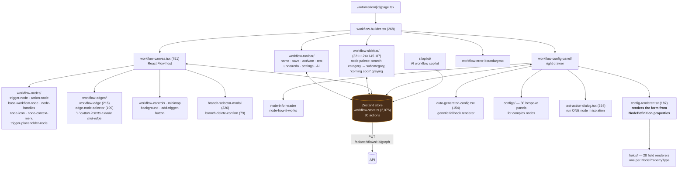
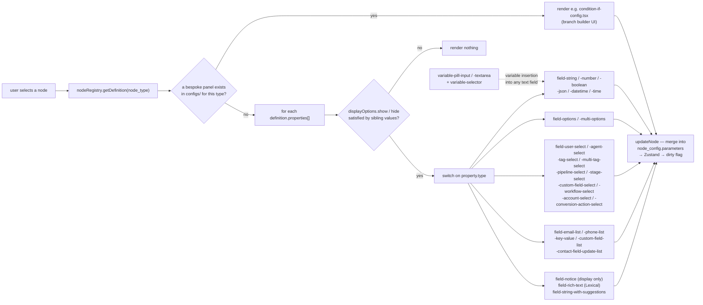
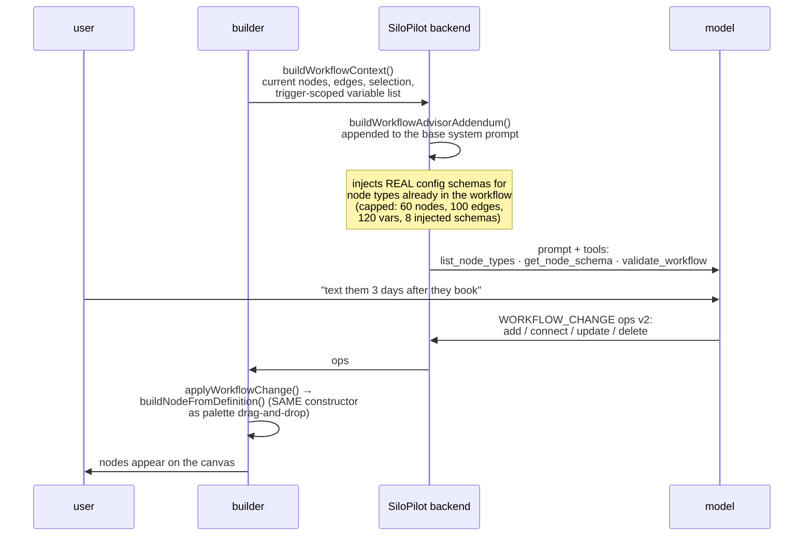

# 07 — Frontend Builder

Stack: **Next.js 16 App Router + React Flow (`@xyflow/react` ^12.9.3) + Zustand + shadcn/ui**.
~3,700 lines of canvas/node/sidebar/edge components plus a 2,076-line Zustand store and a
~4,100-line config panel.

> **This is n8n's editor, rebuilt in React.** Palette on the left → infinite node canvas in the
> middle → config drawer on the right whose form is *generated from the node's JSON description*.
> Same interaction grammar: drag from the palette, connect handle-to-handle, click a node to
> configure it, run a test and inspect each node's input/output. n8n uses Vue Flow; SiloCRM uses
> React Flow — the underlying library (both descend from the same `reactflow` lineage) and the
> resulting UX are effectively the same.
>
> The CRM-specific departures: contextual palette filtering (triggers vs actions), CRM-bound picker
> field types, variable *pills* instead of raw expression syntax, and an execution replay tied to a
> contact rather than to an items array.
>
> **Implementation rules — node chrome, handle affordances, form generation, validation, and
> performance — are in [`11-frontend-guidelines.md`](11-frontend-guidelines.md).** This chapter
> describes what SiloCRM built; chapter 11 says how to build it.

## 7.1 Composition

## 7.2 The config panel — the highest-leverage piece

**Two-tier rendering is the key idea.** A generic renderer covers ~126 of 156 nodes purely from
JSON; 30 nodes with genuinely complex UX (`condition.if`'s branch/condition-group builder,
`delay.wait`'s duration-vs-datetime-vs-business-hours modes, `email.send`'s rich-text editor and
preview modal, `http.request`'s multi-tab request builder) get a bespoke panel.

**Port advice:** build the generic renderer first and resist writing bespoke panels until a node
genuinely can't be expressed declaratively. Every bespoke panel is a place the JSON contract stops
being the source of truth.

### The variable-pill input

`fields/variable-pill-input.tsx` / `-textarea.tsx` / `lexical/` — text inputs where `{{contact.name}}`
renders as a removable **pill** rather than raw braces, backed by Lexical for the rich-text case.
Paired with `variable-selector/` (searchable, **trigger-scoped**) and `smart-value-input.tsx`.

This is the difference between "power users can do it" and "anyone can do it." Budget real time
for it.

## 7.3 The store — 80 actions

`apps/web/src/lib/workflow/store/workflow-store.ts` (2,076 lines). Grouped:

| Group | Actions |
|---|---|
| Workflow meta | `setWorkflow`, `updateWorkflowMetadata`, `updateWorkflowName`, `toggleWorkflowStatus`, `deleteWorkflow`, `updateWorkflowSettings`, `setScope` |
| Graph edits | `onNodesChange`, `addNode`, `updateNode`, `deleteNode`, `onEdgesChange`, `onConnect`, `addEdgeWithData`, `deleteEdge`, `insertNodeOnEdge` |
| Selection | `selectNode(s)`, `addToSelection`, `removeFromSelection`, `selectAllNodes`, `clearSelection` |
| Clipboard | `copySelectedNodes`, `cutSelectedNodes`, `pasteNodes`, `deleteSelectedNodes` |
| Enable/lock | `toggleSelectedNodesDisabledStatus`, `areAllSelectedNodesDisabled`, `toggleNodeLock`, `lockSelectedNodes`, `unlockSelectedNodes`, `toggleGlobalLock` |
| Layout | `applyAutoLayout`, `alignSelectedNodes`, `distributeSelectedNodes`, `tidySelectedNodes`, `toggleSnapToGrid` |
| History | `undo`, `redo`, `pushHistory` |
| Persistence | `saveWorkflow`, `loadWorkflow`, `markAsSaved`, `reset` |
| Testing | `openTestModal`, `closeTestModal`, `setTestRunning`, `setTestResults`, `clearTestResults` |
| Live run visuals | `setExecutingNode`, `addExecutedNode`, `setExecutingEdges`, `clearExecutionVisuals` |
| Palette flow | `setSidebarFilterMode`, `setPendingNodeSource`, `openSidebarForTrigger`, `openSidebarForAction`, `openSidebarForEdgeInsert`, `requestAddNode`, `clearPendingAddNode` |
| Branching | `setPendingConnection`, `openBranchSelector`, `closeBranchSelector`, `confirmBranchDelete`, `cancelBranchDelete` |

**Everything goes through the store; nothing mutates React Flow state directly.** That's what makes
undo/redo, the AI copilot, and keyboard shortcuts all work on the same code path.

## 7.4 UX inventory

Features SiloCRM shipped that materially affect whether users adopt the builder:

| Feature | Where | Worth it? |
|---|---|---|
| Insert node **on an edge** (a `+` on the connector) | `edge-node-selector.tsx` | **Yes — highest ROI single feature.** Users build linearly. |
| Context-aware palette (`openSidebarForTrigger` vs `ForAction`) | store + sidebar | Yes — never offers a trigger where an action belongs |
| Branch selector modal when connecting from a multi-output node | `branch-selector-modal.tsx` | Yes — otherwise handle routing is invisible |
| Auto-layout / align / distribute / tidy | `utils/auto-layout.ts`, `alignment.ts` | Nice-to-have; `applyAutoLayout` earns its keep on AI-generated graphs |
| **Relink on delete** — deleting a mid-chain node reconnects its neighbours | `utils/relink-on-delete.ts` (256) | **Yes.** Without it, deleting a node silently breaks the chain |
| Undo/redo with history stack | store | Yes |
| Copy/cut/paste nodes | store | Yes |
| Node lock (individual + global) | store | Marginal |
| Disable a node without deleting it | `node_config.disabled` → engine skips + logs `skipped` | **Yes** — the debugging primitive |
| Client-side validation before save | `utils/validate-workflow.ts` (213) + `validation-error-dialog.tsx` | Yes |
| Test a **single node** in isolation | `test-action-dialog.tsx` + `POST /api/workflows/test-action` | **Yes** — the difference between 30s and 10min feedback loops |
| Test the whole workflow with sample data | `test-workflow/` + `workflow-sample-data.tsx` | Yes |
| **Live execution visuals** (node pulses as it runs) | `setExecutingNode` / `setExecutingEdges` | High delight, low cost |
| Execution replay viewer | `execution-replay/`, `/automation/[id]/replay/[executionId]` | **Yes** — support burden without it is severe |
| Run-from-node replay | `POST /:id/executions/:executionId/run-from-node` | Yes, for debugging production runs |
| Enrollment history (who's in this workflow) | `enrollment-history.tsx`, `/automation/enrollments` | Yes |
| Folders | `workflow-folders` routes + table | Yes past ~20 workflows |
| Duplicate workflow | `duplicate-workflow-dialog/` | Yes |
| Mobile variants | `workflow-builder/_mobile`, `workflow-toolbar/_mobile` | Marginal — graph editing on a phone is inherently rough |
| **AI copilot** | `silopilot/` | See §7.6 |

## 7.5 Preloading

`automation-preloader.tsx` + `automation-loading-skeleton.tsx`. The builder needs the node registry,
the tenant's pipelines/stages/tags/users/custom fields (for the picker property types), and the
workflow graph. Preloading and skeletons — not spinners — are the repo convention.

## 7.6 The AI copilot (SiloPilot)

An LLM assistant embedded in the builder that can **construct and modify the graph**, not just chat.

Three design choices that make it work:

1. **It reads the same node registry the editor does**, filtered by `getActiveNodeDefinitions()` —
   so it can never propose a coming-soon or wrong-scope node.
2. **It calls `get_node_schema` rather than guessing parameter names.** Real schemas are injected
   for node types already present; everything else is fetched on demand.
3. **It applies changes through `buildNodeFromDefinition()`** — the identical constructor used by
   drag-and-drop. An AI-created node is byte-identical to a hand-created one.

**Port advice:** this is a genuine differentiator and much cheaper than it looks *once the
declarative node registry exists* — the registry doubles as the model's tool schema. Build it after
the registry, not before.

## 7.7 Build-time gotcha to carry over

`apps/web`'s Vercel build is OOM-sensitive during "Collecting page data". Two rules from the repo:

- **Never wildcard-import from an icon library** (`import * as Icons from "lucide-react"`). Use
  explicit imports or a curated map — SiloCRM keeps `workflow-icon-map.ts` for exactly this, since
  node definitions reference icons by *name string* and something must resolve name → component
  without pulling in the whole library.
- **Never glob-import the node registry.** Keep the ~120 explicit `import x from "./registry/y.json"`
  lines.

A node registry that references icons by string is otherwise a natural place to reach for a
wildcard import. Don't.
