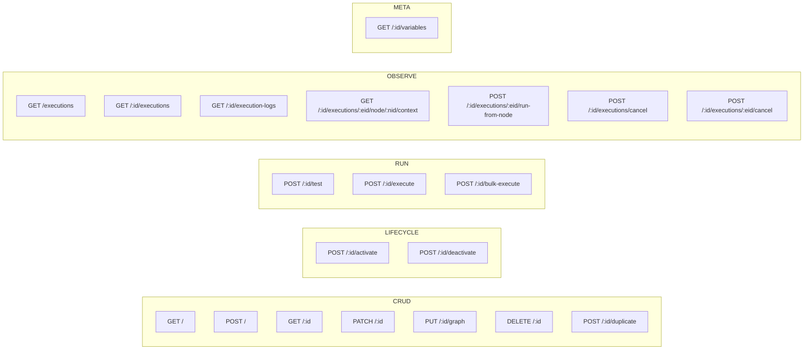

# 08 — API Surface

Fastify, registered in `apps/api/src/index.ts`. All types are generated from Zod schemas in
`packages/shared` → OpenAPI → TypeScript; hand-written response types are banned repo-wide.

## 8.1 Route registration

| Prefix | File | Lines |
|---|---|---|
| `/api/workflows` | `routes/workflows.ts` | 2,150 |
| `/api/workflows/test-action` | `routes/workflow-test-action.ts` | 710 |
| `/api/workflow-executions` | `routes/workflow-executions.ts` | 242 |
| `/api/workflow-folders` | `routes/workflow-folders.ts` | 797 |
| `/api/webhooks/workflow` | `routes/workflow-webhooks.ts` | 1,350 |
| `/api/stage-automations` | `routes/stage-automations.ts` | 1,022 |
| `/api/superadmin/automations` | `routes/superadmin-automations.ts` | 455 |
| *(legacy)* | `routes/automations.ts` | 658 |

`/api/webhooks/workflow/` is on the **public (unauthenticated) allowlist** — it authenticates per
workflow via the trigger node's own auth config.

## 8.2 `/api/workflows` — 20 endpoints



| Method | Path | Purpose |
|---|---|---|
| GET | `/` | List workflows for an org (folder, active, search filters) |
| POST | `/` | Create a workflow |
| GET | `/executions` | Cross-workflow execution feed for the org |
| GET | `/:id` | One workflow **with its full node + edge graph** |
| PATCH | `/:id` | Update metadata (name, description, folder, timezone) |
| **PUT** | **`/:id/graph`** | **Replace the whole graph — the builder's save.** |
| DELETE | `/:id` | Soft delete (trash) |
| POST | `/:id/duplicate` | Deep-copy workflow + nodes + edges with remapped ids |
| POST | `/:id/activate` | `is_active = true` |
| POST | `/:id/deactivate` | `is_active = false` |
| POST | `/:id/test` | Test run with sample/selected data |
| POST | `/:id/execute` | Execute for one contact |
| POST | `/:id/bulk-execute` | Execute for many contacts |
| GET | `/:id/executions` | Execution history for this workflow |
| GET | `/:id/execution-logs` | Node-level logs |
| GET | `/:id/executions/:eid/node/:nid/context` | The stored context at one node — powers the replay inspector |
| POST | `/:id/executions/:eid/run-from-node` | Fork a new execution starting at a node, reusing the stored context (`parent_execution_id`) |
| POST | `/:id/executions/cancel` | Cancel all running/waiting executions of this workflow |
| POST | `/:id/executions/:eid/cancel` | Cancel one |
| GET | `/:id/variables` | Variables available given this workflow's trigger — feeds the picker |

### `PUT /:id/graph` — the save contract

The builder sends the **entire** node + edge set; the server diffs against the DB and
inserts/updates/soft-deletes. This is why node ids are client-minted (`crypto.randomUUID()` in
`build-node.ts`) rather than server-assigned.

Trade-offs to be aware of when porting:
- **Simple and idempotent** — no operational-transform complexity.
- **Last-write-wins.** Two people editing one workflow silently clobber each other. There is no
  optimistic-concurrency token in the request. ⚠️ **UNVERIFIED** whether any `updated_at` check
  exists in the handler; I did not read the full 127-line body.
- Payload grows with graph size, but `MAX_NODES_PER_WORKFLOW = 100` bounds it.

**Recommendation for a port:** keep whole-graph PUT, but add an `If-Match: <updated_at>` style guard
and surface "someone else edited this" rather than clobbering.

### `run-from-node` — the debugging superpower

`GET /:id/executions/:eid/node/:nid/context` returns the exact context that existed at that node.
`POST …/run-from-node` forks a **new** execution seeded with that context, starting at that node,
linked via `parent_execution_id`. Supporting services: `run-from-node.service.ts`,
`execution-remap.service.ts`.

This lets support answer "why did this customer get the wrong SMS?" by replaying the failing node
against the real data, without re-triggering the whole workflow or touching production records
upstream of the failure. **Build this — it pays for itself the first month.**

## 8.3 Other route files

**`/api/workflows/test-action`** (710 lines) — execute a **single node** with a supplied config and
sample context, returning its output without creating an execution. Backs the config panel's "Test
this action" button. The tightest possible feedback loop while authoring a node.

**`/api/workflow-executions/:id`** — execution detail.

**`/api/workflow-folders`** (797 lines) — folder CRUD, move, reorder.

**`/api/webhooks/workflow`** — the receiver (see [`05`](05-triggers-and-events.md) §5.4). Also
exposes `GET /:workflowId/test-payload` (a sample payload for the configured trigger) and
`GET /health`.

**`/api/stage-automations`** (1,022 lines) — a *separate, simpler* automation surface: per-pipeline-
stage config (channels enabled, intent, timing, linked `workflow_ids[]`, template ids, success/
failure stage, AI config). A wizard-driven "when a lead lands in this column, do X" product built
on top of the workflow engine rather than beside it.

**`/api/superadmin/automations`** (455 lines) — agency-scope workflow management, plus the approvals
inbox and the cross-org audit log (UI at `/superadmin/automations/approvals` and `/audit`).

## 8.4 Multi-tenancy on every route

Repo-wide rule, non-negotiable:

```ts
// ✅ organizationId comes from the QUERY PARAM, always
const organizationId = resolveOrganizationId(request);   // reads request.query.organizationId

// ❌ never
request.user.activeOrganizationId   // STALE — not updated on org switch
cookies().get("silocrm-org-id")     // SHARED across browser tabs
headers["X-Organization-Id"]        // SHARED across browser tabs
```

The reasoning: headers, cookies, and JWT claims are shared across a user's browser tabs, so a user
with two orgs open in two tabs gets cross-contaminated data. Query params are per-tab because
they're in the URL. **If your CRM supports multi-org users, adopt this before you have 50 routes to
retrofit.**

The frontend counterpart: `useOrgContext()` reads `?org=X` from the URL and exposes
`selectedOrgId` + `isHydrated`.

## 8.5 Frontend access pattern

Two paths, chosen by read vs write:

```ts
// READS — client-side openapi-fetch through a Next.js catch-all proxy that attaches auth.
// Each call is an independent fetch(), so N dashboard queries run TRULY in parallel.
const { data, error } = await clientApi.GET("/api/workflows", {
  params: { query: { organizationId } },
});

// WRITES — Next.js server actions (sequential by nature, benefit from server-side auth checks)
export async function saveWorkflowGraph(organizationId: string, id: string, graph: Graph) { … }
```

The reason reads bypass server actions: **Next.js serializes concurrent server-action calls per
client**, so even when React Query fires five of them simultaneously they waterfall. For a builder
page that needs the graph + pipelines + tags + users + custom fields at once, that's the difference
between one round-trip and five.

## 8.6 Recommended API for a port

```
GET    /workflows                      ?orgId&folderId&active&q
POST   /workflows
GET    /workflows/:id                  → workflow + nodes + edges
PATCH  /workflows/:id                  metadata only
PUT    /workflows/:id/graph            whole-graph save + If-Match concurrency guard
POST   /workflows/:id/publish          ← NEW: version the graph, in-flight runs keep the old one
DELETE /workflows/:id
POST   /workflows/:id/duplicate
POST   /workflows/:id/activate | /deactivate

POST   /workflows/:id/executions            manual run  (accepts Idempotency-Key)
POST   /workflows/:id/executions/bulk
GET    /workflows/:id/executions            ?status&from&to&cursor
GET    /executions/:eid                     detail + node logs
GET    /executions/:eid/nodes/:nid/context
POST   /executions/:eid/replay-from/:nid
POST   /executions/:eid/cancel

POST   /nodes/:nodeType/test           single-node test with a supplied config
GET    /workflows/:id/variables        trigger-scoped variable list
GET    /node-types                     ?scope — the active registry, for the palette and the AI

POST   /hooks/w/:workflowId/:path      public, per-workflow auth
```

Two additions over SiloCRM: **`/publish` with versioning**, and **`Idempotency-Key` on execution
creation** (which removes the need for a separate trigger-claims table).
