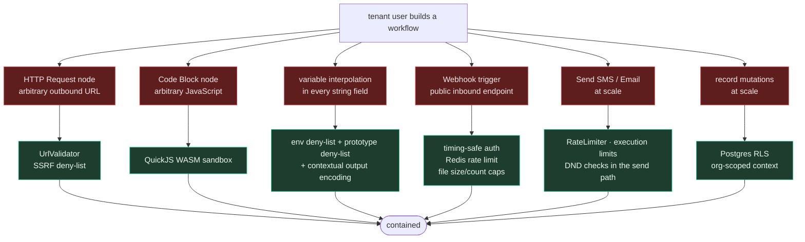

# 09 — Security & Multi-Tenancy

A workflow engine is, by design, **a user-controlled remote-code-and-network execution system inside
your CRM**. Users can make arbitrary HTTP calls, run JavaScript, send messages, and mutate records —
on your infrastructure, with your credentials, against other tenants' data if you let them. Treat
this chapter as mandatory, not optional hardening.



## 9.1 SSRF — the HTTP node

`lib/workflow/security/UrlValidator.ts` + `HttpClient.ts`.

An HTTP node with no guard lets any tenant hit `http://169.254.169.254/latest/meta-data/` and read
your cloud instance credentials, or `http://localhost:6379` to talk to your Redis, or reach anything
in your VPC. This is the single highest-severity risk in the feature.

`UrlValidator` exposes `DEFAULT_VALIDATOR_CONFIG`, a `UrlValidator` class, `createUrlValidator()`
and a module-level `validateUrl()`. `SecureHttpClient` wraps it so every request is validated before
it's issued.

⚠️ **UNVERIFIED**: I read the exported surface but not the rule bodies. Before relying on it, confirm
it covers all of:

- [ ] Scheme allowlist (`http`/`https` only — no `file:`, `gopher:`, `ftp:`, `data:`)
- [ ] Private ranges: `10/8`, `172.16/12`, `192.168/16`, `127/8`, `0.0.0.0`, `::1`, `fc00::/7`
- [ ] Link-local `169.254/16` and `fe80::/10` (**cloud metadata**)
- [ ] **DNS rebinding**: resolve the hostname, validate the *resolved IP*, then connect to that IP —
      not re-resolve at connect time
- [ ] **Redirect following**: re-validate every hop, cap the redirect count
- [ ] Response size cap and connect/read timeouts
- [ ] Optional per-tenant domain allowlist for regulated customers

The DNS-rebinding and redirect items are the ones most commonly missed.

## 9.2 Code execution — the sandbox

`data.code` runs tenant-authored JavaScript. Implementation: **QuickJS compiled to WebAssembly**
(`quickjs-emscripten` ^0.31.0), so the guest interpreter has no access to Node's `require`,
`process`, `fs`, network, or the host event loop.

```
sandbox/SandboxFactory.ts (157) → QuickJSSandbox.ts (377)
                                → CodeSandbox.ts (429)   marshalling + timeouts
                                → SandboxContext.ts (67) what the guest can see
```

**Why not `vm` or `vm2`:** Node's `vm` module is explicitly documented as *not* a security
mechanism — escaping it via `this.constructor.constructor('return process')()` is a one-liner.
`vm2` had repeated sandbox-escape CVEs and is deprecated. QuickJS-in-WASM is the correct choice.

⚠️ **UNVERIFIED**: the configured CPU/instruction limit, memory cap, and wall-clock timeout. Read
`QuickJSSandbox.ts` and pin them explicitly before shipping.

**Port advice:** a code node is a large security and support surface for modest user value. Ship it
in a late phase, and only with a WASM interpreter. If you need something sooner, ship a constrained
expression evaluator (jsonata / CEL / a small custom grammar) instead of full JS.

## 9.3 Multi-tenancy

Three layers, all required:

**1. Postgres Row-Level Security.** `getDb()` returns an RLS-enabled client scoped to the current
organization. Bypassing is explicit and greppable:

```ts
import { withoutRLS } from "./lib/db/rlsHelper.js";
await withoutRLS(async () => { /* global infrastructure only */ });
```

The workflow feature uses `withoutRLS` for genuinely cross-org infrastructure: the event queue, goal
listeners, agency audit, and approvals. Every such use should be justified in a comment — in this
repo they are.

**2. Organization id from the query param only.** See [`08`](08-api-surface.md) §8.4. JWT claims,
cookies, and headers are all shared across browser tabs and therefore unreliable for a user who
belongs to several orgs.

**3. Scope discrimination.** `workflows.scope` (`'org'` | `'agency'`) plus `NodeDefinition.scope`
(`'org'` | `'agency'` | `'both'`). Tenant-facing queries filter `scope='org'`; the agency builder
filters `scope='agency'`. `getActiveNodeDefinitions({ scope })` guarantees an agency-only node can
never appear in a tenant's palette.

### The cross-tenant leak to design against

An agency-scope action mutates **a different organization than the one running the workflow**. The
subject org is `execution.subject_org_id`, not the workflow's own `organization_id`. Getting this
backwards writes org A's data into org B.

SiloCRM's mitigations: a separate `agency-context.ts` hydration path, `audited-write.ts` recording
before/after snapshots per cross-org write, target validation on `action.org.createClientLead`
(*"the subject or a related parent/child org"*), and an approval gate on every cross-org action.

There is a related repo-wide rule worth internalizing even without an agency tier:

> **Never surface one tenant's content inside another tenant's UI** — not as a preview, not as an
> example, not as a thumbnail, not "because it's already public on the internet." Tenants in a
> vertical CRM are frequently direct competitors in the same trade and metro.

## 9.4 The approval gate

For high-blast-radius agency actions. `executors/agency/approval-gate.ts`.

```mermaid
sequenceDiagram
    participant N as gated action node
    participant G as requireApproval()
    participant DB as agency_action_approvals
    participant X as execution
    participant SA as super-admin inbox

    N->>G: requireApproval(action, payload)
    G->>DB: existing approved row for (execution,node)?
    alt none
        G->>DB: INSERT status='pending', requested_by,<br/>requested_at, expires_at
        G--x N: throw ApprovalPauseException
        N--x X: status='waiting', resume_at=NULL,<br/>current_node_id set
        Note over X: reuses the delay/resume machinery —<br/>no separate wait mechanism
        SA->>DB: approve / reject
        alt approved
            SA->>X: resumeWorkflowExecution(id, {reExecuteCurrentNode:true})
            Note over N: the node runs AGAIN; this time<br/>requireApproval finds the approved row
        else rejected
            SA->>X: abort → failed
        end
    else approved row exists
        G-->>N: proceed
    end

    REAP["expiry reaper"]->>DB: status='expired' past expires_at
    REAP->>X: release the stranded 'waiting' execution
```

Three details worth copying even outside an agency context (e.g. for "send to >1,000 contacts"):

1. **Reuse the pause machinery.** No second wait mechanism to maintain.
2. **`reExecuteCurrentNode`** — approval re-runs the node rather than skipping past it, so the
   action executes exactly once with a clean audit trail.
3. **`expires_at` + a reaper.** Without it, one never-decided approval strands a `waiting` execution
   forever.

Also: a **simulate mode** on every gated action (from the node descriptions: *"Requires super-admin
approval unless run in simulate mode"*), so a workflow can be built and dry-run without touching
production.

## 9.5 Rate limiting & resource caps

| Surface | Control | Location |
|---|---|---|
| Inbound webhook | per-workflow limit, **Redis-backed** (holds across replicas) | `rateLimitStore.ts` |
| Webhook uploads | 25 MB/file, 10 files/request, overridable per node | `workflow-webhooks.ts:20` |
| Execution wall clock | 5 minutes | `EXECUTION_LIMITS` |
| Nodes per workflow | 100 | `EXECUTION_LIMITS` |
| Loop iterations | 1,000 | `EXECUTION_LIMITS` |
| Sub-workflow depth | 5 | `EXECUTION_LIMITS` |
| Go To jumps | `maxLoops`, default 10, per node | `traverser.ts:227` |
| Node-level | `utils/RateLimiter.ts`, `utils/TimeoutManager.ts` | — |
| Legacy | `automation_rate_limits` (per automation × contact window) | legacy engine |

**Gap to close in a port:** there is **no per-organization execution budget**. A tenant with a
runaway loop-of-webhooks can consume the shared worker pool. Add a per-org concurrent-execution cap
and a daily execution quota before you have noisy neighbours.

## 9.6 Credentials

Workflow nodes call Slack, OpenAI, Google Sheets, Google Ads, Meta. Those credentials are
per-organization integration records, referenced by node config, resolved at execution time.

Repo-wide rule, learned from a real incident (a live production DB password committed in
`update-leads-script.js` and three docs, pushed to GitHub):

> **Never hardcode a connection string, password, API key, token, or webhook secret in any file** —
> `.ts`, `.js`, `.md`, `.json`, `.sql`, a comment, or a code fence. Read from `process.env` and fail
> closed. In docs, always write a placeholder. If a credential is ever committed, **rotation is the
> fix** — redacting the file is cosmetic, because it stays in history and in every clone and fork.

For a port, apply the same discipline to *stored* integration credentials: encrypted at rest,
never returned to the client (return a masked handle), never logged, and never interpolated into a
node output that lands in `node_execution_logs`.

## 9.7 Logging standard

Errors must be diagnosable from logs alone, without reproducing the bug:

```ts
// ❌ useless in production
log.error({ errorMessage }, "Workflow node failed");

// ✅ actionable
log.error({
  errorMessage, errorName, errorStack,       // name tells you the CATEGORY
  zodIssues,                                  // WHICH field failed and why
  workflowId, executionId, nodeId, nodeType,
  organizationId, contactId,
  tokenFingerprint,                           // sha256(secret).slice(0,12) — NEVER the raw value
  requestId,
}, "Workflow node failed");
```

Rules: never log a raw token/key/password/signed URL — log a stable fingerprint so you can correlate
without exposing. Always include a correlation id. Prefer structured fields over string
interpolation (they're queryable). Distinguish expected-but-noteworthy (`warn`) from genuinely
wrong (`error`). Log **once, richly**, rather than three thin lines leading up to a failure.

`nodeExecutor.ts` writes `input_data` with `stripSensitiveData(context)` applied — do the same, and
audit what "sensitive" covers as you add context fields.

## 9.8 User-facing failure messages

Repo rule with direct relevance here, because workflow failures are the #1 support driver:

> A failure shown to a user must **name the cause and the next action**. `"Failed to send SMS"` is a
> bug, not a message. The backend almost always knows the real reason (contact is blocked, number
> opted out, A2P not approved, file too large); if that reason dies on the way to the screen, the
> user files a ticket you then debug from scratch.

```ts
// ❌  toast.error("Workflow failed");
// ✅  toast.error("This contact replied STOP, so we can't text them. They have to text START to opt back in.");
```

Write the refusal reason **once, on the server, in human words**, so every channel inherits it.
Applied to a workflow builder, that means the execution-replay UI should show *why* a node failed in
plain language, not a stack trace or an error code.

## 9.9 Pre-launch checklist

- [ ] `UrlValidator` blocks private + link-local + metadata IPs, validates **post-DNS-resolution**,
      re-validates **every redirect hop**, caps response size and time
- [ ] Code sandbox is WASM-based with explicit CPU, memory, and wall-clock limits
- [ ] `{{env.*}}`, `__proto__`, `constructor` blocked in interpolation
- [ ] Output encoding applied per destination (html / url / js / json / sql)
- [ ] Webhook auth uses length-padded constant-time comparison
- [ ] Webhook rate limits in Redis, not process memory
- [ ] RLS enabled; every `withoutRLS` call justified in a comment
- [ ] Org id resolved from the query param, never JWT/cookie/header
- [ ] Per-org concurrent-execution cap and daily quota
- [ ] Integration credentials encrypted at rest, masked in responses, never in node logs
- [ ] Every cron holds a distributed lock
- [ ] Node execution logs have a retention policy
- [ ] Approval gate (or an equivalent confirm step) on any bulk/destructive action
- [ ] Failure messages name the cause and the fix
