# 10 — Audit Findings

What SiloCRM's workflow system gets right, where it carries debt, and what a port should do
differently. Findings are ordered by how much they'd cost you to get wrong.

Severity: 🔴 fix before shipping · 🟠 fix before scale · 🟡 quality-of-life

---

## Part A — What to copy verbatim

### ✅ A-01 Declarative node registry shared across FE and BE
`packages/workflow-nodes/`. One JSON file per node declares the config form; the editor renders from
it, the backend reads it, and the AI copilot uses it as a tool schema. Behaviour lives separately in
an executor keyed by the node id. **This is the load-bearing idea of the whole system.** It's why
adding a node is "write JSON + write one executor function" instead of touching six files.

### ✅ A-02 Transactional-outbox event queue
`FOR UPDATE SKIP LOCKED` claiming, exponential backoff, dead-lettering, stale-processing recovery.
Textbook and correct. The code comment explaining *why* `findMany` + `updateMany` is unsafe under
READ COMMITTED should be preserved in your port.

### ✅ A-03 Durable delay pause/resume
Serialize the whole context, set `resume_at`, resume from a locked cron. A 30-day wait survives
every deploy. The cheap `count()` pre-check keeps an idle system free.

### ✅ A-04 Compare-and-set on every status transition
`updateMany({ where: { id, status: "running" } })` closes the race between a delay pause and a
concurrent goal exit. Small, invisible, essential.

### ✅ A-05 `active-nodes.ts` whitelist
Land a node definition + editor UI before its executor exists, without the palette offering a broken
node — and the AI reads the same list, so it can never suggest one either.

### ✅ A-06 `optionsFrom` shared value lists
Registry JSON can't import a TS constant, so shared option lists would drift. Expanding
`"optionsFrom": "leadSources"` at load time from the canonical array fixed a real bug (~7.6k leads
stamped with a retired source value).

### ✅ A-07 Unresolved-variable diagnostics
`Unresolved variable: contact.emial (did you mean: contact.email, …)` plus payload-shape hints for
webhooks. Turns "the SMS came out blank" from a support ticket into a self-service fix.

### ✅ A-08 Layered timezone resolution that never falls back to the server zone
`booker's zone → org zone → America/Chicago`, with the short zone name always appended to rendered
datetimes. Prevents the single most damaging class of automation bug.

### ✅ A-09 Path-gated phone formatting
Format E.164 only when the variable *path* says it's a phone, never because the value happens to be
10 digits. Generalize the rule: **infer type from declaration, never from shape.**

### ✅ A-10 Test-a-single-node + run-from-node replay
`POST /workflows/test-action` (author-time) and `POST /executions/:eid/replay-from/:nid`
(production debugging). Together they're the difference between a supportable feature and a
permanent ticket generator.

### ✅ A-11 Insert-node-on-edge
A `+` button on the connector. Users build linearly; this matches how they think. Highest-ROI single
UI feature in the builder.

### ✅ A-12 Relink-on-delete
Deleting a mid-chain node reconnects its neighbours instead of silently severing the chain.

### ✅ A-13 Every cron holds a distributed lock
`withCronLock(CronLockId.X, …)` with `pg_try_advisory_lock`, acquire+release pinned inside one
transaction (because the connection pooler can hand consecutive queries different connections), and
a table-based TTL lock for long/per-entity jobs. Multi-replica is the default; treat this as a hard
requirement.

### ✅ A-14 Approval gate reusing the pause machinery
No second wait mechanism. `reExecuteCurrentNode` on approval. `expires_at` + a reaper so an
undecided approval can't strand a run forever. Plus a **simulate mode** on every gated action.

---

## Part B — Defects to fix in the port

### 🔴 B-01 `CRMEvent.data` is untyped
**The most expensive defect in the system.** `data: z.unknown()`, so every producer invents a shape
and every consumer guesses.

Documented incident (recorded in the repo's own CLAUDE.md): `services/leads.ts` spread a raw Prisma
row into a `lead.status.changed` event (`pipeline_stage_id`, `to_stage_id` — snake_case);
`workflow-goal-listener.service.ts` read `stageId`/`toStageId` (camelCase);
`workflow-trigger.service.ts` hand-mapped a **third** variant. All sides typed
`Record<string, unknown>`, so it compiled cleanly and **every stage-filtered goal node was silently
dead in production**. The unit test used a hand-written camelCase fixture that production never
emits, so it passed the whole time.

**Fix:** a Zod schema per event type; exactly one producer helper per event; never spread a DB row
into a payload; build test fixtures **from the schema**, never by hand.

### 🔴 B-02 `matchesTriggerFilters()` is a 3,146-line hand-coded cascade
One `if (isLeadEvent) {…} if (isContactEvent) {…} if (isTagEvent) {…}` chain per event family, each
re-implementing pipeline/stage/tag/assignee filtering. camelCase↔snake_case field mapping is
inlined **twice**. Tag matching defensively checks both IDs and names because the payload shape
varies.

Consequences: adding a filter to one trigger doesn't give it to any other; a missing branch means a
filter silently doesn't apply (the user sees it configured and it does nothing); the file is
effectively untestable as a whole.

**Fix:** declare the filter on the node property —
```jsonc
{ "name": "pipelineId", "type": "pipelineSelect",
  "filter": { "path": "lead.pipelineId", "operator": "equals" } }
```
— and evaluate all of them with one generic matcher against a *typed* payload. Every new node gets
filtering for free.

### 🔴 B-03 The variable map is duplicated
`WORKFLOW_VARIABLE_PATHS` (~700 declared paths) and the flat map inside `interpolateVariables()`
(~700 implemented paths) are maintained by hand, in two files, in two packages, kept in sync by
convention. Declared-but-unmapped resolves to `""`; mapped-but-undeclared works but is invisible in
the picker.

**Fix:** one `VariableDef[]` array with `{ path, label, type, format, providedBy, resolve }`;
generate the picker, the resolver, the suggestions, and the docs from it. See
[`06`](06-variables-and-templating.md) §6.7. Collapses ~5,300 lines to a table plus ~150 lines.

### 🟠 B-04 No workflow versioning
`is_active` is the only gate. Editing a live workflow changes it for **in-flight executions** —
a run that paused for 3 days resumes against a graph that may no longer contain its next node.

**Fix:** `workflows.version` + `workflow_executions.workflow_version`; a draft/published split; load
the pinned version on resume. Add this in P0 — retrofitting versioning after you have production
runs is a migration nightmare.

### 🟠 B-05 Interpolation happens per-executor
Each executor interpolates the fields it uses. A new node that forgets a field ships a bug that only
appears when a user puts a variable in that field.

**Fix:** interpolate the whole `parameters` object once in `executeNode()` before dispatch, with an
opt-out list for fields that must stay raw (code bodies, regex patterns).

### 🟠 B-06 Output handles are display labels
`edge_config.sourceHandle` stores the human label (`"Found"`, `"Not Found"`, `"Done"`, `"Each"`).
Renaming a label breaks routing on every saved workflow.

**Fix:** stable handle ids (`found` / `not_found`) with a separate `outputLabels` for display, and
promote `source_handle` to a real column so it's queryable.

### 🟠 B-07 `runEventSideEffects()` is nine coupled concerns
Workflow triggering is item 1 of 9 unrelated side effects run serially. A throw anywhere fails the
whole event and retries all nine — so the workflow re-runs when nurture-bot enrollment fails.
"Self-catching" is a convention, not a boundary.

**Fix:** independent subscribers with per-subscriber success/failure tracking and retry state.

### 🟠 B-08 `firedInactivityRecords` is a per-replica in-memory Map
`schedule-cron.ts` tracks "once only" inactivity firing in a module-level `Map` with a 7-day TTL
sweep. Per replica, lost on restart. The cron lock means one replica ticks, but not necessarily the
same one, so the map can be cold.

**Fix:** persist the fired marker to a table. (Failure mode itself is ⚠️ **UNVERIFIED** in prod —
this is a code reading.)

### 🟠 B-09 No per-organization execution budget
Execution limits are per-*workflow* (5 min, 100 nodes, 1,000 loop iterations). Nothing caps how many
executions one tenant can run concurrently or per day. A runaway workflow is a noisy neighbour on
the shared worker pool.

**Fix:** per-org concurrent-execution cap + daily quota, surfaced in the UI before it's enforced
silently.

### 🟠 B-10 Whole-graph PUT is last-write-wins
Two users editing one workflow silently clobber each other; ⚠️ **UNVERIFIED** whether any
`updated_at` guard exists in the handler.

**Fix:** `If-Match` on `updated_at`, and surface "someone else edited this" instead of clobbering.

### 🟡 B-11 `node_execution_logs` has no stated retention policy
One row per node per run — the fastest-growing table in the system, with full input/output JSON.
⚠️ **UNVERIFIED** whether `trash-cron.ts` prunes it. Plan retention on day one.

### 🟡 B-12 Duplicated context-rebuilding in the trigger service
The waiting-execution dedup branch (`workflow-trigger.service.ts:746`) hand-rebuilds contact and
lead objects across ~180 lines to match `loadExecutionContext`'s format. Two implementations of one
shape, guaranteed to drift.

**Fix:** call the loader.

### 🟡 B-13 Legacy tables in the same schema file
`automation_actions`, `automation_execution_logs`, `automation_message_logs`,
`automation_rate_limits` — a superseded pre-graph engine — sit at the top of `automations.prisma`
above the graph engine's tables. Confusing for anyone reading the schema. Do not port them.

### 🟡 B-14 Naming inconsistencies frozen by immutability
`create_calendar_event` (snake) among dotted lowerCamel ids; `note.add` in the active whitelist with
no registry file; two parallel trigger families (`appointment.*` and `booking.*`). All immutable now
because saved workflows reference them.

**Fix:** a lint rule on node-id format from commit one, and one canonical event family per domain.

### 🟡 B-15 OR-vs-AND join semantics are invisible in the editor
The default OR-join is the right choice, but a converging node gives no visual indication whether
it's waiting for all branches or just the first. Users discover this by being surprised.

**Fix:** render converging edges differently, or show an inline badge on nodes with >1 incoming edge.

### 🟡 B-16 Go To silently abandons parallel branches
`traverser.ts:252` does `queue.length = 0` — a Go To discards every other queued branch. Correct for
the common single-chain case, surprising in a fan-out. Not surfaced in the UI.

---

## Part C — Open questions to resolve for your product

These are genuine product decisions, not defects. SiloCRM picked one answer; pick yours deliberately.

| # | Question | SiloCRM's answer |
|---|---|---|
| C-01 | Does a goal **exit** the workflow or **jump** to the goal branch? | Exit — the contact leaves from wherever it is; the goal node's downstream branch never runs. (GHL jumps.) |
| C-02 | Can one contact be enrolled in the same workflow twice? | No — a new trigger for a contact with a `waiting` execution **refreshes** it instead of starting a second run. |
| C-03 | Do converging branches AND or OR? | OR by default; explicit `logic.merge` for AND. |
| C-04 | What's the max run duration? | 5 minutes wall clock; long waits must be modelled as delays. |
| C-05 | Is there an agency/multi-tenant-management scope? | Yes — 56 extra nodes and an approval subsystem. Only build if you sell to agencies. |
| C-06 | Code node? | Yes, QuickJS/WASM. Consider a constrained expression language instead. |
| C-07 | Where do CRM-native pickers stop? | 12 picker property types (pipeline, stage, tag, user, agent, custom field, workflow, …). This is what makes it feel native rather than generic. |

---

## Part D — Recommended build order

```mermaid
gantt
    title Port plan — 2 engineers
    dateFormat X
    axisFormat %s

    section P0 Foundation
    Node-definition contract + registry pkg   :p0a, 0, 2
    Schema incl. versioning + idempotency     :p0b, 0, 2
    Linear execution, 10 nodes                :p0c, 2, 2

    section P1 Builder
    React Flow canvas + store                 :p1a, 4, 2
    Generic config renderer + 10 field types  :p1b, 4, 3
    Save/load, validation, insert-on-edge     :p1c, 6, 2

    section P2 Events
    Outbox table + dispatcher + worker        :p2a, 8, 2
    Declarative trigger filters               :p2b, 9, 2
    Idempotency keys                          :p2c, 10, 1

    section P3 Control flow
    If/else, switch, stop, goto               :p3a, 11, 2
    Delay + durable resume + cron locks       :p3b, 12, 2
    Loop, merge, error handler                :p3c, 14, 2

    section P4 Breadth
    CRM picker field types                    :p4a, 16, 3
    40-60 nodes by category                   :p4b, 16, 8

    section P5 Observability
    Node logs + replay UI                     :p5a, 24, 2
    Test-single-node + run-from-node          :p5b, 25, 2
    Failure notifications                     :p5c, 26, 1

    section P6 Hardening
    SSRF guard + code sandbox                 :p6a, 27, 2
    Per-org quotas + retention                :p6b, 28, 2
    AI copilot (optional)                     :p6c, 29, 3
```



**Ship an internal alpha after P3** (~14 weeks). At that point you have triggers, actions, branching,
delays, and a working builder — which covers the majority of real customer automations. P4 is
breadth, and breadth is the part you can parallelize and prioritize by demand.
