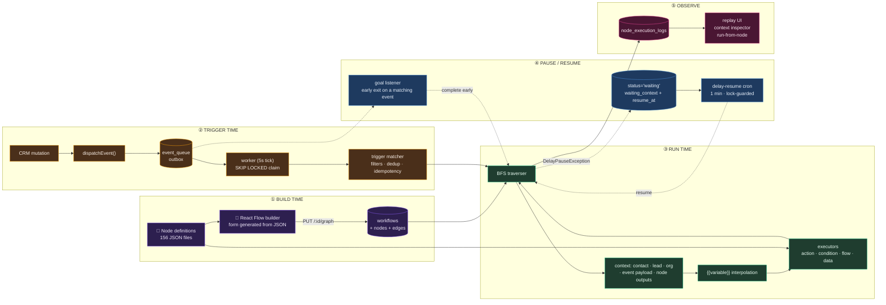

# SiloCRM Workflow Automation — Audit & Port Guide

An audit of the SiloCRM workflow-automation subsystem, written so a **different CRM product**
can re-implement it. Every claim here was read out of the SiloCRM source at the paths cited;
where something was not verified, it says so explicitly.

## TL;DR — this is an n8n-style workflow builder, built into a CRM

If you know n8n, you already know 80% of this system. SiloCRM's automation feature is
**architecturally n8n**, with CRM semantics swapped in:

| n8n concept | SiloCRM equivalent | Same? |
|---|---|---|
| `INodeTypeDescription` (displayName, properties[], displayOptions) | `NodeDefinition` in `packages/workflow-nodes/src/node-definition.ts` | **Near-identical** — same field names, same conditional-field mechanism |
| Node parameter form auto-generated from the node description | `config-renderer.tsx` + 28 field renderers | **Same idea** |
| Canvas of nodes wired by edges, with named output handles | React Flow canvas, `edge_config.sourceHandle` | **Same** |
| Expressions `{{ $json.field }}` | `{{contact.email}}`, `{{nodeId.output}}` | Same concept, CRM-scoped vocabulary instead of arbitrary JSON |
| Trigger nodes / Webhook node / Schedule node / Code node / HTTP Request / IF / Switch / Merge / Loop / Wait | All present, same names and semantics | **Same** |
| Executions list + per-node input/output inspection | Executions + `node_execution_logs` + replay UI | **Same** |
| Items array flowing node-to-node | **Replaced** — a CRM record (contact/lead) is the subject; nodes read a shared execution context | ❌ Different |
| Generic app connectors (400+) | **Replaced** — 156 nodes, mostly CRM-native (pipelines, stages, tags, custom fields) | ❌ Different |
| Self-hosted, single-tenant | Multi-tenant SaaS: RLS, per-org scoping, durable outbox, approval gates | ❌ Different |

**The three deliberate departures from n8n**, and why they matter for a CRM:

1. **Subject-centric, not item-centric.** Every run is *about* one contact/lead. That's what makes
   "enroll this contact", "is this contact already in this workflow", and "remove from workflow"
   expressible at all — concepts n8n has no place for.
2. **Durable, database-backed pauses.** A 30-day "Wait" is a row with a `resume_at`, resumed by a
   cron — not an in-process timer. CRM follow-up sequences run for weeks; n8n's Wait node is built
   for a different time horizon.
3. **CRM-native property types.** 12 of the 26 field types are pickers bound to the tenant's own
   pipelines, stages, tags, users, and custom fields. This is the entire difference between "a
   native automation builder" and "an embedded Zapier."

So: **build the n8n editor model, keep its node-description contract almost verbatim, and swap the
execution model for a subject + durable-pause engine.** That's the whole strategy.

## The whole system in one picture

## Read in this order

| # | File | What it answers |
|---|---|---|
| 00 | [`00-executive-summary.md`](00-executive-summary.md) | What this system *is*, in one page. Scale, shape, effort. |
| 01 | [`01-architecture.md`](01-architecture.md) | Layers, packages, request/event flow, where each concern lives. |
| 02 | [`02-data-model.md`](02-data-model.md) | Every table, column, index. The persistence contract. |
| 03 | [`03-node-catalog.md`](03-node-catalog.md) | All 156 nodes: what each does, its config, its outputs. |
| 04 | [`04-execution-engine.md`](04-execution-engine.md) | BFS traversal, branching, loops, delays, goals, sandbox, limits. |
| 05 | [`05-triggers-and-events.md`](05-triggers-and-events.md) | Event taxonomy, durable queue, trigger matching, webhooks, crons. |
| 06 | [`06-variables-and-templating.md`](06-variables-and-templating.md) | `{{namespace.field}}` system, interpolation, security. |
| 07 | [`07-frontend-builder.md`](07-frontend-builder.md) | React Flow canvas, config panel, node registry, UX inventory. |
| 08 | [`08-api-surface.md`](08-api-surface.md) | Every REST endpoint the feature exposes. |
| 09 | [`09-security-and-multitenancy.md`](09-security-and-multitenancy.md) | RLS, SSRF guards, sandboxing, approval gates, agency scope. |
| 10 | [`10-audit-findings.md`](10-audit-findings.md) | What is good, what is debt, **what not to copy**. |
| 11 | [`11-frontend-guidelines.md`](11-frontend-guidelines.md) | Implementation rules for the builder UI — node chrome, handles, generated forms, validation, performance. |
| — | [`PRD.md`](PRD.md) | Product requirements for building this in the target CRM. |
| — | [`node-catalog.tsv`](node-catalog.tsv) | Machine-readable dump of all 156 node definitions. |

## Diagram index

All diagrams are Mermaid and render on GitHub, in VS Code (Markdown Preview Mermaid extension), and
in most Markdown viewers.

| Diagram | Type | Where |
|---|---|---|
| Whole system, build → trigger → run → pause → observe | flowchart | this file, above |
| Package/layer system map | graph | [`01`](01-architecture.md) §1.0 |
| Event-triggered execution flow | sequence | [`01`](01-architecture.md) §1.2 |
| Entity relationships | ER | [`02`](02-data-model.md) §2.0 |
| Node catalog taxonomy | graph | [`03`](03-node-catalog.md) §3.0 |
| Execution lifecycle states | state | [`04`](04-execution-engine.md) §4.1 |
| BFS traversal loop | flowchart | [`04`](04-execution-engine.md) §4.2 |
| Node dispatch routing | flowchart | [`04`](04-execution-engine.md) §4.3 |
| Durable delay pause/resume | sequence | [`04`](04-execution-engine.md) §4.4 |
| Goal-event early exit | sequence | [`04`](04-execution-engine.md) §4.5 |
| Event taxonomy | mindmap | [`05`](05-triggers-and-events.md) §5.1 |
| Dispatch + outbox + side effects | flowchart | [`05`](05-triggers-and-events.md) §5.2 |
| Trigger matching + filters + dedup | flowchart | [`05`](05-triggers-and-events.md) §5.3 |
| Webhook request handling | flowchart | [`05`](05-triggers-and-events.md) §5.4 |
| Variable contract (and its duplication defect) | graph | [`06`](06-variables-and-templating.md) §6.1 |
| Interpolation resolution cascade | flowchart | [`06`](06-variables-and-templating.md) §6.3 |
| Builder component composition | graph | [`07`](07-frontend-builder.md) §7.1 |
| Config panel rendering | flowchart | [`07`](07-frontend-builder.md) §7.2 |
| AI copilot flow | sequence | [`07`](07-frontend-builder.md) §7.6 |
| REST endpoint groups | graph | [`08`](08-api-surface.md) §8.2 |
| Threat model → mitigations | graph | [`09`](09-security-and-multitenancy.md) |
| Approval gate | sequence | [`09`](09-security-and-multitenancy.md) §9.4 |
| Port plan timeline | gantt | [`10`](10-audit-findings.md) Part D |
| Builder layout + node/handle anatomy | ASCII | [`11`](11-frontend-guidelines.md) §11.2, §11.4 |

## Source of truth in the SiloCRM repo

| Concern | Path |
|---|---|
| Node definitions (shared FE+BE) | `packages/workflow-nodes/src/` |
| Execution engine | `apps/api/src/lib/workflow/engine/` |
| Node executors | `apps/api/src/lib/workflow/executors/` |
| Trigger matching | `apps/api/src/lib/workflow/services/workflow-trigger.service.ts` |
| Event taxonomy (Zod) | `packages/shared/src/schemas/workflow-events.ts` |
| Variable contract (Zod) | `packages/shared/src/schemas/workflow-variables.ts` |
| DB schema | `apps/api/prisma/schema/automations.prisma`, `misc.prisma`, `event-queue.prisma`, `workflow-goals.prisma` |
| REST routes | `apps/api/src/routes/workflow*.ts`, `automations.ts` |
| Builder UI | `apps/web/src/components/automation/` |

## Method & confidence

- Node counts, table columns, endpoint lists, and node-type strings were extracted mechanically
  from the repo (script output in `node-catalog.tsv`) — treat those as **verified**.
- Behavioural descriptions were read from the implementing function and cite `file:line`.
- Anything marked **⚠️ UNVERIFIED** was not confirmed by reading the code or running it. Do not
  build on it without checking.

## Scale at a glance

| Metric | Value |
|---|---|
| Node definitions | 156 (155 active, 1 coming-soon) |
| Backend workflow code | ~34,700 lines (`apps/api/src/lib/workflow/`) |
| Shared Zod workflow schemas | ~10,800 lines (`packages/shared/src/schemas/workflow*.ts`) |
| Builder UI | ~3,700 lines across canvas/nodes/sidebar/edges |
| CRM event types | 45 org-scoped + ~25 agency-scoped |
| DB tables | 13 dedicated |
| REST endpoints | 20 on `/api/workflows` + 5 more route files |
