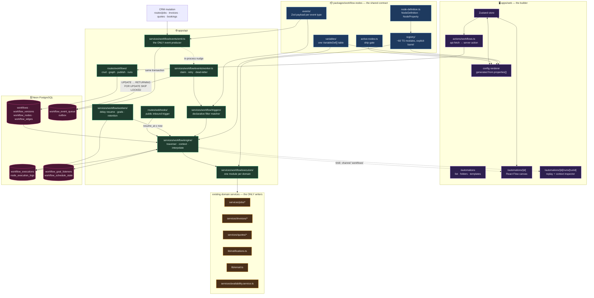
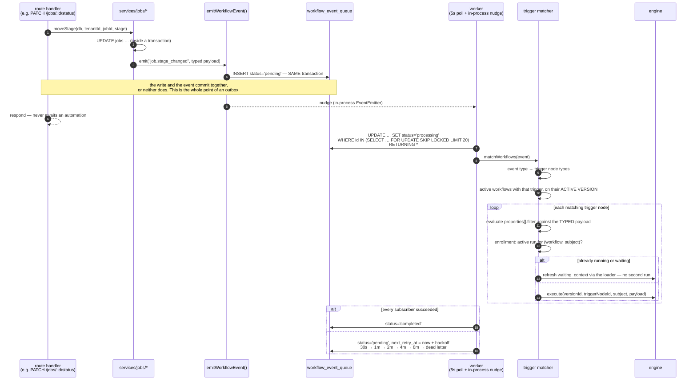

# WF-02 — Architecture

> Related: [[workflow-automation/README|Workflow Automation]] | [[wf-00-decisions]] | [[wf-03-data-model]] | [[wf-05-execution-engine]] | [[wf-06-triggers-and-events]] | [[wf-09-api-surface]] | [[architecture]] | [[api-rules]]

Target architecture for Zaxvio. Layers, packages, module map, and the runtime paths an event takes
from a CRM mutation to a sent email.

---

## 2.1 System map



The one arrow that matters most is `EXEC → DOMAIN`. **Executors do not touch tables.** See §2.5.

---

## 2.2 Physical layout

```
packages/
  workflow-nodes/                  ← NEW workspace package (@hvac-saas/workflow-nodes)
    package.json                   "." : "./src/index.ts" — raw TS, no build step
    src/
      node-definition.ts           NodeDefinition · NodeProperty · NodePropertyType
      registry/
        index.ts                   EXPLICIT static barrel — never a glob (FE-P2)
        triggers/*.ts              one module per trigger node
        actions/*.ts               one module per action node
        logic/*.ts
        data/*.ts
      catalog.ts                   getDefinition() · listByCategory() · getActive({ })
      active-nodes.ts              the ship gate (A-05)
      categories.ts                category + subcategory metadata, colours, order
      events/
        index.ts                   WORKFLOW_EVENTS registry
        payloads.ts                one Zod schema per event type (D-10)
      variables/
        index.ts                   VariableDef[] — ONE declaration (D-10 / §6.7)
      limits.ts                    EXECUTION_LIMITS + per-tenant quotas (D-26)
      index.ts

packages/database/src/schema/
  workflows.ts                     workflows · workflow_versions · workflow_folders
  workflow-graph.ts                workflow_nodes · workflow_edges
  workflow-runs.ts                 workflow_executions · node_execution_logs
  workflow-queue.ts                workflow_event_queue · workflow_goal_listeners
                                   · workflow_schedule_state

packages/types/src/
  workflow.ts                      inferred row types + the shared DTOs

apps/api/src/
  lib/schemas/workflows.ts         Zod for every route (api-rules §2)
  lib/communication-guards.ts      canEmailCustomer() — opt-out + quiet hours (D-15)
  routes/
    workflows/
      index.ts                     CRUD · graph · publish · activate · duplicate
      runs.ts                      executions · logs · replay · cancel · run-from-node
      testing.ts                   test one node · test whole workflow
      builder-context.ts           the one batch read the builder needs (§6 of wf-01)
    webhooks/
      workflow.ts                  PUBLIC inbound trigger receiver
  services/workflow/
    engine/
      execute.ts                   run lifecycle · limits · terminal handling
      traverser.ts                 BFS · joins · branch routing · loops · goto
      node-executor.ts             dispatch · interpolate-once · node log
      context.ts                   loadExecutionContext · refreshAfterNode
      interpolate.ts               {{token}} resolution · encoding · diagnostics
      errors.ts                    DelayPause · GoalWait · Stopped · Timeout
    triggers/
      match.ts                     ONE declarative filter evaluator
      enroll.ts                    dedup · idempotency · waiting-context refresh
    events/
      emit.ts                      emitWorkflowEvent() — the only producer
      worker.ts                    claim · process · backoff · dead-letter · recover
    executors/
      index.ts                     route by node id prefix
      communication.ts             email.send · notification.internal
      customer.ts                  customer.* — calls the customers service
      job.ts                       job.*      — calls services/jobs/*
      quote.ts                     quote.*    — calls services/quotes/*
      invoice.ts                   invoice.*  — calls services/invoices/*
      booking.ts                   booking.*
      asset.ts                     equipment.* · contract.*
      logic.ts                     if · switch · split · merge · delay · goto · stop · goal
      data.ts                      setFields · math · transform
    workers/
      resume.ts                    delay resume · goal expiry · stuck-run reaper
      schedule.ts                  daily/weekly triggers · contract-due · warranty-due
      retention.ts                 node-log sweep (D-19)
    graph/
      persist.ts                   whole-graph PUT diff + If-Match guard
      publish.ts                   snapshot the draft into workflow_versions
      validate.ts                  ONE validator — shared with the builder
    templates/
      seed.ts                      the 10 launch templates (D-27)

apps/web/src/
  app/(dashboard)/automations/
    page.tsx · automations-page-client.tsx · loading.tsx
    [id]/page.tsx · builder-client.tsx · loading.tsx
    [id]/runs/page.tsx · [id]/runs/[runId]/page.tsx
  components/dashboard/automations/     ← strict-rules §3: NEVER inside the route folder
    canvas/ · nodes/ · edges/ · palette/ · config/ · fields/ · variables/
    replay/ · templates/ · toolbar/
  lib/workflow/
    store.ts                       Zustand — every mutation goes through it
    build-node.ts                  THE node constructor (palette, paste, templates, AI)
    validate.ts                    re-export of the shared validator
    icon-map.ts                    curated name → component (FE-P1, never a wildcard)
  actions/workflows.ts             api-fetch → server action (ADR-002)
  hooks/queries/use-workflows.ts   TanStack hooks + keys in lib/query-keys.ts
```

---

## 2.3 Layering rules

Adapted from [[01-architecture|§1.4]], with two additions that are Zaxvio-specific.

1. **A node definition never contains behaviour.** It declares fields; a TS executor implements the
   action. The link is the node id string (`"job.moveStage"`).
2. **Executors never touch HTTP and never touch tables.** Signature is
   `(input: ExecutorInput) => Promise<NodeOutput>`; side effects go through the domain service.
3. **The traverser never knows what a node does.** Run it, read its output, decide which outgoing
   edges to follow.
4. **The engine hydrates entity data once** in `loadExecutionContext()` and re-reads only after
   nodes that declare `mutates`.
5. **Everything crossing the API boundary is a Zod schema** in `lib/schemas/workflows.ts`
   ([[api-rules|§2]]). No route without one.
6. **➕ Every function under `services/workflow/` takes `tenantId` explicitly.** There is no RLS
   ([[wf-00-decisions|D-16]]).
7. **➕ Business logic lives in the domain service, not the executor** ([[wf-00-decisions|D-17]],
   the no-second-writer rule). An executor that contains an `UPDATE` is a bug.

---

## 2.4 The two runtime paths

### Path A — event-triggered (the normal case)



Two properties worth naming because they are improvements on the source:

- **The event is written in the same transaction as the domain write.** SiloCRM's `dispatchEvent()`
  is called after the fact and fire-and-forget, so a rollback after the enqueue leaves a phantom
  event. Drizzle's `db.transaction()` makes the correct version free — pass the transaction handle
  to `emit()`. (`Omit<…, "$client">` is already the repo's idiom for a type that accepts both, see
  `lib/tenant-guards.ts`.)
- **Workflow triggering is its own subscriber.** [[10-audit-findings|B-07]] describes SiloCRM's
  `runEventSideEffects()` as nine coupled concerns where a throw in item 7 retries item 1. Zaxvio's
  outbox rows carry `subscriber` and each subscriber has its own status and retry count.

### Path B — direct invocation

| Entry | Route |
|---|---|
| Inbound webhook | `POST /webhooks/w/:workflowId/:path` → engine (public, per-workflow auth) |
| Manual run | `POST /workflows/:id/runs` |
| Test run (sample data) | `POST /workflows/:id/test` |
| Test **one node** | `POST /workflows/nodes/test` |
| Run from node (replay) | `POST /workflows/runs/:runId/replay-from/:nodeId` |
| Delay resume | `workers/resume.ts` → engine |
| Scheduled triggers | `workers/schedule.ts` → `emitWorkflowEvent()` → rejoins Path A |
| Sub-automation | `workflow.run` node → engine, depth-capped at 3 |

Scheduled triggers **never** call the engine directly. They emit an event, so filters, enrollment
dedup and context loading all take one code path ([[05-triggers-and-events|§5.5]]).

---

## 2.5 The no-second-writer boundary, drawn

This is the single most important structural rule and it deserves a picture.

```
      ┌──────────────────────────────────────────────────────────────┐
      │  executors/job.ts                                            │
      │                                                              │
      │   moveStage(input) {                                         │
      │     const { tenantId, params, context } = input               │
      │  ✅  return jobsService.moveStage(db, tenantId, jobId, {      │
      │        stageId: params.stageId,                              │
      │        actorId: null,          // an automation has no user   │
      │        source: 'automation',                                 │
      │        workflowId: context.workflowId,                       │
      │      })                                                      │
      │                                                              │
      │  ❌  await db.update(jobs).set({ status: params.status })     │
      │        .where(eq(jobs.id, jobId))                            │
      │   }                                                          │
      └──────────────────────────────────────────────────────────────┘
```

The ❌ line is exactly [[quotes|QUO-02]]: `lib/quote-to-job.ts` wrote `jobs.status` by hand and never
set `stage_id`, so for four days every job created from a quote counted 0 in the pipeline stage
counts and matched no lifecycle filter. The engine is a new writer for every table in the product;
if it writes columns it will reproduce that bug in ten places at once.

The domain service is also where the *rest* of the consequences live — the completion gate, the
E-05 email, the notification, the activity row. `bulk-status-update` sent no completion email for
exactly this reason before the jobs audit fixed it.

**Where the service does not exist yet** (jobs, customers), the executor is blocked until it does.
That is the dependency, and it is a feature: Phase 7 extracts `services/jobs/` and closes
[[architecture|ARC-05]].

### Attribution

Every domain service the engine calls gains two optional arguments:

```ts
{ actorId: string | null,   // null for an automation
  source: 'user' | 'automation' | 'public' | 'system',
  workflowId?: string, executionId?: string }
```

so an activity row can say *"Moved to Completed by automation «Job follow-up»"* rather than
appearing to have happened by itself. Users distrust invisible changes more than they dislike
automation.

---

## 2.6 Where the tenant id comes from

```
workflows.tenant_id
   └─► EngineContext { tenantId, timezone, workflowId, versionId, executionId }
          └─► every service call, every query, every guard
```

Never from: a node config field, an event payload, a subject row, an environment variable, or a
cached lookup. `EngineContext` is constructed once in `engine/execute.ts` from the workflow row that
was loaded by id **and** tenant, and is passed down. Nothing under `services/workflow/` calls
`getDb()` and then queries without a tenant predicate.

Foreign ids inside a node config (`pipelineId`, `stageId`, `catalogItemId`, `checklistId`,
`assigneeId`, `templateId`) are **untrusted input** and are checked with `lib/tenant-guards.ts`
twice: at save time so the user is told, and at execution time because rows get deleted and
workflows get duplicated.

---

## 2.7 Module dependency direction

```
packages/workflow-nodes   (no dependencies on apps)
        ▲            ▲
        │            │
   apps/web      apps/api/services/workflow
                        │
                        ▼
              apps/api/services/*  ·  apps/api/lib/*     (existing domain code)
                        │
                        ▼
              packages/database
```

`services/workflow/` depends on the domain. **The domain never depends on `services/workflow/`** —
with one deliberate exception: domain services call `emitWorkflowEvent()`, which lives in
`services/workflow/events/emit.ts`. To keep the direction clean, `emit.ts` imports only from
`packages/workflow-nodes` and `packages/database`. It is a leaf.

---

## 2.8 Failure isolation

| Failure | Blast radius | Mechanism |
|---|---|---|
| One node throws | that execution → `failed`, error re-thrown to a parent sub-automation | terminal handling in `execute.ts` |
| One execution throws | that outbox row retries; other workflows on the same event are unaffected | per-workflow try/catch inside the matcher |
| One subscriber throws | only that subscriber's row retries | per-subscriber outbox rows (fixes [[10-audit-findings\|B-07]]) |
| The worker dies mid-batch | rows stuck in `processing` > 5 min return to `pending` | stale-processing recovery |
| An email provider 403s | node → `failed` with the provider's reason in plain language | [[09-security-and-multitenancy\|§9.8]] |
| A tenant runs away | capped by concurrent + daily quotas, surfaced before enforced | [[wf-00-decisions\|D-26]] |
| The engine breaks entirely | **the CRM keeps working** — every producer is fire-and-forget past the transaction commit | outbox |

That last row is the reason for the outbox in one sentence: a broken automation engine must never be
able to stop someone invoicing a customer.

---

## 2.9 Observability surfaces

| Surface | Where |
|---|---|
| Per-node logs | `node_execution_logs`, denormalised with `workflow_id` / `node_type` / `node_label` so failures are queryable without joins |
| Replay on canvas | `/automations/[id]/runs/[runId]` — the **same** canvas component in read-only mode ([[11-frontend-guidelines\|FE-E3]]) |
| Context inspector | stored context at a node, for failed nodes and test runs ([[wf-00-decisions\|D-19]]) |
| Live test run | SSE channel `"workflows"` on the existing `/events` stream — add to the `EventChannel` union in `lib/event-bus.ts` |
| Enrollment | who is in this automation right now, and at which node |
| Failure notification | `dispatchNotification` to org members on crash/timeout, **not** on cancel ([[04-execution-engine\|§4.1]]) |
| Queue health | superadmin: pending/processing/dead-letter counts, oldest pending age |
