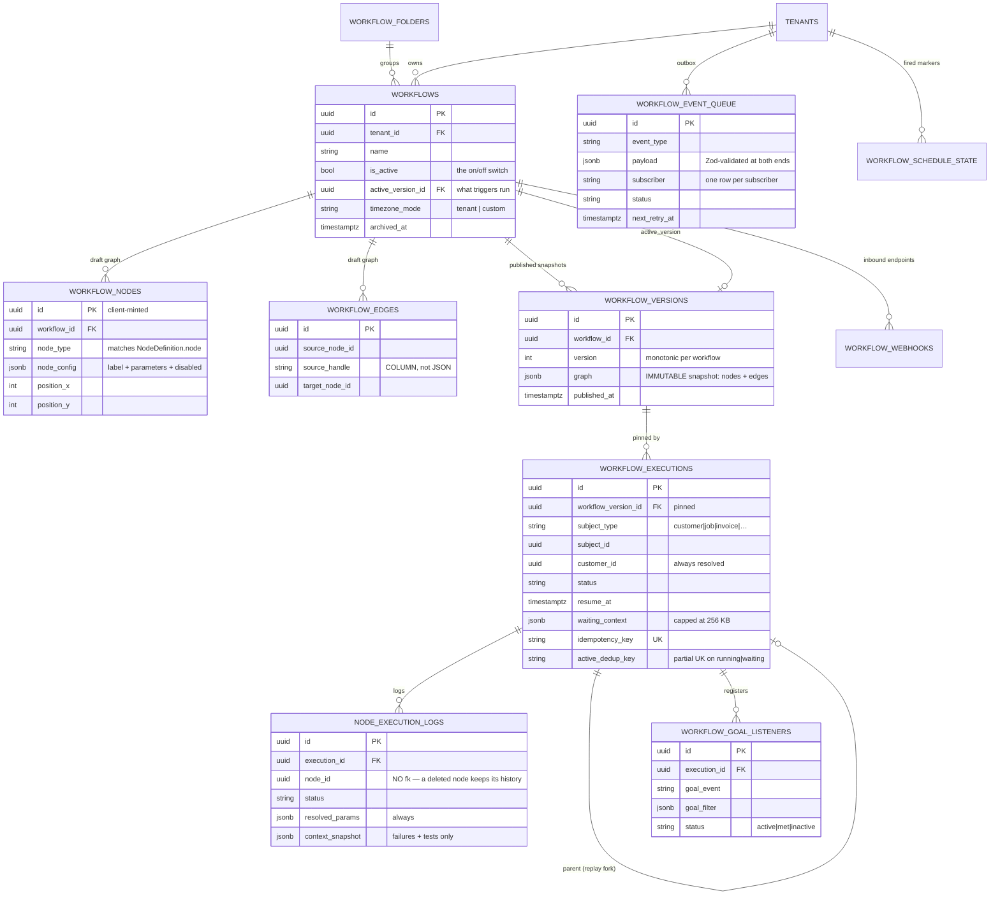

# WF-03 — Data Model

> Related: [[workflow-automation/README|Workflow Automation]] | [[wf-00-decisions]] | [[wf-02-architecture]] | [[wf-05-execution-engine]] | [[wf-06-triggers-and-events]] | [[strict-rules]] | [[security-rules]] | [[backend-stack]]

Ten new tables plus two columns on `customers` and three on `tenants`. Drizzle schema in
`packages/database/src/schema/`, applied by a hand-written **idempotent** migration in
`supabase/migrations/` ([[strict-rules|§1]]).

House conventions, all followed:
- `uuid` primary keys, `defaultRandom()`
- `tenant_id uuid NOT NULL REFERENCES tenants(id) ON DELETE CASCADE` on every tenant-scoped table
- `timestamp with time zone` — **never** BigInt epoch ms (the source system's convention)
- `archived_at timestamptz NULL` for soft delete where the product exposes archiving; hard delete
  otherwise. **No** `is_deleted` / `deleted_by` / `deletion_reason` quartet.
- Enums as `pgEnum`, mirrored as Zod enums in `lib/schemas/` ([[api-rules|§4]])

---

## 3.0 Entity relationships



---

## 3.1 Table map

| Table | Purpose | Phase |
|---|---|---|
| `workflows` | The automation record | P1 |
| `workflow_versions` | Immutable published graph snapshots ([[wf-00-decisions\|D-06]]) | P1 |
| `workflow_nodes` | Draft graph vertices | P1 |
| `workflow_edges` | Draft graph edges | P1 |
| `workflow_executions` | One run | P1 |
| `node_execution_logs` | One node within a run | P1 |
| `workflow_event_queue` | Transactional outbox | P2 |
| `workflow_goal_listeners` | Active goal-exit watches | P6 |
| `workflow_schedule_state` | Persisted "already fired" markers ([[10-audit-findings\|B-08]]) | P9 |
| `workflow_webhooks` | Inbound endpoint + hashed secret | P9 |
| `workflow_folders` | Grouping past ~20 automations | P7 |

Column additions to existing tables:

| Table | Column | Why | Phase |
|---|---|---|---|
| `customers` | `email_opt_out boolean NOT NULL DEFAULT false` | [[wf-00-decisions\|D-15]] | P3 |
| `customers` | `opt_out_at timestamptz`, `opt_out_reason text` | audit trail | P3 |
| `tenants` | `automation_quiet_hours_start time`, `automation_quiet_hours_end time` | nullable = no quiet hours | P6 |
| `tenants` | `automation_daily_email_cap integer NOT NULL DEFAULT 200` | [[wf-00-decisions\|D-26]] | P3 |

---

## 3.2 `workflows`

```ts
export const workflows = pgTable("workflows", {
  id: uuid("id").primaryKey().defaultRandom(),
  tenantId: uuid("tenant_id").notNull()
    .references(() => tenants.id, { onDelete: "cascade" }),
  name: text("name").notNull(),
  description: text("description"),

  /** The on/off switch. An automation with no active version cannot be activated. */
  isActive: boolean("is_active").notNull().default(false),

  /**
   * What triggers actually run. NULL until first publish — which is why a new
   * automation cannot fire while it is still being drawn. Deliberately not a
   * hard FK cycle: set after the version row exists.
   */
  activeVersionId: uuid("active_version_id"),

  folderId: uuid("folder_id").references(() => workflowFolders.id, { onDelete: "set null" }),

  /** 'tenant' resolves tenants.timezone; 'custom' uses the column below. */
  timezoneMode: text("timezone_mode").notNull().default("tenant"),
  timezone: text("timezone"),

  /** Where it came from, so the template gallery can show "already installed". */
  templateKey: text("template_key"),

  createdBy: text("created_by").references(() => user.id, { onDelete: "set null" }),
  createdAt: timestamp("created_at", { withTimezone: true }).notNull().defaultNow(),
  updatedAt: timestamp("updated_at", { withTimezone: true }).notNull().defaultNow(),
  archivedAt: timestamp("archived_at", { withTimezone: true }),
}, (t) => [
  index("idx_workflows_tenant_active").on(t.tenantId, t.isActive),
  index("idx_workflows_tenant_archived").on(t.tenantId, t.archivedAt),
  index("idx_workflows_folder").on(t.folderId),
]);
```

**`is_active` defaults to `false`.** SiloCRM defaults to `true`. A drawing tool that starts sending
email the moment you drop a trigger onto it is a bad idea, and
[[11-frontend-guidelines|FE-O5]] already warns that users build automations, never activate them,
and report it as broken — the fix for that is an unmissable inactive banner, not a dangerous default.

**`timezone_mode` matters.** Schedule triggers, delay resolution and every rendered date resolve the
workflow's zone falling back to `tenants.timezone`, **never** the server zone
([[10-audit-findings|A-08]]). Uses the existing `lib/timezone.ts`.

---

## 3.3 `workflow_versions` — the published snapshot

```ts
export const workflowVersions = pgTable("workflow_versions", {
  id: uuid("id").primaryKey().defaultRandom(),
  tenantId: uuid("tenant_id").notNull()
    .references(() => tenants.id, { onDelete: "cascade" }),
  workflowId: uuid("workflow_id").notNull()
    .references(() => workflows.id, { onDelete: "cascade" }),

  /** Monotonic per workflow. Displayed as "v3". */
  version: integer("version").notNull(),

  /**
   * The whole graph, frozen. { nodes: [...], edges: [...] } exactly as the
   * engine wants to read it — no join, no second query, no chance of an
   * in-flight run seeing a node that was deleted while it was paused.
   */
  graph: jsonb("graph").notNull(),

  /** Denormalised so the executions list can group by trigger without parsing graph. */
  triggerTypes: text("trigger_types").array().notNull().default(sql`'{}'`),

  publishedAt: timestamp("published_at", { withTimezone: true }).notNull().defaultNow(),
  publishedBy: text("published_by").references(() => user.id, { onDelete: "set null" }),
  note: text("note"),
}, (t) => [
  uniqueIndex("idx_workflow_versions_unique").on(t.workflowId, t.version),
  index("idx_workflow_versions_workflow").on(t.workflowId, t.publishedAt),
]);
```

Why a snapshot rather than versioned node rows: node rows must stay editable and singular so the
builder can patch one node, and `node_execution_logs` must keep pointing at a node id that no longer
exists. A JSON snapshot gives version pinning for one column and one write, and makes "revert to v2"
a copy.

**Retention:** keep the active version, the 10 most recent, and any version with a non-terminal
execution. Swept with the node logs.

---

## 3.4 `workflow_nodes` / `workflow_edges` — the draft graph

```ts
export const workflowNodes = pgTable("workflow_nodes", {
  id: uuid("id").primaryKey(),          // CLIENT-minted: crypto.randomUUID() in build-node.ts
  tenantId: uuid("tenant_id").notNull().references(() => tenants.id, { onDelete: "cascade" }),
  workflowId: uuid("workflow_id").notNull().references(() => workflows.id, { onDelete: "cascade" }),
  nodeType: text("node_type").notNull(),        // matches NodeDefinition.node
  nodeConfig: jsonb("node_config").notNull(),   // { label, parameters, disabled? }
  positionX: integer("position_x").notNull().default(0),
  positionY: integer("position_y").notNull().default(0),
  createdAt: …, updatedAt: …,
}, (t) => [index("idx_workflow_nodes_workflow").on(t.workflowId)]);

export const workflowEdges = pgTable("workflow_edges", {
  id: uuid("id").primaryKey(),
  tenantId: uuid("tenant_id").notNull().references(() => tenants.id, { onDelete: "cascade" }),
  workflowId: uuid("workflow_id").notNull().references(() => workflows.id, { onDelete: "cascade" }),
  sourceNodeId: uuid("source_node_id").notNull(),
  /** A COLUMN. Routing logic must be queryable — wf-00 D-07 / B-06. */
  sourceHandle: text("source_handle").notNull().default("main"),
  targetNodeId: uuid("target_node_id").notNull(),
  label: text("label"),
  createdAt: …,
}, (t) => [
  index("idx_workflow_edges_workflow").on(t.workflowId),
  index("idx_workflow_edges_source").on(t.sourceNodeId, t.sourceHandle),
]);
```

Node ids are **client-minted** because the builder sends the whole graph and the server diffs it
(§3.10). Edge endpoints are plain `uuid` with **no FK** to `workflow_nodes` — a whole-graph PUT
deletes and re-inserts in one transaction, and an FK would force ordering constraints for no benefit;
`graph/validate.ts` enforces referential sanity, and it has to anyway for the snapshot.

### `node_config`

```jsonc
{
  "label": "Text the customer",       // user-editable display name
  "parameters": {                      // keys = NodeProperty.name
    "recipient": "customer",
    "subject": "Your {{job.serviceType}} visit tomorrow",
    "body": "Hi {{customer.firstName}}, see you at {{job.scheduledStart}}."
  },
  "disabled": false
}
```

**Every definition default is written into `parameters` at node creation.**
[[05-triggers-and-events|§5.3]] records the bug this prevents: a dropdown showing "First-time callers
only" as pre-selected but persisting nothing, so the runtime default and the UI default were two
separate declarations and disagreed. One constructor (`lib/workflow/build-node.ts`) is used by the
palette, paste, template install and any future AI — an AI-created node is byte-identical to a
hand-created one ([[07-frontend-builder|§7.6]]).

---

## 3.5 `workflow_executions`

```ts
export const workflowExecutionStatusEnum = pgEnum("workflow_execution_status", [
  "running", "waiting", "completed", "failed", "cancelled",
]);

export const workflowSubjectTypeEnum = pgEnum("workflow_subject_type", [
  "customer", "job", "invoice", "quote", "booking", "equipment", "maintenance_contract",
]);

export const workflowExecutions = pgTable("workflow_executions", {
  id: uuid("id").primaryKey().defaultRandom(),
  tenantId: uuid("tenant_id").notNull().references(() => tenants.id, { onDelete: "cascade" }),
  workflowId: uuid("workflow_id").notNull().references(() => workflows.id, { onDelete: "cascade" }),
  /** Pinned. Resume loads THIS graph, never the live draft. */
  workflowVersionId: uuid("workflow_version_id").notNull()
    .references(() => workflowVersions.id, { onDelete: "restrict" }),

  // ── subject (wf-00 D-02) ────────────────────────────────────────────────
  subjectType: workflowSubjectTypeEnum("subject_type"),
  subjectId: uuid("subject_id"),
  /** Always resolved from the subject. Powers "which automations touched this customer". */
  customerId: uuid("customer_id").references(() => customers.id, { onDelete: "set null" }),

  status: workflowExecutionStatusEnum("status").notNull().default("running"),
  triggerNodeId: uuid("trigger_node_id"),
  triggerEvent: text("trigger_event"),
  /** 'event' | 'manual' | 'test' | 'webhook' | 'schedule' | 'sub' | 'replay' */
  source: text("source").notNull(),

  startedAt: timestamp("started_at", { withTimezone: true }).notNull().defaultNow(),
  completedAt: timestamp("completed_at", { withTimezone: true }),
  errorMessage: text("error_message"),
  /** Plain language, for the user. Never a stack — see security §9.8. */
  errorHint: text("error_hint"),

  // ── durable pause ───────────────────────────────────────────────────────
  resumeAt: timestamp("resume_at", { withTimezone: true }),
  currentNodeId: uuid("current_node_id"),
  waitingContext: jsonb("waiting_context"),
  contextTruncated: boolean("context_truncated").notNull().default(false),

  parentExecutionId: uuid("parent_execution_id"),

  // ── dedup (wf-00 D-03) ──────────────────────────────────────────────────
  idempotencyKey: text("idempotency_key"),
  activeDedupKey: text("active_dedup_key"),

  nodesExecuted: integer("nodes_executed").notNull().default(0),
}, (t) => [
  index("idx_wf_exec_workflow").on(t.workflowId, t.startedAt),
  index("idx_wf_exec_tenant_status").on(t.tenantId, t.status),
  /** THE resume query. */
  index("idx_wf_exec_resume").on(t.status, t.resumeAt),
  index("idx_wf_exec_subject").on(t.tenantId, t.subjectType, t.subjectId),
  index("idx_wf_exec_customer").on(t.tenantId, t.customerId),
  uniqueIndex("idx_wf_exec_idempotency").on(t.idempotencyKey)
    .where(sql`${t.idempotencyKey} IS NOT NULL`),
  /** One live run per (workflow, subject). The insert THROWS 23505 and the
   *  trigger service takes the refresh branch — wf-00 D-03. */
  uniqueIndex("idx_wf_exec_active_dedup").on(t.activeDedupKey)
    .where(sql`${t.activeDedupKey} IS NOT NULL AND ${t.status} IN ('running','waiting')`),
]);
```

### Status semantics

| Status | Meaning | Who moves it next |
|---|---|---|
| `running` | actively traversing | the engine |
| `waiting` + `resume_at` set | delay pause | the resume worker |
| `waiting` + `resume_at` NULL | goal wait | a matching event, or the stuck-run reaper |
| `completed` | drained the queue, or exited on a goal, or a success stop | terminal |
| `failed` | crash, timeout, or an error stop | terminal |
| `cancelled` | deliberately stopped, or the subject was deleted | terminal |

**Every transition out of `running` is a compare-and-set** ([[10-audit-findings|A-04]]):

```ts
const [claimed] = await db.update(workflowExecutions)
  .set({ status: "waiting", resumeAt, waitingContext, currentNodeId })
  .where(and(eq(workflowExecutions.id, id), eq(workflowExecutions.status, "running")))
  .returning({ id: workflowExecutions.id });
if (!claimed) return;   // someone else already moved it — a goal exit, or a cancel
```

Small, invisible, and the only thing standing between a delay pause and a concurrent goal exit both
believing they own the row.

**`active_dedup_key` is cleared on every terminal transition** — the partial index only covers
`running|waiting`, so leaving it set is harmless, but clearing it keeps the index small and makes
the intent readable.

### `waiting_context` bounds

Serialised context is capped at **256 KB** ([[wf-00-decisions|D-20]]). Over the cap, the engine keeps
the subject, customer, tenant, trigger payload, loop state and the **last five** node outputs, drops
the rest, and sets `context_truncated`. The replay UI shows a badge. `env`, database handles and
anything non-serialisable are stripped before the size is measured.

---

## 3.6 `node_execution_logs`

```ts
export const nodeExecutionLogs = pgTable("node_execution_logs", {
  id: uuid("id").primaryKey().defaultRandom(),
  tenantId: uuid("tenant_id").notNull().references(() => tenants.id, { onDelete: "cascade" }),
  executionId: uuid("execution_id").notNull()
    .references(() => workflowExecutions.id, { onDelete: "cascade" }),

  /** NO foreign key. A node deleted from the draft graph must not delete its history. */
  nodeId: uuid("node_id").notNull(),

  /** Denormalised so failures are queryable without three joins. */
  workflowId: uuid("workflow_id").notNull(),
  nodeType: text("node_type").notNull(),
  nodeLabel: text("node_label"),
  sequence: integer("sequence").notNull(),

  status: text("status").notNull(),   // running|completed|failed|waiting|skipped
  skipReason: text("skip_reason"),    // "disabled" | "opted out" | "quiet hours" | …

  startedAt: timestamp("started_at", { withTimezone: true }).notNull().defaultNow(),
  completedAt: timestamp("completed_at", { withTimezone: true }),
  durationMs: integer("duration_ms"),

  /** ALWAYS stored: what this node actually tried to do, post-interpolation.
   *  Small, and 95% of debugging. Secrets stripped. */
  resolvedParams: jsonb("resolved_params"),
  output: jsonb("output"),

  /** Failures and test runs ONLY — wf-00 D-19. */
  contextSnapshot: jsonb("context_snapshot"),

  errorMessage: text("error_message"),
  errorHint: text("error_hint"),
}, (t) => [
  index("idx_node_logs_execution").on(t.executionId, t.sequence),
  index("idx_node_logs_tenant_status").on(t.tenantId, t.status),
  index("idx_node_logs_workflow_status").on(t.workflowId, t.status),
  index("idx_node_logs_started").on(t.startedAt),   // the retention sweep
  /** at-most-once side effects: a resume that finds an existing running row
   *  refuses to re-send rather than sending twice — wf-00 D-22. */
  uniqueIndex("idx_node_logs_attempt").on(t.executionId, t.nodeId, t.sequence),
]);
```

Rows are written for `skipped` and `waiting` nodes too, not only success and failure — the replay UI
depends on it ([[04-execution-engine|§4.9]] invariant 6).

**Retention: 90 days**, swept in bounded batches by `workers/retention.ts`, claimed the same way
everything else is claimed. Planned on day one because this is the fastest-growing table in the
system ([[10-audit-findings|B-11]]).

---

## 3.7 `workflow_event_queue` — the outbox

```ts
export const workflowEventStatusEnum = pgEnum("workflow_event_status", [
  "pending", "processing", "completed", "failed", "cancelled",
]);

export const workflowEventQueue = pgTable("workflow_event_queue", {
  id: uuid("id").primaryKey().defaultRandom(),
  tenantId: uuid("tenant_id").notNull().references(() => tenants.id, { onDelete: "cascade" }),

  eventType: text("event_type").notNull(),      // "job.stage_changed"
  /** Zod-validated by the producer AND by the consumer — wf-00 D-10. */
  payload: jsonb("payload").notNull(),

  subjectType: workflowSubjectTypeEnum("subject_type"),
  subjectId: uuid("subject_id"),
  actorUserId: text("actor_user_id"),

  /**
   * One row PER SUBSCRIBER. Fixes B-07: a throw in one subscriber must not
   * retry the others. Today: 'workflow_trigger' and 'goal_listener'.
   */
  subscriber: text("subscriber").notNull(),

  status: workflowEventStatusEnum("status").notNull().default("pending"),
  attempts: integer("attempts").notNull().default(0),
  maxAttempts: integer("max_attempts").notNull().default(5),
  lastError: text("last_error"),

  scheduledAt: timestamp("scheduled_at", { withTimezone: true }).notNull().defaultNow(),
  claimedAt: timestamp("claimed_at", { withTimezone: true }),
  processedAt: timestamp("processed_at", { withTimezone: true }),
  nextRetryAt: timestamp("next_retry_at", { withTimezone: true }),

  /** Groups the per-subscriber rows that came from one domain event. */
  correlationId: uuid("correlation_id").notNull(),
  /** Producer-supplied. UNIQUE per (event, subscriber) — a double-fired
   *  producer enqueues once. */
  dedupKey: text("dedup_key"),
}, (t) => [
  index("idx_wf_queue_claim").on(t.status, t.scheduledAt),
  index("idx_wf_queue_retry").on(t.status, t.nextRetryAt),
  index("idx_wf_queue_tenant").on(t.tenantId, t.status),
  index("idx_wf_queue_correlation").on(t.correlationId),
  uniqueIndex("idx_wf_queue_dedup").on(t.dedupKey, t.subscriber)
    .where(sql`${t.dedupKey} IS NOT NULL`),
]);
```

Backoff: `min(30s · 2^(attempts-1), 8min)` → 30s, 1m, 2m, 4m, 8m, then `failed` (dead letter).
Rows stuck in `processing` for more than 5 minutes return to `pending`.

Claimed with a single statement so two instances split the work rather than duplicating it — the
pattern `email-cron.ts` already uses and which was verified by execution in [[invoices|INV-30]]:

```sql
UPDATE workflow_event_queue
SET status = 'processing', claimed_at = now(), attempts = attempts + 1
WHERE id IN (
  SELECT id FROM workflow_event_queue
  WHERE (status = 'pending' AND scheduled_at <= now())
     OR (status = 'pending' AND next_retry_at IS NOT NULL AND next_retry_at <= now())
  ORDER BY scheduled_at
  FOR UPDATE SKIP LOCKED
  LIMIT 20
)
RETURNING *;
```

`FOR UPDATE SKIP LOCKED` rather than `SELECT` then `UPDATE`, for the reason SiloCRM's own comment
gives and which is worth preserving verbatim: READ COMMITTED lets two transactions read the same
rows before either commits.

**Retention: completed rows 7 days, dead-lettered rows 30 days** (an operator needs time to see
them).

---

## 3.8 `workflow_goal_listeners`

```ts
export const workflowGoalListeners = pgTable("workflow_goal_listeners", {
  id: uuid("id").primaryKey().defaultRandom(),
  tenantId: uuid("tenant_id").notNull().references(() => tenants.id, { onDelete: "cascade" }),
  workflowId: uuid("workflow_id").notNull(),
  executionId: uuid("execution_id").notNull()
    .references(() => workflowExecutions.id, { onDelete: "cascade" }),
  nodeId: uuid("node_id").notNull(),

  subjectType: workflowSubjectTypeEnum("subject_type").notNull(),
  subjectId: uuid("subject_id").notNull(),

  goalEvent: text("goal_event").notNull(),
  /** Extra match conditions, evaluated by the SAME filter engine as triggers. */
  goalFilter: jsonb("goal_filter").notNull().default(sql`'{}'::jsonb`),

  status: text("status").notNull().default("active"),   // active | met | inactive
  metAt: timestamp("met_at", { withTimezone: true }),
  createdAt: timestamp("created_at", { withTimezone: true }).notNull().defaultNow(),
}, (t) => [
  /** THE lookup on every dispatched event. */
  index("idx_goal_listeners_match")
    .on(t.tenantId, t.subjectType, t.subjectId, t.goalEvent, t.status),
  index("idx_goal_listeners_execution").on(t.executionId, t.status),
]);
```

Listeners are deactivated on every terminal transition of their execution. The goal filter reuses the
trigger matcher, so "goal: quote accepted **on this quote**" costs no new code.

---

## 3.9 `workflow_schedule_state`, `workflow_webhooks`, `workflow_folders`

```ts
/** Persisted "already fired" markers. B-08: SiloCRM keeps these in a module-level
 *  Map, so "once only" means "once per replica per uptime window". */
export const workflowScheduleState = pgTable("workflow_schedule_state", {
  id: uuid("id").primaryKey().defaultRandom(),
  tenantId: uuid("tenant_id").notNull().references(() => tenants.id, { onDelete: "cascade" }),
  workflowId: uuid("workflow_id").notNull().references(() => workflows.id, { onDelete: "cascade" }),
  nodeId: uuid("node_id").notNull(),
  /** e.g. "job:<uuid>" for a per-record once-only, or "2026-08-07" for a daily tick. */
  scopeKey: text("scope_key").notNull(),
  firedAt: timestamp("fired_at", { withTimezone: true }).notNull().defaultNow(),
}, (t) => [
  uniqueIndex("idx_schedule_state_unique").on(t.workflowId, t.nodeId, t.scopeKey),
  index("idx_schedule_state_fired").on(t.firedAt),
]);

/** One row per inbound endpoint. The secret is stored HASHED. */
export const workflowWebhooks = pgTable("workflow_webhooks", {
  id: uuid("id").primaryKey().defaultRandom(),
  tenantId: uuid("tenant_id").notNull().references(() => tenants.id, { onDelete: "cascade" }),
  workflowId: uuid("workflow_id").notNull().references(() => workflows.id, { onDelete: "cascade" }),
  nodeId: uuid("node_id").notNull(),
  path: text("path").notNull(),                 // slug segment
  authType: text("auth_type").notNull().default("secret"),  // none|secret|hmac
  secretHash: text("secret_hash"),
  secretHint: text("secret_hint"),              // last 4 chars, for the UI
  methods: text("methods").array().notNull().default(sql`'{POST}'`),
  isActive: boolean("is_active").notNull().default(true),
  lastCalledAt: timestamp("last_called_at", { withTimezone: true }),
  createdAt: …,
}, (t) => [
  uniqueIndex("idx_workflow_webhooks_path").on(t.tenantId, t.path),
  index("idx_workflow_webhooks_workflow").on(t.workflowId),
]);

export const workflowFolders = pgTable("workflow_folders", { /* id, tenantId, name, sortOrder */ });
```

`workflow_webhooks.path` is unique **per tenant**, and the public URL carries the workflow id, so a
path collision across tenants is impossible and a path cannot be guessed into another tenant.

---

## 3.10 The whole-graph save contract

`PUT /workflows/:id/graph` sends the complete node + edge set; the server diffs and applies inside
one transaction. Node ids are client-minted so the diff is by id.

```
incoming.nodes − existing  → INSERT
incoming.nodes ∩ existing  → UPDATE (config + position)
existing − incoming.nodes  → DELETE  (hard: the draft graph has no history to keep)
edges: DELETE ALL for this workflow, then INSERT — they are cheap and identity-free
```

**Concurrency guard, from day one** ([[10-audit-findings|B-10]]): the request carries
`expectedUpdatedAt`; the `UPDATE workflows SET updated_at = now() WHERE id = ? AND updated_at = ?`
either claims the write or returns zero rows, in which case the API responds **409** and the builder
says *"Someone else edited this automation. Reload to see their changes."* Not last-write-wins.

`MAX_NODES_PER_WORKFLOW = 60` bounds the payload ([[wf-00-decisions|D-26]]).

---

## 3.11 Migration

One file, `supabase/migrations/2026XXXXXXXXXX_workflow_automation.sql`, **idempotent throughout**
([[strict-rules|§1]]), following the shape of `20260806000001_job_costing.sql`:

| Guard | For |
|---|---|
| `DO $$ … IF NOT EXISTS (SELECT 1 FROM pg_type WHERE typname='…') THEN CREATE TYPE …` | all 4 new enums |
| `CREATE TABLE IF NOT EXISTS` | all 11 tables |
| `ALTER TABLE … ADD COLUMN IF NOT EXISTS` | `customers`, `tenants` additions |
| `CREATE INDEX IF NOT EXISTS` / `CREATE UNIQUE INDEX IF NOT EXISTS` | every index |
| `information_schema` guard | the two partial unique indexes (no `IF NOT EXISTS` for a `WHERE` clause change) |

Split by phase so each phase applies its own file rather than one 600-line drop:

| File | Phase | Contents |
|---|---|---|
| `…_workflow_core.sql` | P1 | workflows, versions, nodes, edges, executions, node logs + enums |
| `…_workflow_queue.sql` | P2 | event queue + enum |
| `…_workflow_comms_guard.sql` | P3 | `customers.email_opt_out` + friends, `tenants.automation_daily_email_cap` |
| `…_workflow_goals.sql` | P6 | goal listeners, `tenants.automation_quiet_hours_*` |
| `…_workflow_folders.sql` | P7 | folders + `workflows.folder_id` |
| `…_workflow_schedules.sql` | P9 | schedule state, webhooks |

**Verification** for each (the standard this repo holds itself to — [[invoices|the invoices
migration]] was verified 79/79 by execution):

- runs clean on an empty schema
- **runs again 3 more times producing only NOTICEs**, with the column and index sets byte-identical
  after each
- every FK enforces (insert a bogus id, expect `23503`, roll back)
- every partial unique index enforces (insert a duplicate, expect `23505`, roll back)
- `EXPLAIN` on the resume query and the queue claim query shows an index scan, not a seq scan

The `meta/_journal.json` reconciliation problem is pre-existing and out of scope
([[todo|Post-Neon Cleanup]]) — these files are applied the same way the last four were.

---

## 3.12 What is deliberately **not** in the schema

| Not building | Why |
|---|---|
| `scope` (org/agency) | [[wf-00-decisions\|D-11]] |
| `trigger_claims` | An `idempotency_key` unique index does the same job with less machinery ([[02-data-model\|§2.11]] point 4) |
| `stage_automations` (a second, simpler surface) | SiloCRM has a wizard-driven per-stage config *beside* the engine. Zaxvio expresses the same thing as a template on the engine — one system, not two |
| `workflow_templates` table | Templates are seeded `workflow_versions` snapshots in code ([[wf-00-decisions\|D-27]]) — versioned with the repo, reviewable in a PR, no migration to change one |
| Any `convex_*` / legacy engine residue | [[02-data-model\|§2.10]] — do not port |
