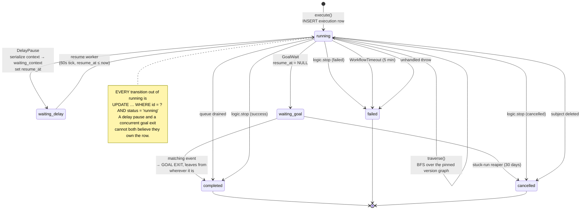
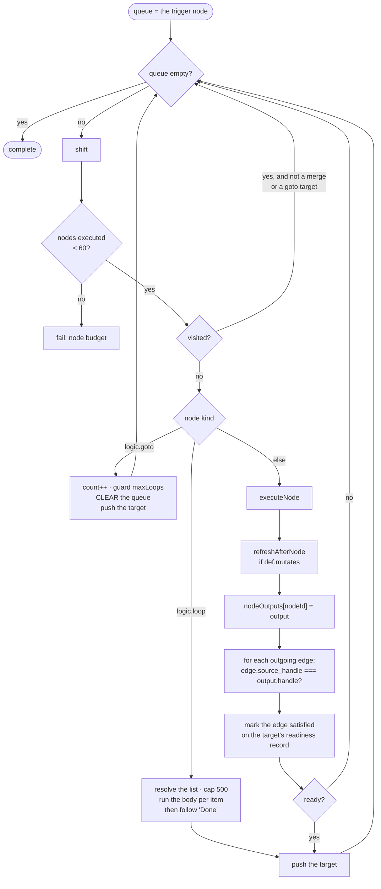
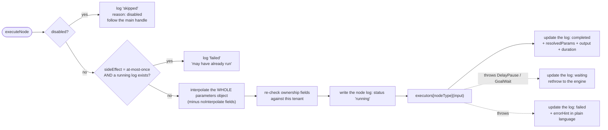
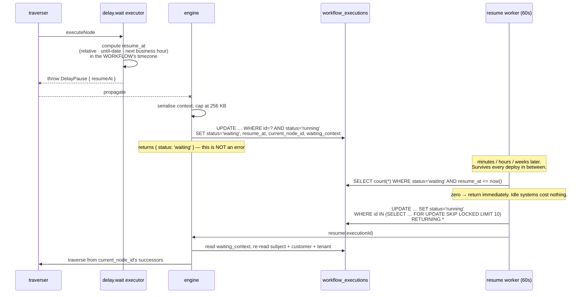

# WF-05 — Execution Engine

> Related: [[workflow-automation/README|Workflow Automation]] | [[wf-02-architecture]] | [[wf-03-data-model]] | [[wf-04-node-catalog]] | [[wf-07-variables]] | [[wf-11-testing]] | [[security-rules]]

`apps/api/src/services/workflow/engine/`. Six modules, target ~1,800 lines total — about a fifth of
the source system's, because the catalog is smaller, the filters are declarative, and the variables
are declared once.

| File | Responsibility |
|---|---|
| `execute.ts` | Run lifecycle: create the row, load context, wall clock, terminal handling, quotas |
| `traverser.ts` | BFS walk, join readiness, edge routing, loops, goto |
| `node-executor.ts` | Interpolate once, dispatch, write the node log, re-run guard |
| `context.ts` | `loadExecutionContext` · `refreshAfterNode` · serialise/restore |
| `interpolate.ts` | `{{token}}` resolution, encoding, diagnostics |
| `errors.ts` | `DelayPause` · `GoalWait` · `WorkflowStopped` · `WorkflowTimeout` |

---

## 5.1 Lifecycle



### `execute()` — order of operations

```ts
execute(params: {
  tenantId: string;                    // NEVER from a payload — wf-00 D-16
  workflowId: string;
  versionId?: string;                  // omitted → the workflow's active version
  triggerNodeId: string;
  subject: { type: SubjectType; id: string } | null;
  event?: { type: WorkflowEventType; payload: unknown };
  source: ExecutionSource;
  idempotencyKey?: string;
  depth?: number;
  parentContext?: Record<string, unknown>;
}): Promise<ExecutionResult>
```

1. **Quota check** — per-tenant concurrent (25) and daily (2,000). Over quota → do not start; record
   it, notify once per day, surface it in the UI. Never silently drop.
2. **Depth guard** — `depth > 3` throws. Sub-automation recursion.
3. **Load the version** — the pinned snapshot, tenant-scoped. A soft-deleted or archived workflow
   refuses to run even for a direct invocation (event triggers already filter, direct ones do not —
   [[04-execution-engine|§4.1]] point 2).
4. **Insert the execution row** — `status='running'`, with `idempotency_key` and `active_dedup_key`.
   A `23505` on either is **not an error**: it means "already enrolled", and the caller takes the
   refresh branch ([[wf-00-decisions|D-03]]).
5. **`loadExecutionContext()`** — subject, its customer, tenant, assignee, trigger payload.
6. **Attribution** — `ctx.workflowId` / `workflowName` / `executionId`, so every activity row and
   every email can say which automation did it.
7. **Merge parent context** for sub-automations.
8. **Register goal listeners** — scan the graph for `goal.event` nodes, insert listener rows.
9. **`withTimeout(traverse(...), 5 min)`**.
10. **Terminal handling** — one branch per error class.

### Terminal paths

| Thrown | Meaning | Result |
|---|---|---|
| *(nothing)* | traversal drained the queue | `completed` |
| `DelayPause` | a wait node paused | `waiting` + `resume_at` + `waiting_context` |
| `GoalWait` | a goal registered | `waiting`, `resume_at` NULL |
| `WorkflowStopped` | `logic.stop` | `completed` / `failed` / `cancelled` per `stopType` |
| `SubjectGone` | the subject row no longer exists | **`cancelled`** — a deleted job is not a bug |
| `WorkflowTimeout` | > 5 min | `failed`, partial outputs preserved |
| anything else | crash | `failed`, **re-thrown** so a parent sub-automation can catch it |

**Failure notification** fires for crashes, timeouts and error stops — **not** for `cancelled`.
A cancel is expected behaviour, and notifying on it trains people to ignore the notification. Good
instinct in the source ([[04-execution-engine|§4.1]]); copied.

The notification says what failed and what to do, in plain language, and links to the replay
([[09-security-and-multitenancy|§9.8]]) — never `WORKFLOW_NODE_FAILED`.

---

## 5.2 The execution context

```ts
interface ExecutionContext {
  // identity — set once, never read from user data
  tenantId: string;
  timezone: string;               // workflow zone → tenant zone → America/Chicago. NEVER the server.
  workflowId: string; workflowName: string;
  versionId: string; executionId: string;

  // the subject and everything that hangs off it
  subject: { type: SubjectType; id: string } | null;
  customer: CustomerContext | null;      // ALWAYS resolved when a subject exists
  job?: JobContext;
  invoice?: InvoiceContext;
  quote?: QuoteContext;
  booking?: BookingContext;
  equipment?: EquipmentContext;
  contract?: ContractContext;
  tenant: TenantContext;                 // business name, phone, address, logo, terms
  assignee?: MemberContext;

  // the event that started it
  trigger: { event: WorkflowEventType | null; payload: Record<string, unknown> };

  // accumulated during the run
  nodeOutputs: Record<string, unknown>;  // keyed by node id
  vars: Record<string, unknown>;         // data.setFields writes here
  loop?: { item: unknown; index: number; total: number };

  // bookkeeping
  visited: Set<string>;
  gotoCounts: Record<string, number>;
  sequence: number;
}
```

**The customer is always resolved.** Every one of the seven subject tables carries a `customer_id`,
so `{{customer.email}}` works on a job-, invoice-, quote- or booking-triggered run without the author
thinking about it ([[wf-00-decisions|D-02]]).

### Refresh after mutation

A node whose definition declares `mutates: ["job"]` triggers a re-read of the job **and** an
`analyticsCache.invalidateTenant()` call. Declarative, not imperative — the source system does this
in 753 lines of hand-written code and [[04-execution-engine|§4.8]] says to declare it instead.

```ts
async function refreshAfterNode(ctx, def) {
  if (!def.mutates?.length) return;
  for (const kind of def.mutates) ctx[kind] = await loaders[kind](db, ctx.tenantId, ctx[kind].id);
  analyticsCache.invalidateTenant(ctx.tenantId);   // wf-01 §4b — engine writes have no request
}
```

That cache line is the easiest thing in this whole document to forget and the hardest to notice:
without it a workflow that records a payment leaves the dashboard wrong for up to ten minutes.

### Serialise / restore

On pause: strip anything non-serialisable, JSON-encode, measure. Over **256 KB**, drop `nodeOutputs`
for all but the last five nodes and set `context_truncated`
([[wf-00-decisions|D-20]]). On resume: restore, then **re-read the subject, customer and tenant**
from the database rather than trusting a snapshot that may be three weeks old. Node outputs stay as
they were, because they are a record of what happened.

---

## 5.3 Traversal



### Join semantics — the most important rule in the engine

| Incoming edge | Join | Why |
|---|---|---|
| from a `trigger.*` node | **OR** | a workflow may have several parallel trigger chains |
| into `logic.merge` | **AND** | that is what a merge node is *for* |
| everything else | **OR** | converging IF/ELSE branches proceed as soon as either arrives |

OR-by-default is unusual and deliberate ([[04-execution-engine|§4.2]]): the common pattern is an
if/else whose two branches both feed one "send follow-up" node, and with AND semantics that node
would never fire, because only one branch ran.

**And the editor says so.** Any node with more than one incoming edge renders *"Runs when any branch
reaches it"*; a merge renders *"Waits for all N branches"* ([[wf-00-decisions|D-05]], fixing
[[10-audit-findings|B-15]]).

### Edge routing

`shouldFollowEdge(edge, output)` compares `edge.source_handle` to the handle the executor returned.
Handles are **stable ids**, and the label is a separate display field
([[wf-00-decisions|D-07]]) — renaming "Found" to "Match" changes one label and breaks nothing.

An executor that returns no handle is treated as `main`.

### Go To

Jumping clears the queue and deletes the target from `visited`. That **abandons any parallel
branches still queued** — correct for the common single-chain case, surprising in a fan-out, and
invisible in SiloCRM's UI ([[10-audit-findings|B-16]]). Zaxvio's editor renders a warning on a
`logic.goto` that sits downstream of a `split.branch`, and the save-time validator raises it as a
non-blocking warning.

### Loops

Resolve the list, cap at **500**, set `ctx.loop = { item, index, total }`, run the subgraph off the
`each` handle per item, then follow `done`. Exposed as `{{loop.item}}`, `{{loop.index}}`,
`{{loop.total}}`.

**A `delay.wait` inside a loop body is rejected at save time** ([[wf-00-decisions|D-21]]) — the source
system marks loop-position-survives-resume as **UNVERIFIED**, and making the unverified case
unexpressible is cheaper than verifying it.

---

## 5.4 Node execution



Four things happen here that the source system does elsewhere or not at all:

1. **Interpolation is one pass, before dispatch** ([[wf-00-decisions|D-08]] / [[10-audit-findings|B-05]]).
   A new node cannot ship a field that forgot to resolve variables.
2. **Ownership re-check at execution time.** A node config's `pipelineId` was validated when the
   graph was saved; the row can be deleted, and the automation can be duplicated into another tenant.
   Re-check. There is no RLS underneath ([[wf-00-decisions|D-16]]).
3. **The log row is written `running` before the side effect** ([[wf-00-decisions|D-22]]). A resume
   that finds one refuses rather than sending twice.
4. **`skipped` and `waiting` are logged**, not only success and failure — the replay UI depends on it
   ([[04-execution-engine|§4.9]] invariant 6).

### Executor signature

```ts
type Executor = (input: {
  db: Db;                                   // accepts a transaction: Omit<…, "$client">
  ctx: ExecutionContext;
  params: Record<string, unknown>;          // ALREADY interpolated
  node: { id: string; type: string; label: string };
}) => Promise<{ handle?: string; output?: Record<string, unknown> }>;
```

No HTTP, no reply object, no direct table writes. An executor that contains an `UPDATE` is a bug
([[wf-00-decisions|D-17]]).

---

## 5.5 Durable delays

The single most valuable mechanic in the source system, copied whole.



Details that matter, all lifted:

- **Cheap `count()` first.** An idle system does not scan a table every minute.
- **Claim with `UPDATE … RETURNING`**, so two instances split rather than double-resume — and unlike
  an advisory lock, this is correct at any instance count ([[wf-00-decisions|D-18]]).
- **`reExecuteCurrentNode`** — a flag that makes the paused node run *again* instead of continuing to
  its successor. Needed the moment a gate exists ([[09-security-and-multitenancy|§9.4]]).
- The worker also prunes expired goal listeners and sweeps node logs, each in its **own** try/catch
  so a cleanup failure can never block a resume.

### Timezone resolution

```
workflow.timezone (when timezone_mode = 'custom')
  → tenants.timezone
    → DEFAULT_TENANT_TIMEZONE  ("America/Chicago", already exported by lib/auth-middleware.ts)
```

**Never the server zone.** Uses `lib/timezone.ts` — the existing implementation, not a new copy. The
repo has already paid for two timezone helpers drifting apart (BOOK-30) and for the E-05 completion
email stamping the server's date (proved: 02:30 UTC is Aug 1 in Chicago and Aug 2 in UTC).

Every rendered datetime carries its zone abbreviation ([[10-audit-findings|A-08]]) — a reminder that
says "3:30 PM" and a reminder that says "3:30 PM CDT" are different products.

---

## 5.6 Goals

`goal.event` registers a listener row per node at run start. Every dispatched event checks listeners
for `(tenantId, subjectType, subjectId, goalEvent, status='active')` — one indexed lookup — and
evaluates `goal_filter` with the **same** matcher the triggers use.

On a match: the execution is marked `completed` via the same compare-and-set, the listener becomes
`met`, and the contact leaves from wherever it is. **The goal node has no outputs**
([[wf-00-decisions|D-04]]), so there is no dead branch to be surprised by.

Listeners deactivate on any terminal transition. A `waiting_goal` run with no matching event for
**30 days** is cancelled by the reaper with a plain-language reason — [[09-security-and-multitenancy|§9.4]]
makes the same point about approvals: without an expiry, one undecided wait strands a run forever.

---

## 5.7 Limits

`packages/workflow-nodes/src/limits.ts` — one file, imported by the engine, the validator and the UI,
so the number enforced and the number displayed cannot drift.

```ts
export const EXECUTION_LIMITS = {
  MAX_EXECUTION_MS: 5 * 60_000,
  MAX_NODES_PER_WORKFLOW: 60,
  MAX_NODES_EXECUTED: 200,          // > 60 because loops and goto revisit
  MAX_LOOP_ITERATIONS: 500,
  MAX_NESTING_DEPTH: 3,
  MAX_GOTO_JUMPS: 5,
  MAX_CONTEXT_BYTES: 256 * 1024,
  MAX_DELAY_DAYS: 365,
} as const;

export const TENANT_QUOTAS = {
  MAX_CONCURRENT_EXECUTIONS: 25,
  MAX_DAILY_EXECUTIONS: 2_000,
  MAX_DAILY_AUTOMATION_EMAILS: 200,
} as const;
```

**The 5-minute cap is a design constraint, not a tuning knob.** Long work is a *delay*, which
persists and resumes; a slow node is not. If bulk fan-out is ever needed, it is a queue-backed
executor, not a bigger number ([[04-execution-engine|§4.1]]).

Quotas are **surfaced before they are enforced**: the automations list shows today's usage, and the
first refusal notifies the owner with the number and what to do. A silent cap is a support ticket
([[10-audit-findings|B-09]]).

---

## 5.8 Invariants — the checklist this engine is judged against

Six from [[04-execution-engine|§4.9]], three added for Zaxvio.

1. **Compare-and-set on every status transition out of `running`.**
2. **Pauses are exceptions, not return values** — any executor at any depth can pause the run and
   control flow still reads top-to-bottom.
3. **Serialise the whole context on pause** — no cleverness about what to keep, only a size cap.
4. **A global wall clock wraps traversal**, and partial outputs survive a timeout.
5. **Re-throw unknown errors** after marking `failed`, so a parent sub-automation can catch.
6. **Log `skipped` and `waiting` nodes too.**
7. ➕ **Every query carries `tenantId`.** There is no RLS ([[wf-00-decisions|D-16]]).
8. ➕ **Every side effect goes through the domain service.** ([[wf-00-decisions|D-17]])
9. ➕ **Every mutating node invalidates the analytics cache.** ([[wf-01-gap-analysis|§4b]])

---

## 5.9 What the engine refuses to do

| Refusal | Why |
|---|---|
| Run an automation with no published version | Drawing is not publishing ([[wf-00-decisions\|D-06]]) |
| Start a second run for a subject already running or waiting | Refresh instead ([[wf-00-decisions\|D-03]]) |
| Email a customer who has opted out | Logs `skipped` with the reason ([[wf-00-decisions\|D-15]]) |
| Email outside quiet hours | Pushes `resume_at` to the next allowed window |
| Send to a free-typed address | Not expressible in v1 ([[wf-00-decisions\|D-14]]) |
| Write a domain table directly | Not expressible — executors have no table access ([[wf-00-decisions\|D-17]]) |
| Re-enter an `at-most-once` node after a crash | Fails loudly rather than sending twice ([[wf-00-decisions\|D-22]]) |
| Touch a row belonging to another tenant | Ownership re-checked at execution ([[wf-00-decisions\|D-16]]) |
| Run longer than 5 minutes | Long work is a delay |
| Exceed a tenant's quota | Refuses and says so |
