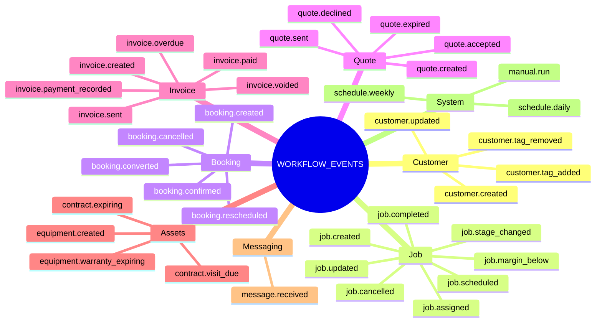
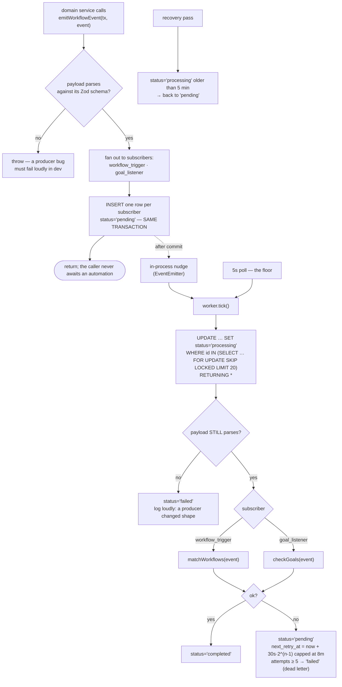
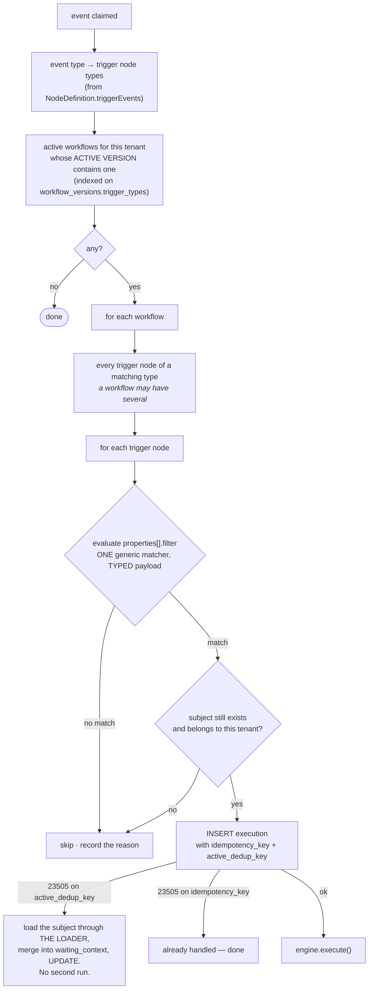
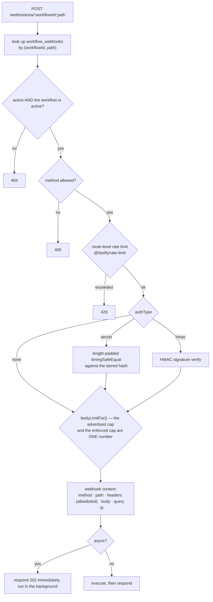

# WF-06 — Triggers & the Event Pipeline

> Related: [[workflow-automation/README|Workflow Automation]] | [[wf-03-data-model]] | [[wf-04-node-catalog]] | [[wf-05-execution-engine]] | [[wf-10-security]] | [[api-rules]] | [[backend-stack]]

How a CRM mutation becomes a running automation. Three parts: a **typed** event taxonomy with one
producer per event, a durable outbox, and a **declarative** filter matcher.

The two most expensive defects in the source system both live here
([[10-audit-findings|B-01]] untyped payloads, [[10-audit-findings|B-02]] a 3,146-line filter
cascade). Both are designed out rather than ported.

---

## 6.1 The event taxonomy

`packages/workflow-nodes/src/events/` — **36** event types, each with a Zod payload schema.

> Built in P2. The count in the first draft of this document said 32 and the mindmap below listed
> 36; the mindmap was the enumeration and won. The registry test now asserts the number, so the
> two cannot disagree again — adding an event is a deliberate act that updates the count, the docs
> and the producer together.



### The event shape

```ts
export interface WorkflowEvent<T extends WorkflowEventType = WorkflowEventType> {
  type: T;
  tenantId: string;
  /** What the event is about. Drives enrollment and context loading. */
  subject: { type: SubjectType; id: string };
  /** Who did it. NULL for a cron, a public portal visitor, or another automation. */
  actorUserId: string | null;
  occurredAt: Date;
  /** ➕ TYPED. One Zod schema per event type. Never `unknown`. */
  payload: EventPayloadFor<T>;
  /** Producer-supplied dedup, so a double-fired producer enqueues once. */
  dedupKey?: string;
}
```

### 🔴 The rule this exists to enforce

> **`payload` is typed per event. There is exactly one producer helper per event. Spreading a
> database row into a payload is forbidden.**

[[10-audit-findings|B-01]] is the most expensive defect in the source system and the story is worth
repeating because it is so cheap to repeat the mistake: `services/leads.ts` spread a raw Prisma row
into `lead.status.changed` (`pipeline_stage_id`, snake_case); the goal listener read `stageId`
(camelCase); the trigger service hand-mapped a **third** spelling. All three sides were typed
`Record<string, unknown>`, so it compiled cleanly and **every stage-filtered goal node was silently
dead in production**. The unit test passed the entire time, because it hand-wrote a camelCase fixture
that production never emitted.

Zaxvio has its own version of the same scar: [[quotes|QUO-02]] — a second writer with its own idea of
the shape, four days of every quote-created job sitting outside the stage model.

Three mechanisms, not one:

| Mechanism | Stops |
|---|---|
| A Zod schema per event type, `.strict()` | an extra or misspelled key |
| `emitWorkflowEvent()` parses the payload **before** insert, and the worker parses it **again** after read | drift between what was written and what is read |
| Test fixtures are generated **from the schema** | a hand-written fixture that production never emits |

### Payload example

```ts
export const jobStageChangedPayload = z.object({
  jobId: z.string().uuid(),
  jobNumber: z.string(),
  customerId: z.string().uuid(),
  pipelineId: z.string().uuid().nullable(),
  fromStageId: z.string().uuid().nullable(),
  fromStageName: z.string().nullable(),
  fromLifecycle: jobLifecycleSchema.nullable(),
  toStageId: z.string().uuid(),
  toStageName: z.string(),
  toLifecycle: jobLifecycleSchema,
  assigneeId: z.string().nullable(),
  serviceType: serviceTypeSchema,
  priority: jobPrioritySchema,
  totalAmount: z.string(),
}).strict();
```

Note `toLifecycle`. A tenant can name a stage anything; `lifecycle` is the four-value truth the rest
of the system reasons about. A trigger filter on "moved to a completed stage" must key on the
lifecycle, not the label — SiloCRM's stage filters are string matching and cannot express this.

### One producer per event

```ts
// services/workflow/events/producers.ts — the ONLY place these are constructed
export function jobStageChanged(db: Db, args: {
  tenantId: string; job: Job; from: ResolvedStage | null; to: ResolvedStage;
  actorUserId: string | null;
}) {
  return emitWorkflowEvent(db, {
    type: "job.stage_changed",
    tenantId: args.tenantId,
    subject: { type: "job", id: args.job.id },
    actorUserId: args.actorUserId,
    payload: {
      jobId: args.job.id,
      jobNumber: args.job.jobNumber,
      // … explicit field by field. NEVER ...args.job
    },
  });
}
```

An ESLint rule forbids object spread inside `producers.ts`. It is a one-line rule and it closes the
entire class.

---

## 6.2 Producer sites — where each event is emitted

Every one of these is inside the domain service, **in the same transaction as the write**, so an
event and the change that caused it commit together or not at all.

| Event | Emitted from | Phase |
|---|---|---|
| `customer.created` | `routes/customers` POST → `services/customers` | P2 |
| `customer.updated` | PATCH — with a computed `changedFields[]` | P2 |
| `customer.tag_added` / `_removed` | customer tag routes | P2 |
| `job.created` | `routes/jobs` POST, `lib/quote-to-job.ts`, booking convert | P2 |
| `job.stage_changed` | **`services/job-stages.service.ts`** — the one place a job changes column | P2 |
| `job.completed` | same, when `toLifecycle === 'completed'` | P2 |
| `job.assigned` | jobs PATCH + assignee picker | P2 |
| `job.scheduled` | jobs PATCH when `scheduled_date/start/end` changes | P2 |
| `job.updated` | jobs PATCH — `changedFields[]` | P2 |
| `booking.created` | `routes/public/booking.ts` **and** `routes/bookings` POST | P2 |
| `booking.confirmed` / `_cancelled` / `_rescheduled` / `_converted` | bookings status paths | P2 |
| `quote.sent` | `services/quotes` send — after the token and PDF exist | P2 |
| `quote.accepted` / `_declined` | `routes/public/quote.ts`, inside the `SELECT … FOR UPDATE` | P2 |
| `quote.expired` | the quote-expiry sweep in `email-cron.ts` | P2 |
| `invoice.payment_recorded` | `services/invoices/invoices.service.ts` recordPayment | P2 |
| `invoice.paid` | **`services/invoices/status.service.ts`**, when the derived status becomes `paid` | P2 |
| `invoice.sent` / `_voided` | invoice routes | P2 |
| `invoice.overdue` | the schedule worker, at a **specific** day count | P9 |
| `equipment.created` | equipment POST | P2 |
| `equipment.warranty_expiring` | schedule worker | P9 |
| `contract.visit_due` / `_expiring` | schedule worker | P9 |
| `job.margin_below` | schedule worker, daily, only for jobs with complete cost coverage | P9 |
| `message.received` | `services/conversations.service.ts` inbound | P2 |
| `schedule.daily` / `_weekly` | schedule worker | P9 |
| `manual.run` | `POST /workflows/:id/runs` | P3 |

Two of these are load-bearing and worth naming:

- **`job.stage_changed` is emitted from `job-stages.service.ts`, not from the route.** That service
  is already "the one place that decides what stage a job is allowed to move to". Emitting there
  means bulk status updates, drag-and-drop, quote conversion and the API all produce the event.
  Emitting from the route would reproduce [[jobs|the bulk-status-update bug]] — where the bulk path
  skipped the completion email that the single path sent.
- **`invoice.paid` is emitted from `status.service.ts`**, which *derives* status from payment rows
  rather than assigning it. So the event fires exactly when the invoice truly becomes paid, including
  when a payment is deleted and it becomes unpaid again — a case the source system's "assign the
  status" model cannot express.

---

## 6.3 The outbox



Three properties that make this production-grade, all from [[10-audit-findings|A-02]]:

1. **`FOR UPDATE SKIP LOCKED`, not `SELECT` then `UPDATE`.** READ COMMITTED lets two transactions
   read the same rows before either commits.
2. **Stale-processing recovery.** A process that dies mid-event leaves rows in `processing` forever.
3. **Enqueue failure degrades, it does not vanish** — if the insert throws, the producer logs at
   `error` with the full event and the correlation id. It does **not** fall back to inline
   processing: at one instance that would turn a database blip into a customer email sent outside a
   transaction that then rolled back.

And one that is a correction to the source:

4. **One row per subscriber.** [[10-audit-findings|B-07]] describes `runEventSideEffects()` as nine
   coupled concerns run serially, where a throw in item 7 fails the whole event and retries item 1 —
   so the workflow re-runs because nurture enrollment failed. Here, `workflow_trigger` and
   `goal_listener` have independent rows, statuses and retry counts.

### Why in-process nudge *and* a poll

`emitWorkflowEvent` fires an `EventEmitter` after commit; the worker wakes immediately. The 5-second
poll is the floor and the recovery path.

Latency in the common case is sub-second instead of averaging 2.5 seconds — which matters, because
"a booking came in and the confirmation email took 8 seconds" is a visible product quality signal.
The caveat is written down: **a second instance would not see the nudge**, and the poll covers it.
Same known constraint as [[decisions|ADR-001]]'s in-process bus, and the same swap point.

---

## 6.4 Trigger matching



### The declarative filter evaluator

A trigger node's properties **declare** their filtering:

```ts
{
  displayName: "Moved to stage", name: "toStageId", type: "stageSelect",
  filter: { path: "toStageId", operator: "equals" },
}
{
  displayName: "Only when it becomes", name: "toLifecycle", type: "options",
  options: [ { name: "Completed", value: "completed" }, … ],
  filter: { path: "toLifecycle", operator: "equals" },
}
{
  displayName: "Only these service types", name: "serviceTypes", type: "multiOptions",
  filter: { path: "serviceType", operator: "inList" },
}
```

One evaluator walks `definition.properties` where `filter` is present, reads the configured value
out of `node_config.parameters`, reads the actual value at `filter.path` from the **typed** payload,
and applies the operator.

```ts
export function matchesFilters(def: NodeDefinition, params: Params, payload: unknown): MatchResult {
  for (const prop of def.properties) {
    if (!prop.filter) continue;
    const configured = params[prop.name];
    if (isUnset(configured)) continue;              // an unset filter matches everything
    const actual = getPath(payload, prop.filter.path);
    if (!applyOperator(prop.filter.operator, actual, configured)) {
      return { matched: false, failedOn: prop.name, expected: configured, actual };
    }
  }
  return { matched: true };
}
```

What this buys, against [[10-audit-findings|B-02]]'s 3,146-line cascade:

- Every new trigger gets filtering **for free**.
- One code path to test, and one matrix test covers every operator.
- A filter cannot silently not apply because someone forgot to add a branch.
- `failedOn` / `expected` / `actual` go straight into the "why didn't my automation run?" diagnostic
  — which is the single most common support question this feature will generate.

**`isUnset` is load-bearing.** The builder persists every property, so an unconfigured filter is
present-but-empty. `null`, `""`, `[]`, `"__any__"` all mean "no filter". Getting this wrong makes
every automation fire on everything, or nothing.

**Defaults are persisted at node creation** ([[wf-03-data-model|§3.4]]), so the UI default and the
runtime default are one declaration. [[05-triggers-and-events|§5.3]] records the source system's bug
here: a dropdown showing "First-time callers only" as pre-selected but persisting nothing, so the
runtime had to guess — and guessing "all" would have fired on every call, the exact opposite of what
the editor told the user was configured.

---

## 6.5 Enrollment and idempotency

Two different problems, two different keys.

| Problem | Key | Mechanism |
|---|---|---|
| The **same event** delivered twice creates two runs | `idempotency_key = sha256(workflowId:triggerNodeId:queueRowId)` | `UNIQUE` — a 23505 means "already handled" |
| A **different event** arrives for a subject already mid-run | `active_dedup_key = workflowId:subjectType:subjectId` | partial `UNIQUE WHERE status IN ('running','waiting')` — a 23505 means "refresh, don't duplicate" |

The second is what stops a chatty trigger — a job updated five times during a three-day wait — from
creating five parallel runs. The refresh branch **calls the loader**:

```ts
// ✅ one implementation of one shape
const fresh = await loadSubjectContext(db, tenantId, subject);
await db.update(workflowExecutions)
  .set({ waitingContext: mergeContext(existing.waitingContext, fresh) })
  .where(and(eq(id, existing.id), eq(status, "waiting")));
```

[[10-audit-findings|B-12]] flags SiloCRM's version: ~180 lines hand-rebuilding contact and lead
objects to match the loader's format. Two implementations of one shape, guaranteed to drift.

**Structural, not query-then-insert.** The source checks with a query and then inserts, which is a
race. The unique index is the same instinct that put a UNIQUE on `quotes.access_token` — and that one
was verified by execution, duplicate raising `23505`.

---

## 6.6 Inbound webhooks — Phase 9

`POST /webhooks/w/:workflowId/:path`, on the public (unauthenticated) allowlist, authenticated
per workflow by its own trigger config.



Security specifics, from [[05-triggers-and-events|§5.4]] and this repo's own history:

- **`timingSafeEqual` with both buffers padded to the same length**, then an explicit length check —
  closing the length oracle a naive implementation leaves open.
- **Secrets stored hashed**, with a 4-character hint for the UI. Shown in full exactly once, at
  creation.
- **`bodyLimitFor()`** — `lib/upload-limits.ts` exists precisely because [[jobs|JOB-04]] found a route
  advertising 2 MB while Fastify enforced ~786 KB. The number the handler checks and the number the
  parser enforces come from one place.
- **Header allowlisting.** The raw header bag reaches `{{webhook.headers.*}}`; `authorization`,
  `cookie` and `x-internal-proxy-secret` are stripped before it does.
- **Rate limit is in-process** (`@fastify/rate-limit` route config), correct at one instance,
  documented as the Redis swap point ([[wf-01-gap-analysis|§5]]).

---

## 6.7 Scheduled and derived triggers — Phase 9

`services/workflow/workers/schedule.ts`, one tick per minute, everything claimed with
`UPDATE … RETURNING`.

| Trigger | How it fires |
|---|---|
| `schedule.daily` | at the configured local time in the **workflow's** zone, one row in `workflow_schedule_state` per (workflow, node, date) so a restart cannot double-fire |
| `schedule.weekly` | same, keyed on ISO week |
| `invoice.overdue` | one event per invoice per configured day-count, using the **same** `overdueCondition()` the list, the stats endpoint and the dunning cron already share ([[invoices\|INV-06]]) |
| `contract.visit_due` | from `maintenance_contracts.service_frequency` + `visits_per_year` + the last visit |
| `contract.expiring` | N days before `end_date` |
| `equipment.warranty_expiring` | N days before the warranty date |
| `job.margin_below` | daily, **only** for jobs whose cost coverage is complete |

Two rules:

1. **Schedule workers never call the engine.** They `emitWorkflowEvent()` and rejoin the normal
   pipeline, so filters, enrollment dedup and context loading all take one code path
   ([[05-triggers-and-events|§5.5]]).
2. **"Already fired" is a table row, never a Map.** [[10-audit-findings|B-08]]: SiloCRM keeps this in
   a module-level `Map` with a TTL sweep, so on a multi-replica deploy "once only" means "once per
   replica per uptime window". `workflow_schedule_state` has a unique index and the insert either
   wins or tells you someone else already did it.

The overdue point deserves emphasis. Zaxvio has **one** definition of overdue, shared across three
consumers, because [[invoices|INV-06]] found three that disagreed — and the disagreement meant a
customer who paid half and stopped was shown as overdue everywhere and **never chased**. The
automation trigger becomes the fourth consumer of that same predicate, not a fifth definition.

---

## 6.8 "Why didn't my automation run?"

The most common support question this feature will ever generate, and it has to be answerable from
the UI without a database session.

Every skipped match writes a **trigger evaluation record** (7-day retention, not a full node log):

```
Automation:  "Quote follow-up"
Event:       quote.sent · Quote Q-1042 · 2026-08-07 14:03 CDT
Trigger:     "Quote Sent"
Result:      did not match
Reason:      "Minimum total" is $5,000 — this quote is $1,250
```

The filter evaluator already returns `failedOn` / `expected` / `actual`; this is one render away.
The alternative is what the source system has: a log line on a server the customer cannot read.

The automation detail page shows the last 50 evaluations — matched and skipped — so "it's not
firing" becomes a self-service answer.
