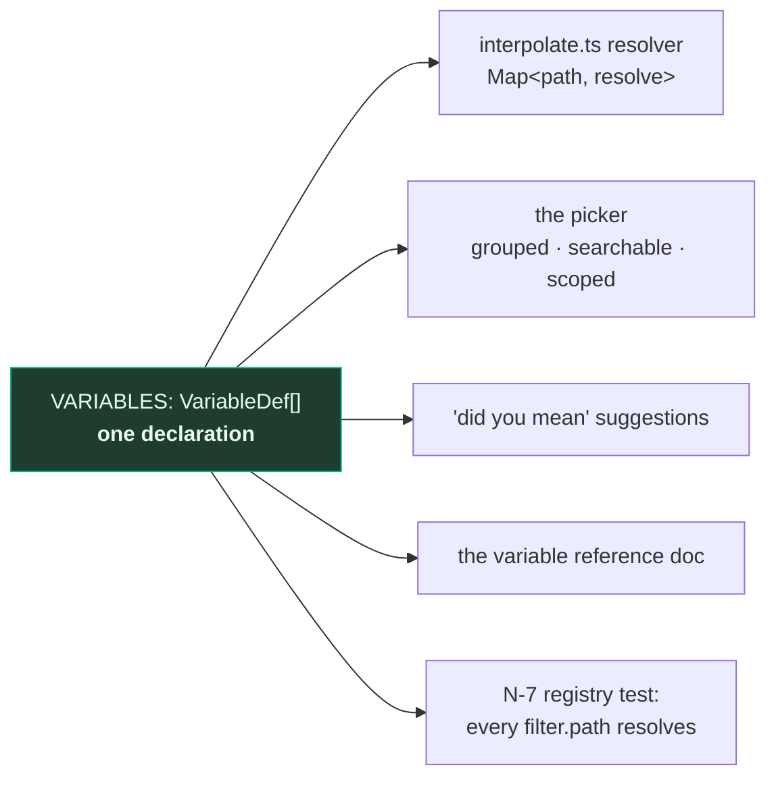
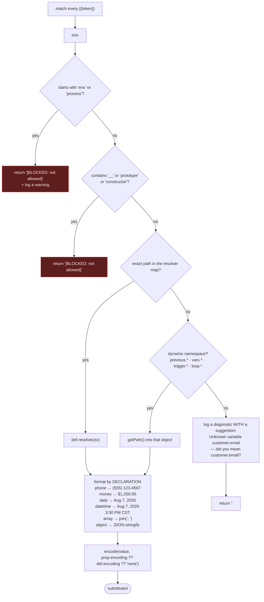

# WF-07 — Variables & Templating

> Related: [[workflow-automation/README|Workflow Automation]] | [[wf-05-execution-engine]] | [[wf-08-builder-frontend]] | [[wf-10-security]] | [[frontend-nextjs]] | [[backend-stack]]

Every string field in every node config is templated. `{{customer.firstName}}` in an email body,
`{{job.total}}` in a condition, `{{previous.httpRequest.body.id}}` downstream.

**One declaration per variable.** The picker, the resolver, the "did you mean" suggestions and the
documentation are all generated from a single table. This is the corrected design from
[[06-variables-and-templating|§6.7]], and it collapses roughly 5,300 lines of the source system into
one array plus ~150 lines of machinery.

---

## 7.1 The declaration

`packages/workflow-nodes/src/variables/index.ts`

```ts
export interface VariableDef {
  /** IMMUTABLE. Saved automations reference this exact string. */
  path: string;                        // "customer.firstName"
  label: string;                       // "First name"   — freely renameable
  description: string;
  type: "string" | "number" | "money" | "boolean" | "date" | "datetime" | "array" | "object";

  /** Formatting is driven by the DECLARATION, never inferred from the value's
   *  shape. A-09: a 10-digit Google Ads campaign id was being rendered as a
   *  phone number in the source system. */
  format?: "phone" | "money" | "date" | "datetime" | "percent";

  /** Which subject types provide it. Scopes the picker — FE-V2. */
  providedBy?: SubjectType[];
  /** Or: which trigger events provide it (for trigger.* namespaces). */
  providedByEvent?: WorkflowEventType[];

  /** Default output encoding when interpolated. §6.4 flags the source system's
   *  per-call-site choice as a footgun. */
  encoding?: "none" | "html" | "url";

  /** A realistic value shown in the picker — FE-V4. */
  sample: string;

  /** THE implementation. There is no second hand-written map. */
  resolve: (ctx: ExecutionContext) => unknown;
}

export const VARIABLES: VariableDef[] = [ /* … */ ];
```

Everything derives from that array:



> The dotted line in [[06-variables-and-templating|§6.1]] — `WORKFLOW_VARIABLE_PATHS` and the flat
> resolver map, ~700 entries each, kept in sync **by convention** — is a real defect. A path declared
> but not mapped resolves to `""`; a path mapped but not declared works and never appears in the
> picker. Deriving one from the other removes the entire class of "the variable is in the dropdown
> but comes out blank".

---

## 7.2 Namespaces

| Namespace | Available when | Examples |
|---|---|---|
| `customer.*` | always (the customer behind any subject) | `id, firstName, lastName, fullName, email, phone, address, city, state, zipCode, fullAddress, notes, isOptedOut` |
| `job.*` | subject is a job, or the subject links to one | `id, number, title, description, serviceType, priority, status, stageName, stageLifecycle, pipelineName, scheduledDate, scheduledStart, scheduledEnd, address, subtotal, taxAmount, total, assigneeName, assigneeEmail, completedAt, actualHours, marginPercent, costCoverage` |
| `invoice.*` | subject is an invoice | `id, number, status, issueDate, dueDate, subtotal, taxAmount, total, amountPaid, balanceDue, daysOverdue, paymentTerms, publicUrl` |
| `quote.*` | subject is a quote | `id, number, status, issueDate, expiryDate, subtotal, taxAmount, total, publicUrl, acceptUrl` |
| `booking.*` | subject is a booking | `id, date, startTime, endTime, serviceType, status, source, notes` |
| `equipment.*` | subject is equipment | `id, name, type, make, model, serialNumber, installDate, warrantyExpiresAt, location` |
| `contract.*` | subject is a maintenance contract | `id, name, startDate, endDate, annualPrice, visitsPerYear, frequency, nextVisitDue` |
| `tenant.*` | always | `businessName, ownerName, email, phone, address, city, state, zipCode, fullAddress, logoUrl, licenseNumber, bookingUrl, googleReviewUrl, timezone` |
| `assignee.*` | the job's assignee | `id, name, email` |
| `trigger.*` | the event payload | typed per event — `trigger.fromStageName`, `trigger.changedFields`, `trigger.daysOverdue`, `trigger.paymentAmount`, … |
| `previous.*` | earlier node outputs | `{{previous.<nodeLabel>.<key>}}` and `{{previous.<nodeId>}}` |
| `vars.*` | `data.setFields` | whatever the author named |
| `loop.*` | inside a `logic.loop` | `item, index, total` |
| `now.*` | computed at interpolation time, in the **workflow's** zone | `date, time, datetime, dayOfWeek, year, month` |

**Path immutability.** Paths are a permanent public API — saved automations, seeded templates and
exported data reference the exact strings. New paths are fine; renames and removals are not. Labels
change freely. Same rule as node ids, same CI test.

---

## 7.3 Resolution



### Four rules worth stating plainly

**1. Format by declaration, never by shape.** `format: "phone"` on the declaration, not "this string
has ten digits so it's probably a phone number". [[10-audit-findings|A-09]]: the source system was
rendering a Google Ads campaign id as `(123) 456-7890`.

**2. Datetimes never fall back to the server zone.**

```
workflow.timezone (mode = 'custom')  →  tenants.timezone  →  DEFAULT_TENANT_TIMEZONE
```

and a rendered datetime **always carries its zone abbreviation** (`3:30 PM CDT`). This repo has paid
for the alternative more than once: the E-05 completion email stamped the server's date, and 02:30
UTC is Aug 1 in Chicago and Aug 2 in UTC. Uses `lib/timezone.ts` — the existing implementation, not
a copy.

**3. Money is money.** `format: "money"` renders through the same helper the invoices and costing
work use, and a *comparison* on money goes through `services/costing/money.ts` in integer cents,
never a float. A margin is a difference of two sums, so float error is doubled.

**4. An unresolved variable is a diagnostic, not silence.** A blank email is otherwise
undebuggable. The suggestion is computed by filtering `VARIABLES` on the namespace prefix and
edit distance — free, because the table exists.

```
[workflow] Unknown variable "customer.emial" in node "Send Email" (field: body)
           did you mean: customer.email, customer.emailSecondary?
           execution: 3f9c… · workflow: "Quote follow-up"
```

The same message reaches the **user** on the replay page, next to the node. Server logs the customer
cannot read are the reason this feature generates tickets.

---

## 7.4 Output encoding

`encode(value, "none" | "html" | "url")`.

| Destination | Encoding | Why |
|---|---|---|
| Email subject | `none` + `sanitizeSubject()` | `lib/email.ts` already strips `\r\n\t` — header injection ([[security-rules\|§6]]) |
| Email body → React Email | `html` | a `<script>` in a customer's last name must not reach the template |
| A URL being built | `url` | |
| A note, an activity description | `none` | plain text, stored and rendered as text |

**The encoding is declared with the property**, not chosen at the call site
([[wf-00-decisions|D-08]]). [[06-variables-and-templating|§6.4]] flags the source system's version:
a new node that forgets to pass one silently gets `'none'`.

### Blocked paths

`env*`, `process*`, `__*`, `*prototype*`, `*constructor*` return a **visible**
`[BLOCKED: not allowed]` marker rather than an empty string. A user who tries `{{env.DATABASE_URL}}`
sees the refusal in their test email and learns immediately.

Because variables resolve through a **closed map of declared paths** rather than free property
traversal on the context object, prototype-chain access is not reachable in the first place — the
deny-list is defence in depth, not the mechanism.

---

## 7.5 The picker

`components/dashboard/automations/variables/`

| # | Rule |
|---|---|
| V-1 | Inserted variables render as **removable pills**, not raw `{{braces}}`. Raw braces read as "this is for developers" |
| V-2 | The picker is **scoped to what this automation's trigger actually provides**. A booking-triggered automation does not offer `{{invoice.balanceDue}}` |
| V-3 | Grouped by namespace, searchable, keyboard-navigable |
| V-4 | Every entry shows its description **and a sample value** |
| V-5 | Previous node outputs are their own group, labelled with the node's user-given name |
| V-6 | Both an insert button and typeahead on `{{` |
| V-7 | An unknown variable is flagged **inline in the editor** — red pill, tooltip — not only at runtime |

V-2 is cheap because `providedBy` / `providedByEvent` is on the declaration, and it is the difference
between a blank email and a support ticket.

V-7 is possible because the same array is imported by the browser. That is the whole argument for
`packages/workflow-nodes` ([[wf-00-decisions|D-24]]).

### Implementation note

The pill input is a controlled `contentEditable`-free component: a plain `<textarea>` plus an overlay
that renders the pills, or a token-array model with a hidden input. **Not Lexical** — the source
system uses it only for the rich-text email body, and Zaxvio's email nodes fill fields in a designed
React Email template rather than authoring HTML ([[wf-01-gap-analysis|§7]]).

---

## 7.6 Worked example

```
Subject:  Your {{job.serviceType}} visit on {{job.scheduledDate}}
Body:     Hi {{customer.firstName}},

          Just confirming {{tenant.businessName}} will be at
          {{job.address}} on {{job.scheduledDate}} at {{job.scheduledStart}}.

          Your technician is {{assignee.name}}.
          Questions? Call us on {{tenant.phone}}.
```

resolves, for a job-triggered run in `America/Chicago`, to:

```
Subject:  Your Maintenance visit on Aug 8, 2026
Body:     Hi Dana,

          Just confirming Shihab Housing will be at
          1420 W 18th St, Chicago, IL 60608 on Aug 8, 2026 at 9:00 AM CDT.

          Your technician is Marcus Webb.
          Questions? Call us on (312) 555-0148.
```

`job.serviceType` is title-cased by its declaration. `job.scheduledDate` is a `date` column rendered
without the UTC-midnight day shift — the bug [[quotes|QUO-10]] fixed and which
`formatDateOnly` in `lib/timezone.ts` exists to prevent. `scheduledStart` is a `time` column rendered
in the tenant's zone **with the abbreviation**. `tenant.phone` is formatted by declaration through
`lib/phone.ts`, the single implementation that replaced four divergent copies.

Every one of those four details is a bug this codebase has already had, found and fixed once.
