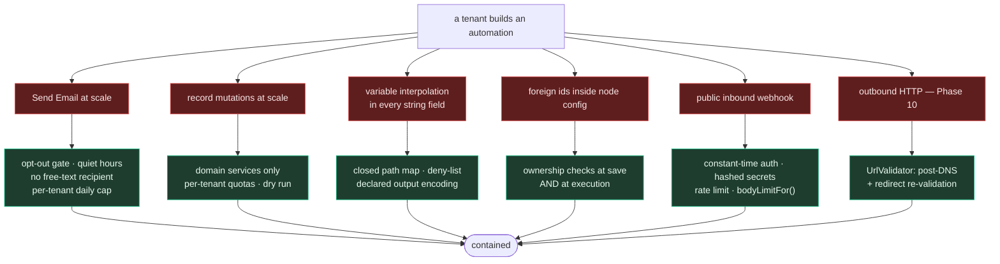

# WF-10 — Security

> Related: [[workflow-automation/README|Workflow Automation]] | [[security-rules]] | [[wf-00-decisions]] | [[wf-05-execution-engine]] | [[wf-06-triggers-and-events]] | [[tenant-security]] | [[auth-flow]]

A workflow engine is, by design, **a user-controlled execution system inside the CRM**. Users make it
send mail, mutate records at scale, and eventually call arbitrary URLs — on our infrastructure, with
our sender reputation, against data that belongs to other tenants if we let it.

Treat this chapter as mandatory, not as hardening to add later.



---

## 10.1 🔴 The delta that matters most: there is no RLS

[[09-security-and-multitenancy|The source guide's §9.3]] assumes three layers, the first of which is
Postgres row-level security. **Zaxvio has none.** Isolation is entirely application-level:
`requireTenant` on the route, `tenantFilter()` in the query ([[security-rules|§1]]).

Every existing subsystem gets away with this because it runs **inside a request**, where
`request.authUser.tenantId` is right there. The workflow engine is the first that does not.

### The rules

| # | Rule |
|---|---|
| T-1 | `EngineContext.tenantId` is built **once**, in `engine/execute.ts`, from a workflow row loaded by `(id, tenantId)`. Nothing else constructs it |
| T-2 | Every function under `services/workflow/` takes `tenantId` as an explicit argument. No default, no optional |
| T-3 | Every query includes the tenant predicate. `and(eq(t.tenantId, tenantId), eq(t.id, id))` — **never** the record id alone |
| T-4 | A tenant id is **never** read from a node config, an event payload, a webhook body, or a subject row |
| T-5 | Cross-tenant surfaces — the queue worker, the resume worker, the schedule worker, the retention sweep — each carry a comment saying why, and re-scope to a single tenant before doing any work |
| T-6 | The subject is re-verified as belonging to the tenant on **every** resume, not only at start |

T-6 exists because a run can pause for three weeks. In that time a job can be deleted, or — once
tenant merging or data import exists — moved. Re-verify.

### Foreign ids in node config are untrusted input

A node config holds `pipelineId`, `stageId`, `catalogItemId`, `checklistId`, `assigneeId`,
`templateId`, `tagId`. These arrive in a request body exactly like any other client-supplied FK, and
[[security-rules|§1]] plus the 2026-08-06 audit are unambiguous about what happens when they are not
checked — that audit found the same defect in conversations, checklists and calendar events, and the
worst of the three leaked a customer's name, email and phone **and** sent attacker-authored mail to
another tenant's customer.

A node config is a fourth hiding place, and a worse one: it is written once and re-read for years.

**Checked twice**, via `lib/tenant-guards.ts`:

1. **At save time** (`PUT /:id/graph` and publish) so the user is told immediately, using the
   `ownership` declaration on the property ([[wf-04-node-catalog|§4.1]]).
2. **At execution time** in `node-executor.ts`, because rows get deleted and automations get
   duplicated.

`lib/tenant-guards.ts` currently exports `ownsCustomer`, `ownsEquipment`, `ownsBooking`,
`ownsCatalogItem`. This feature adds `ownsPipeline`, `ownsStage`, `ownsChecklist`, `ownsJob`,
`ownsTag`, `ownsMember`, `ownsWorkflow` — into that file, not into a new copy. The file's own header
explains why the gap survived last time: *"there was nothing to import, so each new writer either
rewrote the check or skipped it."*

---

## 10.2 🔴 Communication safety

The most likely way this feature causes real damage is not a breach. It is emailing a thousand
customers something wrong, at 3am, to people who asked not to be contacted.

| Control | Mechanism | Phase |
|---|---|---|
| **Opt-out** | `customers.email_opt_out`; a single `canEmailCustomer()` gate every send path calls | P3 |
| **Unsubscribe link** | in every automation-sent customer email, in the shared layout | P3 |
| **No free-text recipient** | not expressible in the node definition ([[wf-00-decisions\|D-14]]) | P3 |
| **Per-tenant daily email cap** | 200/day default, on the tenant row, surfaced in the UI | P3 |
| **Quiet hours** | tenant-configured; a send outside them pushes `resume_at` forward rather than dropping | P6 |
| **Dry run** | a first-class mode, not a flag ([[wf-09-api-surface\|§9.4]]) | P5 |
| **Bulk confirmation** | `runs/bulk` states the count and the daily quota impact before running | P5 |
| **Templates install inactive** | nothing sends until a human activates it ([[wf-00-decisions\|D-27]]) | P7 |
| **Attribution** | every automation email carries "Sent automatically by *Quote follow-up*" in the footer | P3 |

A refusal logs `skipped` with a plain-language reason and **does not fail the run** — an opted-out
customer is an expected state, not an error.

Attribution matters more than it looks: when a customer replies *"why did I get this?"*, the
contractor needs to be able to answer without opening a support ticket.

---

## 10.3 Interpolation

| Threat | Mitigation |
|---|---|
| Secret exfiltration via `{{env.DATABASE_URL}}` | `env*` / `process*` blocked, returns a **visible** `[BLOCKED]` marker |
| Prototype pollution / gadget access | `__*`, `prototype`, `constructor` blocked — **and** variables resolve through a closed map of declared paths, so free property traversal is not reachable at all |
| XSS via interpolated customer data in an email | `encoding: "html"` declared on the property ([[wf-00-decisions\|D-08]]) |
| Header injection in an email subject | `sanitizeSubject()` from `lib/email.ts` ([[security-rules\|§6]]) |
| `[object Object]` in a customer-facing message | objects are `JSON.stringify`d by the formatter |
| Formula injection in any future export | `escapeCell` ([[security-rules\|§7]]) |

The closed-map design is the real control here. The deny-list is defence in depth, and it returns a
visible marker rather than an empty string so a user who tries it learns immediately.

---

## 10.4 Inbound webhooks — Phase 9

| Control | Detail |
|---|---|
| Auth | `none` / `secret` / `hmac`; **length-padded `timingSafeEqual`** plus an explicit length check, closing the length oracle |
| Secret storage | hashed; shown in full exactly once at creation; a 4-char hint in the UI |
| Rate limit | route-level `config.rateLimit`, 60/min per workflow. In-process — correct at one instance, documented as the Redis swap point |
| Body size | `bodyLimitFor()` from `lib/upload-limits.ts`, so the advertised cap and the enforced cap are one number ([[jobs\|JOB-04]]) |
| Header exposure | allowlist before headers reach `{{webhook.headers.*}}`; `authorization`, `cookie`, `x-internal-proxy-secret` stripped |
| Enumeration | an unknown workflow, an inactive one and a wrong path all return the same 404 |
| Payload | Zod-validated into the trigger's declared field mapping; the raw variant is addressable but never executed |
| Logging | the token is never logged — a `sha256(secret).slice(0,12)` fingerprint is, so an operator can correlate without exposure |

---

## 10.5 Outbound HTTP — Phase 10, and not before

The single highest-severity risk in the feature. An unguarded HTTP node lets any tenant read cloud
metadata credentials, reach anything in the private network, or use the API as a proxy.

`http.request` and `webhook.send` do not ship until **all** of this is true and reviewed:

- [ ] Scheme allowlist — `http`/`https` only. No `file:`, `gopher:`, `ftp:`, `data:`
- [ ] Deny `10/8`, `172.16/12`, `192.168/16`, `127/8`, `0.0.0.0/8`, `::1`, `fc00::/7`
- [ ] Deny link-local `169.254/16` and `fe80::/10` — **cloud metadata**
- [ ] **Resolve the hostname, validate the resolved IP, then connect to that IP.** Do not re-resolve
      at connect time — that is the DNS-rebinding hole
- [ ] **Re-validate every redirect hop**, cap the redirect count at 3
- [ ] Response size cap (1 MB) and connect/read timeouts (5s/10s)
- [ ] The response body is **not** written into a node log unless the run is a test
- [ ] Per-tenant outbound request quota

The last two items are the ones most commonly missed, and they are also the two Zaxvio would miss —
the repo has no outbound-request infrastructure at all today.

Until then the node exists in the registry tagged `coming-soon` and greyed in the palette. That is
what the whitelist is for ([[10-audit-findings|A-05]]).

---

## 10.6 Resource abuse

| Surface | Control |
|---|---|
| Runaway loop | `MAX_LOOP_ITERATIONS = 500`, wall clock 5 min, node budget 200 |
| Infinite goto | `maxLoops` per node, default 5 |
| Recursive sub-automation | depth ≤ 3 |
| A tenant monopolising the process | concurrent (25) and daily (2,000) execution quotas |
| Email flooding | 200/day per tenant, plus the opt-out gate |
| A huge paused context | 256 KB cap with visible truncation |
| Log table growth | 90-day retention, swept in bounded batches |
| Queue growth | completed rows 7 days, dead-letter 30 days |
| A poison event retried forever | 5 attempts, then dead-letter, and the operator health endpoint shows it |

**Quotas are surfaced before they are enforced.** The list page shows today's usage; the first
refusal notifies the owner with the number and what to do. A silent cap is a support ticket
([[10-audit-findings|B-09]]).

---

## 10.7 Authorization inside the product

| Action | Required |
|---|---|
| View automations, runs, replay | any member |
| Create, edit, save a draft, test | any member |
| **Publish** | `requireOrgRole(["owner", "admin"])` |
| **Activate / deactivate** | `requireOrgRole(["owner", "admin"])` |
| **Delete / bulk** | `requireOrgRole(["owner", "admin"])` |
| Bulk run | `requireOrgRole(["owner", "admin"])` |
| Queue health | `requireAdminTier(["super_admin"])` |

Drawing is safe; making it live is not. The same instinct as gating member cost rates on
owner/admin — a rate is payroll data, and an active automation is the ability to email every customer
the business has.

---

## 10.8 Logging

Errors must be diagnosable from logs alone, without reproducing the bug.

```ts
// ❌ useless
log.error({ err }, "workflow node failed");

// ✅ actionable
log.error({
  errorName, errorMessage, errorStack,
  zodIssues,                       // WHICH field failed and why
  tenantId, workflowId, versionId, executionId, nodeId, nodeType,
  subjectType, subjectId,
  correlationId,
  secretFingerprint,               // sha256(secret).slice(0,12) — NEVER the raw value
}, "workflow node failed");
```

Never log a raw token, key, password or signed URL. Always include the correlation id. Prefer
structured fields over interpolated strings — they are queryable. Log **once, richly**, rather than
three thin lines leading up to a failure.

`resolvedParams` written to a node log passes through a redactor that strips anything whose key looks
like a secret, and any value matching a stored webhook secret.

---

## 10.9 User-facing failure messages

Workflow failures will be the number one support driver. A failure shown to a user must **name the
cause and the next action**.

```
❌  "Automation failed"
❌  "EMAIL_SEND_FAILED"
✅  "We didn't email Dana Rivera because they unsubscribed on 12 July.
     You can still call them, or ask them to opt back in from the customer page."

❌  "Node error"
✅  "The 'Move Job Stage' step couldn't run: that stage was deleted from the
     Installations pipeline. Open the automation and pick a stage that still exists."
```

Write the reason **once, on the server, in human words**, so the replay page, the failure
notification and the run list all inherit it. That is what `executions.error_hint` and
`node_execution_logs.error_hint` are for.

---

## 10.10 Pre-launch checklist

Every box before public beta. Phase 10 is where the unchecked ones get closed.

**Tenancy**
- [ ] Every `services/workflow/` function takes `tenantId` explicitly; no query matches on id alone
- [ ] Every `ownership` field is checked at save **and** at execution
- [ ] The subject is re-verified on every resume
- [ ] Every cross-tenant worker re-scopes before doing work, and says why in a comment
- [ ] A duplicated automation cannot carry another tenant's ids

**Communication**
- [ ] `email_opt_out` shipped and enforced in one gate
- [ ] Unsubscribe link in every automation email
- [ ] Attribution footer in every automation email
- [ ] Quiet hours enforced
- [ ] Per-tenant daily email cap enforced and displayed
- [ ] No free-text recipient exists

**Interpolation**
- [ ] `env*`, `__*`, `prototype`, `constructor` blocked and visible
- [ ] Encoding declared per property; HTML encoding on email bodies
- [ ] `sanitizeSubject()` on every subject line

**Webhooks**
- [ ] Length-padded constant-time comparison
- [ ] Secrets hashed at rest, never logged, fingerprinted in logs
- [ ] Route-level rate limits
- [ ] `bodyLimitFor()` matches the advertised cap
- [ ] Header allowlist before interpolation
- [ ] No existence enumeration

**Outbound HTTP** *(Phase 10 gate)*
- [ ] Every item in §10.5

**Resource**
- [ ] All limits in one constants file, enforced and displayed
- [ ] Node log retention running
- [ ] Queue retention running
- [ ] Dead-letter visible to an operator

**Operational**
- [ ] Failure messages name the cause and the fix
- [ ] Structured logs with a correlation id, no secrets
- [ ] Health endpoint live
- [ ] A `pnpm test` suite that actually runs ([[wf-11-testing]])
- [ ] `/security-review` run on the branch before merge
