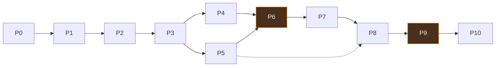

# WF-12 — The Phased Plan

> Related: [[workflow-automation/README|Workflow Automation]] | [[wf-PROGRESS]] | [[wf-00-decisions]] | [[wf-03-data-model]] | [[wf-11-testing]] | [[todo]] | [[planner]]

**Eleven phases, P0 → P10.** Each is independently verifiable, leaves the app in a shippable state,
and has an explicit definition of done.

Two gates matter:
- **Internal alpha after P6** — the engine is correct and the builder is usable.
- **Public beta after P9** — everything a tenant needs, hardened.

Sizes are judgment, not measurement: **S** ≈ 1 working session · **M** ≈ 2–3 · **L** ≈ 4–6 ·
**XL** ≈ 7+.

```mermaid
gantt
    title Workflow Automation — build order
    dateFormat X
    axisFormat %s

    section Foundations
    P0 harness · package · E-15 email   :p0, 0, 2
    P1 schema + migration               :p1, 2, 2

    section Engine
    P2 event taxonomy + outbox          :p2, 4, 3
    P3 engine core + 7 nodes            :p3, 7, 4
    P4 trigger matching + enrollment    :p4, 11, 2

    section Product
    P5 builder MVP                      :p5, 13, 5
    P6 control flow + delays + goals    :p6, 18, 4

    section Breadth
    P7 pickers + node breadth + services:p7, 22, 6
    P8 observability + replay           :p8, 28, 4
    P9 webhooks + schedules + recurring :p9, 32, 4

    section GA
    P10 hardening + templates + docs    :p10, 36, 4
```

---

## P0 — Foundations & test harness · **M**

Nothing here is workflow code. All of it is a prerequisite that is cheaper now than later.

**Scope**
- `apps/api/vitest.config.ts` + `vitest.integration.config.ts`, vitest added to `apps/api`,
  `apps/web`, and the new package
- `apps/api/src/test/` — `setup.ts`, `db.ts` (`withRollback`), `factories/`
- **`packages/workflow-nodes`** scaffold: `package.json` (`"." : "./src/index.ts"`, no build step),
  `node-definition.ts`, empty registry + barrel, `active-nodes.ts`, `limits.ts`, `categories.ts`
- Registry invariant tests (they pass trivially on an empty registry, and stay honest as it grows)
- **E-15 generic notification email template** in `packages/email`, exported from `lib/email.ts` —
  fixes [[wf-01-gap-analysis|§8.1]], where `sendNotificationAlertEmail` is called and exists nowhere,
  so **every notification email currently logs instead of sending**
- `pnpm workspace` + `turbo.json` wiring for the new package

**Done when**
- `pnpm test` runs and passes in all three workspaces
- `withRollback` writes a row inside a test and the row is gone afterwards
- A notification email actually arrives (or fails with Resend's real reason, not a `console.log`)
- Registry tests fail correctly when a node id is renamed in a scratch commit

**Risks** — the new package must be importable by both `tsx` (API) and Next 14 (web) with no build
step. Prove that on day one with a trivial import from both sides; it is the one thing that would
force a different package shape.

---

## P1 — Data model & migration · **M**

**Scope**
- `packages/database/src/schema/workflows.ts`, `workflow-graph.ts`, `workflow-runs.ts`
- 4 enums, 6 tables: `workflows`, `workflow_versions`, `workflow_nodes`, `workflow_edges`,
  `workflow_executions`, `node_execution_logs`
- `supabase/migrations/…_workflow_core.sql`, idempotent throughout
- `packages/types/src/workflow.ts` — inferred row types + DTOs
- Relations in `schema/relations.ts`

**Done when**
- The migration is applied to Neon and **re-run 3 more times**, NOTICE-only, with column and index
  sets byte-identical after each
- Every FK proven by execution (`23503`, rolled back)
- Both partial unique indexes proven (`23505`, rolled back) — `idempotency_key` and
  `active_dedup_key`
- `EXPLAIN` on the resume query `(status, resume_at)` shows an index scan

**Risks** — the two partial unique indexes have no `IF NOT EXISTS` semantics for a changed `WHERE`
clause. Guard on `information_schema`/`pg_indexes`, the way the job-costing migration guards its
generated column.

---

## P2 — Event taxonomy & outbox · **L**

**Scope**
- `packages/workflow-nodes/src/events/` — 36 event types, one Zod payload schema each, `.strict()`
- `services/workflow/events/emit.ts` — the only producer, writes in the caller's transaction
- `services/workflow/events/producers.ts` — one helper per event; ESLint bans object spread in this
  file
- `services/workflow/events/worker.ts` — claim, process, backoff, dead-letter, stale recovery,
  in-process nudge
- `workflow_event_queue` table + migration
- **Instrument ~24 producer sites** ([[wf-06-triggers-and-events|§6.2]]) — the ones inside
  `job-stages.service.ts` and `invoices/status.service.ts` matter most, because they are the single
  place their change can happen
- Wire the worker into `server.ts` startup beside the email crons

**Done when**
- Every producer's output parses `.strict()` against its schema
- Fixtures are generated **from** the schemas — a hand-written fixture is a test failure
- Concurrency test: two workers, 20 rows, zero double-processing
- A rolled-back domain write leaves **no** queue row
- A failing subscriber does not retry the other

**Risks** — instrumenting 24 sites across five route files is the widest-touching change in the plan.
Do it as one commit per domain, and never inside a route handler when a service exists.

---

## P3 — Engine core · **XL**

The first phase that runs something.

**Scope**
- `services/workflow/engine/` — `execute.ts`, `traverser.ts` (linear + branch only),
  `node-executor.ts`, `context.ts`, `interpolate.ts`, `errors.ts`
- `packages/workflow-nodes/src/variables/` — the `VariableDef[]` table for customer, job, invoice,
  quote, booking, tenant, assignee, trigger, now
- **7 nodes**: `trigger.manual`, `trigger.job.completed`, `trigger.invoice.paid`, `email.send`,
  `notification.internal`, `customer.addNote`, `logic.stop`
- `lib/communication-guards.ts` + `customers.email_opt_out` migration
  ([[wf-00-decisions|D-15]]) + unsubscribe link + attribution footer
- Per-tenant quotas ([[wf-00-decisions|D-26]])
- `POST /workflows/:id/runs` (manual) so the engine is reachable
- Analytics-cache invalidation on `mutates` ([[wf-01-gap-analysis|§4b]])

**Done when**
- A hand-inserted graph runs end to end and an email arrives
- Every engine unit test in [[wf-11-testing|§11.2]] passes
- An opted-out customer produces a `skipped` node log with a readable reason, and the run completes
- A tenant at quota is refused and told
- Cross-tenant integration test: an automation cannot touch another tenant's rows

**Risks** — this is the phase where scope creeps into node breadth. Seven nodes. The catalog is P7.

---

## P4 — Trigger matching & enrollment · **M**

**Scope**
- `services/workflow/triggers/match.ts` — one declarative evaluator, ~22 operators
- `services/workflow/triggers/enroll.ts` — idempotency key, `active_dedup_key`, the 23505 refresh
  branch calling **the loader**
- Trigger evaluation records (7-day retention) for the "why didn't it run?" view
- Wire the worker's `workflow_trigger` subscriber to the matcher
- Trigger nodes for the events instrumented in P2

**Done when**
- The operator × value-shape matrix passes, including `0`/`false` being values and `null`/`""`/`[]`
  being unset
- A second event for a waiting subject refreshes; it does not duplicate — proven by execution
- The same queue row processed twice creates one run
- A stage filter matches on `lifecycle`, not the label

---

## P5 — Builder MVP · **XL**

The first demoable phase.

**Scope**
- `@xyflow/react` + `zustand`
- `app/(dashboard)/automations/` — list page, builder page, `loading.tsx` for both
- `components/dashboard/automations/` — canvas, node, edges, palette sheet, config drawer
- **11 P5 field types** ([[wf-04-node-catalog|§4.1]])
- `lib/workflow/build-node.ts` (the one constructor), `store.ts`, `icon-map.ts`
- `services/workflow/graph/persist.ts` (whole-graph PUT + `If-Match`), `publish.ts`, `validate.ts`
- `routes/workflows/index.ts` (11 endpoints), `builder-context.ts`
- `actions/workflows.ts` on `api-fetch`, `hooks/queries/use-workflows.ts`, query keys
- Insert-on-edge, relink-on-delete, undo/redo, multi-select, disable-node
- Draft/published state, validation dialog with clickable errors
- Sidebar entry — a new **Automate** group, above Reference

**Done when**
- Every box in [[wf-08-builder-frontend|§8.13]] that does not depend on a later phase
- A concurrent edit 409s with a Reload action
- Publish is blocked on an invalid graph; every error selects its node
- Adding a node definition requires **zero** frontend code
- 390px has no horizontal scroll; light and dark both correct

**Risks** — the single largest phase. Split the commits: canvas+store, then config renderer+fields,
then save/publish, then polish. React Flow must be `dynamic(..., { ssr: false })` and the icon map
must be curated from the first commit — retrofitting either is a hosted-build failure.

---

## P6 — Control flow, delays, goals · **L**  ← **internal alpha gate**

**Scope**
- `condition.if` (+ bespoke branch/condition-group panel), `logic.switch`, `split.branch`,
  `logic.merge`, `logic.goto`, `logic.loop`
- `delay.wait` (+ bespoke mode panel): relative · until-a-date · next business hour, quiet-hours safe
- `services/workflow/workers/resume.ts` — cheap `count()`, claim, resume, `reExecuteCurrentNode`
- `goal.event` + `workflow_goal_listeners` + the goal subscriber
- Quiet-hours columns on `tenants`; business hours through `services/availability.service.ts`
- Join badges on converging nodes; the goto-after-split warning
- Save-time rejection of a delay inside a loop

**Done when**
- A pause survives a **real deploy** — set `resume_at` +2 min, redeploy, confirm it resumes
- Version pinning proven: publish v2 mid-pause, the run resumes on v1
- Compare-and-set proven: a concurrent goal exit and delay pause race, exactly one wins
- Delay maths correct across a DST boundary in the tenant's zone
- OR/AND join behaviour matches the badges the UI renders

---

## P7 — CRM pickers, node breadth, service extraction · **XL**

The phase that pays down [[architecture|ARC-05]].

**Scope**
- **13 CRM picker field types** — the difference between native and an embedded Zapier
- **Extract `services/jobs/`** out of the 2,514-line route handler: create, update, moveStage
  (exists), assign, schedule, addLineItem, attachChecklist. Routes become thin
  ([[api-rules|§1]])
- **Extract `services/customers/`** likewise
- Node breadth to ~45: the rest of the job/customer/quote/invoice/booking/asset actions,
  `data.setFields`, `data.math`, `data.format`, `workflow.run`
- Remaining triggers for events already instrumented
- `workflow_folders` + folder UI
- Variable picker with pills, trigger-scoped, inline unknown-variable flagging

**Done when**
- Every executor test proves it calls a service and writes no table directly (the throwing `db`
  proxy)
- The jobs route file is materially smaller and its handlers are validate → service → respond
- Every picker draws only from `builder-context`, so a tenant cannot see another's rows

**Risks** — extracting `services/jobs/` touches the most-audited file in the repo. Do it as a pure
move with no behaviour change, one endpoint at a time, and lean on the fact that jobs already has
`job-guards.ts` and `job-stages.service.ts` as the seams.

---

## P8 — Observability & replay · **L**

**Scope**
- `routes/workflows/runs.ts` (11 endpoints) and `testing.ts` (3)
- Runs list — per automation and org-wide, filterable
- **Replay page** — the same canvas in read-only mode, per-node status, context inspector
- Run-from-node, test-a-single-node, whole-workflow dry run
- Live test-run visuals over the SSE channel `"workflows"`
- Enrollment view, trigger evaluation view ("why didn't it run?")
- Failure notifications; `error_hint` in plain language everywhere
- `workers/retention.ts` — node logs 90d, queue 7d/30d
- `/admin/workflows/health`

**Done when**
- A failed run's replay explains the failure in words a contractor would use
- `replay-from` forks a run seeded with the stored context, linked to its parent
- Dry run describes every send instead of sending
- Retention actually deletes, in bounded batches

---

## P9 — Webhooks, schedules, recurring triggers · **L**  ← **public beta gate**

**Scope**
- `routes/webhooks/workflow.ts` — public receiver, all of [[wf-10-security|§10.4]]
- `workflow_webhooks` table, secret generation and hashing, the settings UI
- `trigger.webhook` + `trigger.webhook.raw`; field mapping into a customer/booking
- `workers/schedule.ts` + `workflow_schedule_state` — daily/weekly,
  `invoice.overdue` at a day count, `contract.visit_due`, `contract.expiring`,
  `equipment.warranty_expiring`, `job.margin_below`
- `quotes.first_viewed_at` for `trigger.quote.viewed`

**Done when**
- A webhook with a wrong secret is rejected in constant time; an unknown workflow, an inactive one
  and a wrong path are indistinguishable
- `bodyLimitFor()` matches the advertised cap, proven by an oversized request
- "Once only" survives a restart — proven by killing the process between ticks
- `invoice.overdue` uses the **same** `overdueCondition()` as the list, the stats endpoint and the
  dunning cron — four consumers, one predicate

---

## P10 — Hardening, templates, GA · **L**

**Scope**
- **The 10 launch templates** ([[wf-00-decisions|D-27]]) as seeded version snapshots, installed
  inactive; the template gallery replaces the blank canvas
- `http.request` + `webhook.send` behind a complete `UrlValidator` — every box in
  [[wf-10-security|§10.5]] or they do not ship
- The full [[wf-10-security|§10.10]] pre-launch checklist
- `/security-review` on the branch
- **Housekeeping** ([[strict-rules|§8]]): REPO_MAP 1 + 2, API docs (26 endpoints), chatbot
  knowledge base, `docs/claude/todo.md`, lessons
- An ADR in [[decisions]] recording the engine's standing decisions
- `pnpm seed:demo --with-automations`

**Done when**
- Every checklist box in §10.10 is ticked or explicitly deferred with a reason
- A new tenant can install a template and see it run, without reading documentation
- Docs are accurate — measured, not asserted

---

## Dependency graph

P5 (builder) needs only P3, so the builder and trigger matching can proceed in either order once the
engine runs. Everything after P6 is sequential.

---

## What "done" means, every phase

Non-negotiable, from [[wf-11-testing|§11.4]]:

1. Automated tests pass; the count is recorded in [[wf-PROGRESS]]
2. Any migration is applied **and re-run 3× clean**; FKs and unique indexes proven by execution
3. The manual list is walked
4. `pnpm typecheck` and `pnpm lint` clean
5. [[strict-rules|§8]] housekeeping done **in the same commit** — REPO_MAP, API docs, chatbot KB,
   todo, lessons
6. [[wf-PROGRESS]] updated with what was actually verified and what was not

> **Verification is the user's to run.** The plan produces the tests and the commands; a phase is
> reported as *"tests written, not yet run"* until there is output. Never green without evidence.

---

## Effort

Judgment, not measurement.

| Phase | Size | Engineer-days (2 eng.) |
|---|---|---|
| P0 Foundations | M | 2–3 |
| P1 Data model | M | 2–3 |
| P2 Events & outbox | L | 5–7 |
| P3 Engine core | XL | 8–12 |
| P4 Trigger matching | M | 3–4 |
| P5 Builder MVP | XL | 10–15 |
| P6 Control flow | L | 6–9 |
| P7 Breadth + extraction | XL | 10–15 |
| P8 Observability | L | 6–8 |
| P9 Webhooks & schedules | L | 6–8 |
| P10 Hardening & GA | L | 5–8 |
| **Total** | | **≈ 63–92 engineer-days** |

The source guide estimates 5–8 months for 2 engineers to reach parity, and 10–14 weeks for an MVP.
This is smaller because the catalog is a third the size, there is no agency scope, no telephony, no
ad platforms and no code sandbox — and because the corrected designs (declarative filters, one
variable declaration) remove the two largest files in the source system outright.

---

## What is explicitly not in this plan

| Deferred | Revisit when |
|---|---|
| SMS / voice nodes | a provider is wired |
| Code node (QuickJS) | a customer needs something `data.setFields` cannot express |
| AI copilot | after the registry exists; it doubles as the model's tool schema |
| Agency scope | if the product is ever sold to agencies |
| Real-time multiplayer editing | never, probably — `If-Match` is the right amount of concurrency control |
| Sub-second latency | polling is seconds by design |
